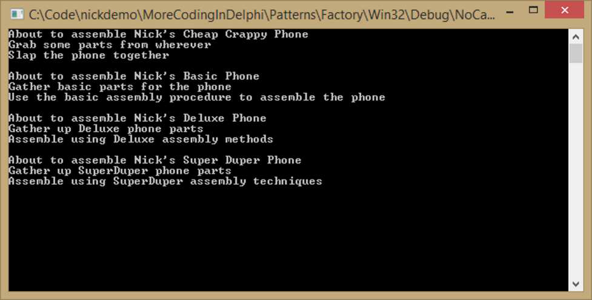

### **Введение**

В моей предыдущей книге и даже в моем блоге я призывал вас не создавать объекты вручную. Вместо этого я рекомендовал перекладывать ответственность за создание объектов на другие классы, чьей специфической задачей является именно это. Причина, конечно, в том, что каждый вызов `Create` порождает зависимость и жесткую связь в коде. Подобных вещей лучше избегать.

В этой главе мы рассмотрим паттерн Фабрика. Сначала мы взглянем на фабрики неформально и разберемся, как они работают. Затем мы перейдем к двум основным «настоящим» фабричным паттернам из книги «Банды четырех»: Абстрактная фабрика (Abstract Factory) и Фабричный метод (Factory Method). Существует множество способов реализации фабрик — даже контейнер внедрения зависимостей (Dependency Injection), по сути, является прославленной фабрикой, — но мы постараемся рассмотреть общие способы их реализации.

Почему мы используем паттерн Фабрика? Потому что мы хотим писать SOLID-код. Мы хотим следовать Принципу единственной ответственности (Single Responsibility Principle), и поэтому мы не хотим, чтобы наши классы брали на себя дополнительную ответственность по созданию объектов. Вместо этого мы создаем отдельный класс, чьей единственной задачей является создание объектов для нас. Также, как мы увидим далее, мы хотим следовать Принципу открытости/закрытости (Open/Closed Principle). В нашем первом примере мы увидим класс, который определенно не закрыт для модификации, поэтому мы захотим вынести эту проблему в отдельный класс, что сделает основной класс закрытым для изменений.

#### **Неформальный взгляд на фабрики**
##### **Простая фабрика**
Давайте соберем несколько смартфонов. Сначала сделаем это «неправильно», чтобы увидеть проблемы этого подхода, а затем перейдем к тому, как фабрики могут развязать ваш код и облегчить его поддержку.
Во-первых, определим перечисляемый тип:
```pascal
TSmartPhoneType = (CheapCrappy, Basic, Deluxe, SuperDuper);`.
```
Этот тип будет определять четыре различных вида смартфонов, которые мы будем собирать на сборочном заводе Nick Phone Assembly.
Вот как выглядят наши смартфоны:
```pascal
TBaseSmartPhone = class abstract
protected
  function GetName: string; virtual; abstract;
public
  procedure GatherParts; virtual; abstract;
  procedure Assemble; virtual; abstract;
  property Name: string read GetName;
end;

TBasicSmartPhone = class(TBaseSmartPhone)
protected
  function GetName: string; override;
public
  procedure GatherParts; override;
  procedure Assemble; override;
end;

TDeluxeSmartPhone = class(TBaseSmartPhone)
protected
  function GetName: string; override;
public
  procedure GatherParts; override;
  procedure Assemble; override;
end;

TSuperDuperSmartPhone = class(TBaseSmartPhone)
protected
  function GetName: string; override;
public
  procedure GatherParts; override;
  procedure Assemble; override;
end;

TCheapCrappySmartPhone = class(TBaseSmartPhone)
protected
  function GetName: string; override;
public
  procedure GatherParts; override;
  procedure Assemble; override;
end;
```

Вот несколько моментов, которые стоит отметить в отношении наших классов смартфонов:
*   Все они наследуются от абстрактного класса `TBaseSmartPhone`. Помните, я всегда говорю, что нужно программировать на уровне абстракций, а не реализаций? `TBaseSmartPhone` — это абстракция. Он объявлен как абстрактный класс и имеет три абстрактных метода. Мы собираемся писать код, используя его, а не конкретные классы телефонов.
*   Существует четыре наследника — `TBasicSmartPhone`, `TCheapCrappySmartPhone`, `TDeluxeSmartPhone` и `TSuperDuperSmartPhone`, каждый из которых происходит от `TBaseSmartPhone`. Каждый из них переопределяет три абстрактных метода, предоставляя различные реализации.
*   Я не показываю реализации, потому что это простые операторы `WriteLn`, которые описывают, что делает каждый метод, идентифицируя каждый из них именем телефона. Вы можете увидеть весь код в репозитории кода для книги. 

Итак, теперь, когда у нас есть набор телефонов, мы можем создать объект сборочного цеха, который будет их собирать:

```pascal
type
  TBadSmartPhoneAssemblyPlant = class
    procedure AssembleSmartPhone(aType: TSmartPhoneType);
  end;

procedure TBadSmartPhoneAssemblyPlant.AssembleSmartPhone(aType: TSmartPhoneType);
var
  SmartPhone: TBaseSmartPhone;
begin
  case aType of
    Basic: begin
      SmartPhone := TBasicSmartPhone.Create;
    end;
    Deluxe: begin
      SmartPhone := TDeluxeSmartPhone.Create;
    end;
    SuperDuper: begin
      SmartPhone := TSuperDuperSmartPhone.Create;
    end;
  else
    raise ENotImplemented.Create('aType was set to an undefined value');
  end;

  try
    WriteLn(Format('Assemble a %s', [SmartPhone.Name]));
    SmartPhone.GatherParts;
    SmartPhone.Assemble;
  finally
    SmartPhone.Free;
  end;
end;
```

Вот несколько замечаний по поводу приведенного выше кода (и того, почему он называется «плохой» фабрикой):
*   Он содержит большой оператор `case`, который создает нужный тип телефона на основе параметра, переданного в метод `AssembleSmartPhone`. Если мы добавим больше телефонов, этот оператор `case` придется увеличивать.
*   Затем он использует полиморфизм для вызова методов `GatherParts` и `Assemble`, чтобы метафорически собрать телефон воедино.
*   Однако здесь есть проблемы. Во-первых, как вы, вероятно, заметили, объект сборочного цеха жестко связан с объектами смартфонов. Во-вторых, если мы захотим добавить телефон, нам придется нарушить Принцип открытости/закрытости и изменить объект `TBadSmartPhoneAssemblyPlant`, а именно метод `AssembleSmartPhone`.
* Кроме того, у класса есть более чем одна причина для изменения. Во-первых, он может измениться, потому что сборочному цеху может понадобиться больше функциональности. Во-вторых, он может измениться, потому что ему может потребоваться выпускать новый вид смартфона, скажем, `TSuperCheapSmartPhone`. Таким образом, класс нарушает Принцип единственной ответственности.

Каково решение этих проблем? Что ж, давайте отделим процесс создания объектов смартфонов от сборочного цеха, создав несколько простых фабрик для смартфонов. Вот объявление базового класса для нашей фабрики смартфонов:

```pascal
TBaseSmartPhoneFactory = class abstract
public
  function GetSmartPhone: TBaseSmartPhone; virtual; abstract;
end;
```

Всё довольно просто: всего одна абстрактная функция под названием `GetSmartPhone`. И я уверен, вы догадываетесь, что здесь происходит — этот метод просто создаст и вернет потомка `TBaseSmartPhone`. Ниже приведено объявление и реализация `TBasicSmartPhoneFactory`. Я покажу вам только одну из трех, потому что все они объявлены в принципе одинаково, и я не хочу повторяться.

```pascal
TBasicSmartPhoneFactory = class(TBaseSmartPhoneFactory)
public
  function GetSmartPhone: TBaseSmartPhone; override;
end;

function TBasicSmartPhoneFactory.GetSmartPhone: TBaseSmartPhone;
begin
  Result := TBasicSmartPhone.Create;
end;
```

Здесь нет ничего особенного. Это просто метод, который создает тот тип телефона, в честь которого названа фабрика. Фактически, используя фабрику, мы освободили сборочный цех от ответственности за создание вещей. Таким образом, мы удовлетворили Принципу единственной ответственности. В результате вместо передачи перечисляемого типа в `AssembleSmartPhone` мы можем просто передать фабрику.

```pascal
type
  TGoodSmartPhoneAssemblyPlant = class
    procedure AssembleSmartPhone(aFactory: TBaseSmartPhoneFactory);
  end;

procedure TGoodSmartPhoneAssemblyPlant.AssembleSmartPhone(aFactory: TBaseSmartPhoneFactory);
var
  SmartPhone: TBaseSmartPhone;
begin
  SmartPhone := aFactory.GetSmartPhone;
  try
    WriteLn(Format('Assemble a %s', [SmartPhone.Name]));
    SmartPhone.GatherParts;
    SmartPhone.Assemble;
  finally
    SmartPhone.Free;
  end;
end;
```

Заметьте, что оператор `case` исчез, и теперь мы можем создать любой тип телефона, какой захотим, с помощью этого сборочного цеха, даже те телефоны, о которых мы еще и не думали. Так что если наш отдел маркетинга решит попробовать захватить рынок дешевых, дрянных сотовых телефонов, мы сможем создать такой:

```pascal
TCheapCrappySmartPhone = class(TBaseSmartPhone)
protected
  function GetName: string; override;
public
  procedure GatherParts; override;
  procedure Assemble; override;
end;
```

наряду с фабрикой:

```pascal
TCheapCrappyPhoneFactory = class(TBaseSmartPhoneFactory)
public
  function GetSmartPhone: TBaseSmartPhone; override;
end;

function TCheapCrappyPhoneFactory.GetSmartPhone: TBaseSmartPhone;
begin
  Result := TCheapCrappySmartPhone.Create;
end;
```

И вы можете передать это в `TGoodSmartPhoneAssemblyPlant`, не меняя ни единой строчки в этом классе. Таким образом, мы удовлетворили Принципу открытости/закрытости в `TGoodSmartPhoneAssemblyPlant` — он открыт для расширения, но закрыт для изменения. Мы расширяем его, позволяя передавать любого потомка `TBaseSmartPhoneFactory`. Круто, не так ли? 
Теперь мы можем собрать любой телефон, какой захотим:

```pascal
procedure BuildASmartPhone(aFactory: TBaseSmartPhoneFactory);
var
  SmartPhonePlant: TSmartPhoneAssemblyPlant;
begin
  SmartPhonePlant := TSmartPhoneAssemblyPlant.Create;
  try
    SmartPhonePlant.AssemblePhone(aFactory);
  finally
    SmartPhonePlant.Free;
  end;
end;

procedure BuildPhone;
var
  SmartPhoneFactory: TBaseSmartPhoneFactory;
begin
  SmartPhoneFactory := TBasicSmartPhoneFactory.Create;
  try
    BuildASmartPhone(SmartPhoneFactory);
  finally
    SmartPhoneFactory.Free;
  end;
end;
```

##### **Сделайте следующий шаг**

Хм. Эти последние два метода работают отлично — если вы хотите создать `TBasicSmartPhone`. Если же вы хотите создать `TDeluxePhone`, вам придется заставить процедуру `BuildPhone` создавать `TDeluxeSmartPhoneFactory` вместо `TBasicSmartPhoneFactory`. Это немного неуклюже, не так ли?

Возможно, вы видите, к чему всё идет — то есть, пока что нам придется где-то разместить этот большой уродливый оператор `case` (мы избавимся от него ниже, не волнуйтесь). Поэтому, если нам нужно это сделать, давайте изолируем его как можно сильнее и сделаем так, чтобы в него было максимально легко добавлять новые элементы. Хорошо, давайте просто пойдем дальше и сделаем это. По сути, давайте инкапсулируем само понятие создания правильной фабрики вот так:

```pascal
type
  TBetterSmartPhoneFactory = class(TBaseSmartPhoneFactory)
  private
    FSmartPhoneType: TSmartPhoneType;
  public
    constructor Create(aPhoneType: TSmartPhoneType);
    function GetSmartPhone: TBaseSmartPhone; override;
  end;

constructor TBetterSmartPhoneFactory.Create(aPhoneType: TSmartPhoneType);
begin
  inherited Create;
  FSmartPhoneType := aPhoneType;
end;

function TBetterSmartPhoneFactory.GetSmartPhone: TBaseSmartPhone;
begin
  case FSmartPhoneType of
    CheapCrappy: Result := TCheapCrappySmartPhone.Create;
    Basic: Result := TBasicSmartPhone.Create;
    Deluxe: Result := TDeluxeSmartPhone.Create;
    SuperDuper: Result := TSuperDuperSmartPhone.Create;
  end;
end;
```

У этой фабрики есть конструктор, который принимает и сохраняет `TSmartPhoneType`, чтобы определить, какой смартфон должен быть создан. Конечно, оператор `case` всё еще на месте, но он спрятан немного глубже внутри фабрики. Затем мы можем изменить вспомогательную процедуру, чтобы она принимала такой параметр:

```pascal
procedure BuildPhone(aPhoneType: TSmartPhoneType);
var
  SmartPhoneFactory: TBaseSmartPhoneFactory;
begin
  SmartPhoneFactory := TBetterSmartPhoneFactory.Create(aPhoneType);
  try
    BuildASmartPhone(SmartPhoneFactory);
  finally
    SmartPhoneFactory.Free;
  end;
end;
```

И вот оно — у вас есть фабрика, которая отделила создание объектов от использования этих объектов.

### **Избавление от оператора Case**

Пока всё хорошо. Но этот проклятый оператор `case` всё еще не дает мне покоя. Как насчет того, чтобы спроектировать систему без него? Во-первых, мы будем использовать существующие типы смартфонов, а именно `TBaseSmartPhone` и его потомков, а также `TSmartPhoneType`. Затем мы создадим тип анонимного метода, который создает смартфон по запросу:

`TSmartPhoneFunction = reference to function: TBaseSmartPhone;`

Затем мы объявим фабрику:

```pascal
TSmartPhoneFactory = class
private
  class var FDictionary: IDictionary<TSmartPhoneType, TSmartPhoneFunction>;
public
  class constructor Create;
  class procedure AddPhone(aType: TSmartPhoneType; aFunction: TSmartPhoneFunction);
  class function GetPhone(aType: TSmartPhoneType): TBaseSmartPhone;
end;
```

Эта фабрика довольно интересная. Первое, на что стоит обратить внимание, это то, что всё является методом или переменной класса, включая переменную `IDictionary`. Также у нее есть конструктор класса. Конструктор класса — это специальный конструктор, используемый компилятором. Он проверяет, используется ли класс где-либо фактически, и если да, то добавляет вызов этого конструктора в секцию инициализации модуля, содержащего класс.

Хорошо, реализация конструктора класса не должна вызывать удивления:

```pascal
class constructor TSmartPhoneFactory.Create;
begin
  FDictionary := TCollections.CreateDictionary<TSmartPhoneType, TSmartPhoneFunction>;
end;
```

Он просто создает внутреннюю переменную класса типа `IDictionary` из модуля `Spring.Collections`. Словарь использует тип смартфона в качестве ключа и функцию, создающую соответствующий тип смартфона, в качестве значения. Таким образом, в нем будет храниться способ создания смартфона на основе переменной типа `TSmartPhoneType`.

Метод `AddPhone` именно такой, как вы и думали:

```pascal
class procedure TSmartPhoneFactory.AddPhone(aType: TSmartPhoneType; aFunction: TSmartPhoneFunction);
begin
  FDictionary.AddOrSetValue(aType, aFunction);
end;
```

А вот метод `GetPhone` требует небольшого пояснения. Вот его реализация:

```pascal
class function TSmartPhoneFactory.GetPhone(aType: TSmartPhoneType): TBaseSmartPhone;
begin
  Result := FDictionary.Items[aType]();
end;
```

Здесь всего одна строчка кода, но она немного хитрая. Сначала код берет параметр `aType` и извлекает анонимную функцию, хранящуюся в словаре. Но есть один маленький «трюк», который вам нужно заметить. Видите эти две маленькие скобки в конце? Они говорят компилятору: «Эй, на самом деле выполни эту процедуру и верни результат». Таким образом, функция класса `GetPhone` возвращает экземпляр `TBaseSmartPhone` на основе переданного типа. Здорово, правда?

Хорошо, а как данные попадают в словарь? Что ж, каждый раз, когда вы объявляете потомка `TBaseSmartPhone`, вы вызываете для него метод `AddPhone` где-нибудь в секции инициализации. В нашем демо-приложении инициализация для модуля, в котором объявлена `TSmartPhoneFactory`, выглядит так:

```pascal
var
  SPF: TSmartPhoneFunction;

initialization
  SPF := function: TBaseSmartPhone
    begin
      Result := TCheapCrappySmartPhone.Create;
    end;
  TSmartPhoneFactory.AddPhone(CheapCrappy, SPF);

  SPF := function: TBaseSmartPhone
    begin
      Result := TBasicSmartPhone.Create;
    end;
  TSmartPhoneFactory.AddPhone(Basic, SPF);

  SPF := function: TBaseSmartPhone
    begin
      Result := TDeluxeSmartPhone.Create;
    end;
  TSmartPhoneFactory.AddPhone(Deluxe, SPF);

  SPF := function: TBaseSmartPhone
    begin
      Result := TSuperDuperSmartPhone.Create;
    end;
  TSmartPhoneFactory.AddPhone(SuperDuper, SPF);
```

Таким образом, все типы смартфонов регистрируются и становятся доступными для использования во время выполнения. Теперь, когда у нас всё зарегистрировано и готово к работе, мы можем фактически использовать фабрику для создания типов по требованию:

```pascal
procedure DoIt;
var
  SmartPhone: TBaseSmartPhone;
  SmartPhoneType: TSmartPhoneType;
begin
  for SmartPhoneType := Low(TSmartPhoneType) to High(TSmartPhoneType) do
  begin
    SmartPhone := TSmartPhoneFactory.GetPhone(SmartPhoneType);
    WriteLn('About to assemble ', SmartPhone.Name);
    SmartPhone.GatherParts;
    SmartPhone.Assemble;
    WriteLn;
  end;
end;
```

И мы получаем вывод, который выглядит следующим образом:


*(Изображение со страницы 41 image_page041.png)*

Этот метод, очевидно, лучше, чем уродливый оператор `case`. Вы можете добавить функциональность, поместив весь новый код в отдельный модуль, не касаясь существующего кода. Это даже позволяет вам динамически расширять функциональность, регистрируя элементы из внешней библиотеки. Это в целом более гибко, легче поддерживается и проще расширяется.

#### **Некоторые общие мысли о фабриках**
##### **Фабрики абстрагируют понятие создания**
Иногда создание объектов сложно, и вы не хотите, чтобы ваш основной класс был связан с вещами, которые необходимы для создания класса. Именно здесь на помощь приходят фабрики, чтобы взять на себя это создание без привязки (coupling). Они могут инкапсулировать и абстрагировать само понятие создания объекта.

##### **Фабрики могут возвращать интерфейсы**
Как мы увидим ниже, фабрики могут возвращать интерфейсы — то, что конструктор сделать не может. Это позволяет создать фабрику, которая может возвращать различные несвязанные классы, если они реализуют требуемый интерфейс. Таким образом, классу, использующему фабрику, вообще не нужно заботиться о том, как реализован интерфейс, пока он реализован.

##### **Вызов исключения в фабрике не имеет побочных эффектов**
Когда вы вызываете исключение в конструкторе, происходят различные последствия. Например, исключение в конструкторе приводит к вызову деструктора. Вызов исключения в фабрике не имеет таких побочных эффектов. При создании объектов вам может понадобиться более тонкий контроль, и фабрика может его обеспечить.

##### **Фабрики могут возвращать пустые объекты (null objects)**
Ну, фабрика на самом деле может вернуть `nil`, но мы ведь никогда не захотим этого делать, верно? Что фабрика может сделать, так это вернуть объект, следующий паттерну Null Object.

##### **Фабрики могут иметь параметры обобщенных типов (generics)**
Вы не можете параметризовать конструктор. Но вы можете параметризовать фабрику. Таким образом, вы можете воспользоваться мощью дженериков с фабриками — то, что конструктор сделать не может.

###### **Фабрики могут создавать сложные типы**
Фабрики могут инкапсулировать создание сложных типов, позволяя вам изолировать конструирование сложных объектов. Это может избавить конструктор класса от бремени наличия множества зависимостей и необходимости координировать построение этих сложных типов.

### **Более формальный взгляд на фабрики**

До сих пор мы рассматривали общее понятие фабрик и не совсем следовали «строгим» определениям, данным **«Бандой четырех»**. Они определяют два различных паттерна фабрик: Абстрактная фабрика (Abstract Factory) и Фабричный метод (Factory Method). Ниже мы рассмотрим эти два более формальных определения паттернов.

#### **Фабричный метод**
«**Банда четырех**» определяет паттерн Фабричный метод следующим образом:
> Определяет интерфейс для создания объекта, но позволяет подклассам решать, какой класс инстанцировать. Фабричный метод позволяет классу делегировать инстанцирование подклассам.

Что это на самом деле означает? Давайте рассмотрим простой пример. В Delphi есть классная функция, которой нет во многих других языках — ссылка на класс (class reference). На самом деле ссылка на класс сама по себе может выступать в качестве фабрики классов, а когда она встроена в класс, она может служить хорошей демонстрацией паттерна Фабричный метод. Паттерн Фабричный метод проявляется, когда вы — сюрприз! — используете метод класса как фабрику для создания класса. Обычно Фабричный метод принимает какую-то форму абстракции, позволяя пользователю класса определять через полиморфизм, какой именно класс будет создан.

Например, вот ссылка на класс, которую мы будем использовать в качестве простой фабрики:
`TSmartPhoneFactory = class of TBaseSmartPhone;`
затем мы можем создать класс, который будет иметь метод класса для создания экземпляров наших смартфонов:

```pascal
TSmartPhoneAssemblyPlant = class
  class function MakeUnassembledSmartPhone(aSmartPhoneFactory: TSmartPhoneFactory): TBaseSmartPhone;
  class function MakeAssembledSmartPhone(aSmartPhoneFactory: TSmartPhoneFactory): TBaseSmartPhone;
end;
```

Обратите внимание, что существует два способа создания `TBaseSmartPhone` — собранный или несобранный. Это основная причина использования фабрики — когда вы хотите варьировать конструирование класса, а варьирование конструирования делает вещи немного более сложными. Здесь мы можем создать полностью собранный телефон или телефон, готовый к сборке. Эти два фабричных метода позволяют нам легко и чисто выбирать, инкапсулируя два типа сборки.

Вот код, который показывает, как можно использовать фабрику для создания любого типа смартфона, просто передав ссылку на класс в соответствующий фабричный метод:

```pascal
procedure DoItAgain;
var
  SmartPhone: TBaseSmartPhone;
begin
  SmartPhone := TSmartPhoneAssemblyPlant.MakeUnassembledSmartPhone(TDeluxeSmartPhone);
  SmartPhone.GatherParts;
  SmartPhone.Assemble;
  WriteLn;
  SmartPhone := TSmartPhoneAssemblyPlant.MakeAssembledSmartPhone(TCheapCrappySmartPhone);
  // Телефон уже собран.
end;
```

**Абстрактная фабрика**
Иногда вам нужна фабрика, которая определяет заданный интерфейс для создания объекта, но вы не хотите указывать реализацию этого интерфейса до момента выполнения.
**«Банда четырех»** определяет паттерн Абстрактная фабрика следующим образом:
> Предоставляет интерфейс для создания семейств связанных или зависимых объектов без указания их конкретных классов.

Конечно, пример всё прояснит. Давайте представим концепцию электрических устройств, работающих на батарейках. Здесь мы будем использовать интерфейсы в качестве наших абстракций:

```pascal
IBattery = interface
  ['{AE55BF10-394B-4386-BD-AC8556334D55}']
  function GetType: string;
end;

IElectricalDevice = interface
  ['{14655F2F-8B5A-4A45-BC7F-459FEB99F8B6}']
  function GetName: string;
  procedure UseBattery(aBattery: IBattery);
end;

IElectricalDeviceFactory = interface
  ['{EFB88733-99B0-4E3C-B626-19D6C6CDA111}']
  function CreateBattery: IBattery;
  function CreateElectricalDevice: IElectricalDevice;
end;
```

`IBattery` представляет — да — батарею, а `IElectricalDevice` представляет любое устройство, которому нужна батарея. Однако существует множество различных типов устройств и множество различных типов батарей. Давайте объявим несколько из них:

```pascal
TLitiumIonBattery = class(TInterfacedObject, IBattery)
  function GetType: string;
end;

TCellPhone = class(TInterfacedObject, IElectricalDevice)
  function GetName: string;
  procedure UseBattery(aBattery: IBattery);
end;

TAABatteries = class(TInterfacedObject, IBattery)
  function GetType: string;
end;

TToyRaceCar = class(TInterfacedObject, IElectricalDevice)
  function GetName: string;
  procedure UseBattery(aBattery: IBattery);
end;
```

Мы объявили два типа батарей и два типа электрических устройств, которые используют разные типы батарей. 
Итак, каков был бы хороший способ создавать нужные вещи в нужных местах и в нужное время так, чтобы это было несвязанным (decoupled) и гибким? Мы могли бы создать Абстрактную фабрику:

```pascal
// Abstract Factory
IElectricalDeviceFactory = interface
  ['{EFB88733-99B0-4E3C-B626-19D6C6CDA111}']
  function CreateBattery: IBattery;
  function CreateElectricalDevice: IElectricalDevice;
end;
```

Да, это фабрика, и поскольку это интерфейс, она абстрактна и содержит две функции, которые создают батарею и электрическое устройство для использования. Используя её, вы можете реализовать любой тип батареи и любое электрическое устройство, которое захотите. Теперь, когда у нас есть абстрактная фабрика, мы можем создать класс «клиент», который использует её, и мы можем сделать это еще до того, как напишем какие-либо конкретные фабрики. В этом сила и гибкость фабрик. Смотрите:

```pascal
// Client class
TElectrical = class
private
  FBattery: IBattery;
  FElectricalDevice: IElectricalDevice;
public
  constructor Create(aElectricalDeviceFactory: IElectricalDeviceFactory);
  procedure TurnOnDevice;
end;

constructor TElectrical.Create(aElectricalDeviceFactory: IElectricalDeviceFactory);
begin
  inherited Create;
  FBattery := aElectricalDeviceFactory.CreateBattery;
  FElectricalDevice := aElectricalDeviceFactory.CreateElectricalDevice;
end;

procedure TElectrical.TurnOnDevice;
begin
  FElectricalDevice.UseBattery(FBattery);
end;
```

`TElectrical` создает любое электрическое устройство, для которого у вас есть фабрика, а затем позволяет вам включить его. Он делает всё это, фактически не вызывая конструктор чего-либо. Он делегирует фабрике создание батарей и самого устройства. Что сейчас необходимо, так это несколько конкретных реализаций фабрик:

```pascal
// Concrete Factories
TCellPhoneFactory = class(TInterfacedObject, IElectricalDeviceFactory)
  function CreateBattery: IBattery;
  function CreateElectricalDevice: IElectricalDevice;
end;

TToyRaceCarFactory = class(TInterfacedObject, IElectricalDeviceFactory)
  function CreateBattery: IBattery;
  function CreateElectricalDevice: IElectricalDevice;
end;

function TCellPhoneFactory.CreateElectricalDevice: IElectricalDevice;
begin
  Result := TCellPhone.Create;
end;

function TCellPhoneFactory.CreateBattery: IBattery;
begin
  Result := TLitiumIonBattery.Create;
end;

function TToyRaceCarFactory.CreateElectricalDevice: IElectricalDevice;
begin
  Result := TToyRaceCar.Create;
end;

function TToyRaceCarFactory.CreateBattery: IBattery;
begin
  Result := TAABatteries.Create;
end;
```

Как видите, каждая из фабрик решает, какое именно электрическое устройство будет создано и какой тип батареи нужен этому устройству. Вы могли бы создать еще много таких похожих фабрик и передавать их в `TElectrical` без изменения чего-либо в существующем коде. `TElectrical` может создавать любое электрическое устройство, даже те, которые еще не были изобретены. Расширение вселенной электрических устройств не требует ничего большего, кроме создания новых классов. Вот что позволяет вам делать абстрактная фабрика.
Вот процедура, заставляющая всё это работать:

```pascal
procedure DoIt;
var
  CellPhoneFactory: IElectricalDeviceFactory;
  ToyCarFactory : IElectricalDeviceFactory;
  Electrical: TElectrical;
begin
  CellPhoneFactory := TCellPhoneFactory.Create;
  Electrical := TElectrical.Create(CellPhoneFactory);
  try
    Electrical.TurnOnDevice;
  finally
    Electrical.Free;
  end;
  ToyCarFactory := TToyRaceCarFactory.Create;
  Electrical := TElectrical.Create(ToyCarFactory);
  try
    Electrical.TurnOnDevice;
  finally
    Electrical.Free;
  end;
end;
```

### **Заключение**
Мы довольно основательно отделили создание объектов от классов, которые их используют, не так ли? (И давайте скажем это все вместе: «Слабая связность — это хорошо! Жесткая связность — это плохо!»). Мы создали фабрики, которые являются классами, берущими на себя ответственность за создание объектов, так что вашим основным классам больше не нужно нести эту ответственность. Наши общие классы больше не зависят от конкретных классов, а вместо этого могут полагаться на абстракции. А опора на абстракции обеспечивает чистый и легкий в поддержке код. Ура!
