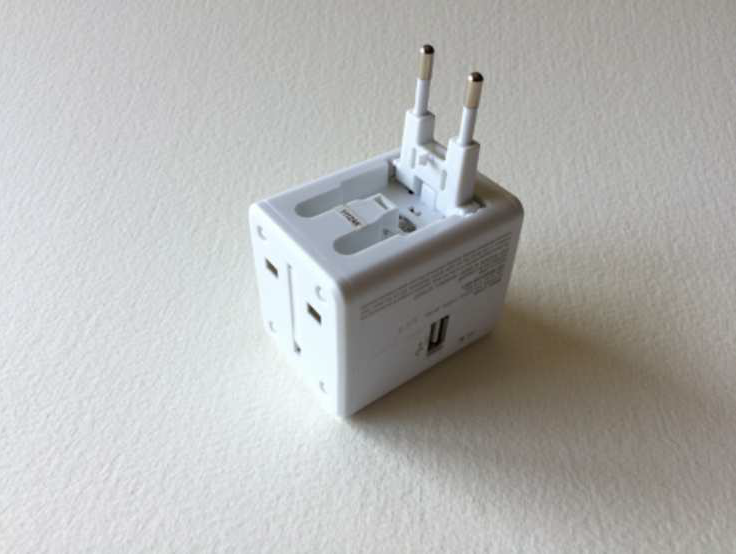
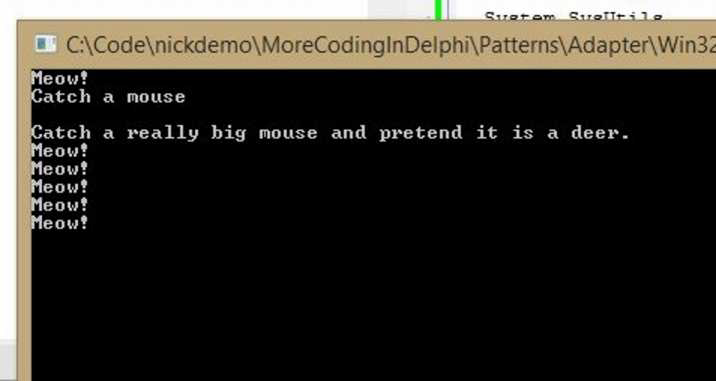

### **Введение**

Многие из вас, я уверен, путешествовали, и многие из вас, несомненно, бывали в странах, где стандартная электрическая розетка отличается от розетки в вашей родной стране. Здесь, в США, наши розетки состоят из двух параллельных слотов и отверстия под ними. Один из слотов находится под напряжением, а отверстие обеспечивает заземление.

В странах Европы розетки другие. Когда я еду туда, мне приходится брать с собой адаптер питания — устройство, которое имеет американский разъем с одной стороны и европейский штекер с другой. Я включаю адаптер в европейскую розетку, а затем подключаю свое устройство — обычно компьютер — к адаптеру. Адаптер питания моего компьютера может выполнять работу по преобразованию диапазона напряжений — обычно 110 В или 220 В — в то, что может потреблять компьютер. В зависимости от того, где я нахожусь в мире, мой компьютер использует до двух адаптеров для питания.


*(Изображение со страницы 58 / image_page058.png)*

Иногда в нашем коде нам нужен адаптер. Иногда две вещи, которые мы хотим заставить работать вместе, не совсем подходят друг другу, и нам нужно написать класс, который их согласует. Задача «адаптера» — привести один интерфейс в соответствие со вторым. Это называется паттерном Адаптер. Цель паттерна Адаптер — позволить нам обернуть что-то, чтобы оно выглядело и работало как что-то другое, чем оно на самом деле не является. Часто эти две вещи уже похожи, но это не обязательно. Подобно нашему адаптеру питания, паттерн Адаптер позволит нам взять `TSquarePeg` (квадратный колышек) и вставить его в `TRoundHole` (круглое отверстие).

Определение паттерна Адаптер звучит так: *«Паттерн, который преобразует один интерфейс в другой интерфейс, ожидаемый другим классом. Паттерн Адаптер позволяет двум разрозненным системам работать вместе, предоставляя общий интерфейс объектам, которые в противном случае были бы несовместимы»*.

Вы будете использовать паттерн Адаптер, когда вам нужно использовать существующий класс, а его интерфейс не совпадает с интерфейсом, который вам нужно использовать. Адаптер превратит существующий класс в то, что ожидает потребляющий класс.

#### **Простой пример**

Давайте начнем с простого, но наглядного примера. Попробуем найти способ сделать так, чтобы домашняя кошка выглядела как пума. Сначала определим домашнюю кошку:

```pascal
type
  IHouseCat = interface
    ['{4A5537CF-60D7-4617-95F9-9E4DC3660FB4}']
    procedure Hunt;
    procedure Meow;
  end;

  THouseCat = class(TInterfacedObject, IHouseCat)
    procedure Hunt;
    procedure Meow;
  end;

procedure THouseCat.Hunt;
begin
  WriteLn('Catch a mouse');
end;

procedure THouseCat.Meow;
begin
  WriteLn('Meow!');
end;
```

Затем определим пуму:

```pascal
type
  ICougar = interface
    ['{DD635959-ED9E-4A55-B17A-ABCE7B49204F}']
    procedure Hunt;
    procedure Growl;
  end;

  TCougar = class(TInterfacedObject, ICougar)
    procedure Hunt;
    procedure Growl;
  end;

procedure TCougar.Growl;
begin
  WriteLn('GROWL!');
end;

procedure TCougar.Hunt;
begin
  WriteLn('Run down a mule deer');
end;
```


У этих двух объектов схожие, но не идентичные интерфейсы. Можно представить ситуацию, когда вам может понадобиться использовать домашнюю кошку в качестве пумы. Ладно, может и не совсем, но давайте все равно это сделаем. Мы создадим класс-адаптер, чтобы домашняя кошка выглядела как пума.

```pascal
THouseCatAdapter = class(TInterfacedObject, ICougar)
private
  FHouseCat: IHouseCat;
public
  constructor Create(aHouseCat: IHouseCat);
  procedure Hunt;
  procedure Growl;
end;

constructor THouseCatAdapter.Create(aHouseCat: IHouseCat);
begin
  inherited Create;
  FHouseCat := aHouseCat;
end;

procedure THouseCatAdapter.Growl;
var
  i: Integer;
begin
  // Пытаемся быть пумой, мяукая много раз, чтобы имитировать рычание
  for i := 1 to 5 do
  begin
    FHouseCat.Meow;
  end;
end;

procedure THouseCatAdapter.Hunt;
begin
  WriteLn('Catch a really big mouse and pretend it is a deer.');
end;
```


Итак, что же здесь происходит?
*   Во-первых, обратите внимание, что `THouseCatAdapter` реализует интерфейс `ICougar`, что означает, что он будет делать то, что делает пума, используя домашнюю кошку в качестве адаптируемого объекта.
*   Далее, у `THouseCatAdapter` есть конструктор, который принимает `IHouseCat` в качестве параметра. Он сохраняет его внутри и использует, чтобы «притворяться» пумой. В этом и заключается секрет адаптера — он принимает адаптируемый объект в качестве параметра и использует его, чтобы быть тем, под что он адаптируется.
*   Затем метод `Hunt` заставляет кошку поймать большую мышь и притвориться, что это олень. Это часть адаптации, где домашняя кошка снова ведет себя как пума.
*   Наконец, домашняя кошка мяукает пять раз в попытке имитировать грозное рычание пумы.

По сути, класс `THouseCatAdapter` — это `ICougar`, который использует `IHouseCat` для выполнения роли пумы. Другими словами, он берет домашнюю кошку и адаптирует ее в пуму.

Чтобы продемонстрировать адаптер в действии, давайте создадим метод, который принимает пуму и делает вещи пумы:

```pascal
procedure DoCougarStuff(aCougar: ICougar);
begin
  aCougar.Hunt;
  aCougar.Growl;
end;
```

Очевидно, мы можем передать пуму в `DoCougarStuff`:

```pascal
Cougar := TCougar.Create;
DoCougarStuff(Cougar);
```


И это дает ожидаемый результат, дела пумы выполняются.

А вот и самое интересное. Вы можете создать домашнюю кошку, передать ее адаптеру и заставить эту домашнюю кошку вести себя как пуму. Смотрите:

```pascal
HouseCat := THouseCat.Create;
HouseCat.Meow;
HouseCat.Hunt;

HouseCatAdapter := THouseCatAdapter.Create(HouseCat);
DoCougarStuff(HouseCatAdapter);
```


Запустите этот код, и вы получите следующий вывод:


*(Изображение со страницы 61 / image_page061.png)*

Таким образом, кошка может стать пумой. Я знаю, моим четырем кошкам дома это бы понравилось.

#### **Более практичный пример**

Вот более практичный пример. Представьте, что вы работаете в компании, и вы поглощаете небольшой стартап. Вам поручено интегрировать их систему управления клиентами (Customer Management System) с вашей текущей. Вы смотрите на проблему, и она не кажется слишком сложной, но одно из основных различий заключается в том, как новая система обрабатывает дни рождения и имена клиентов. В вашей системе просто есть свойство 'Name', но в новой системе есть `FirstName` и `LastName`. Ваша система хранит дату рождения клиента в такой структуре:

```pascal
TDateOfBirth = record
  Month: integer;
  Day: integer;
  Year: integer;
end;
```

в то время как новая система использует старый добрый `TDate`. Что делать?
Ну, во-первых, давайте разработаем интерфейсы для двух систем:

```pascal
IOldCustomer = interface
  ['{14C3F1DB-0901-4AB7-8F6E-346C4BBA2E43}']
  function GetName: string;
  procedure SetName(aName: string);
  function GetDateOfBirth: TDateOfBirth;
  procedure SetDateOfBirth(aDateOfBirth: TDateOfBirth);
  property Name: string read GetName write SetName;
  property DateOfBirth: TDateOfBirth read GetDateOfBirth write SetDateOfBirth;
end;

INewCustomer = interface
  ['{BDACD6A1-C181-4A06-978F-6CAB72CD229B}']
  function GetFirstName: string;
  procedure SetFirstName(aFirstName: string);
  function GetLastName: string;
  procedure SetLastName(aLastName: string);
  function GetDateOfBirth: TDate;
  procedure SetDateOfBirth(aDOB: TDate);
  property FirstName: string read GetFirstName write SetFirstName;
  property LastName: string read GetLastName write SetLastName;
  property DateOfBirth: TDate read GetDateOfBirth write SetDateOfBirth;
end;
```

Затем давайте создадим реализации для обоих интерфейсов:

```pascal
TOldCustomer = class(TInterfacedObject, IOldCustomer)
strict private
  FName: string;
  FDOB: TDateOfBirth;
  function GetName: string;
  procedure SetName(aName: string);
  function GetDateOfBirth: TDateOfBirth;
  procedure SetDateOfBirth(aDateOfBirth: TDateOfBirth);
public
  constructor Create(aName: string; aYear, aMonth, aDay: integer);
  property Name: string read GetName write SetName;
  property DateOfBirth: TDateOfBirth read GetDateOfBirth write SetDateOfBirth;
end;

TNewCustomer = class(TInterfacedObject, INewCustomer)
strict private
  FFirstName: string;
  FLastName: string;
  FDOB: TDate;
  function GetFirstName: string;
  procedure SetFirstName(aFirstName: string);
  function GetLastName: string;
  procedure SetLastName(aLastName: string);
  function GetDateOfBirth: TDate;
  procedure SetDateOfBirth(aDOB: TDate);
public
  property FirstName: string read GetFirstName write SetFirstName;
  property LastName: string read GetLastName write SetLastName;
  property DateOfBirth: TDate read GetDateOfBirth write SetDateOfBirth;
end;
```

Реализации для обоих классов — это именно то, что вы ожидаете, поэтому я не буду их здесь показывать. Важно то, что у нас есть два похожих класса, но они не совсем подходят друг другу. Это колышки, но один круглый, а другой квадратный. Что делать? Паттерн Адаптер спешит на помощь!

Вот адаптер клиента:

```pascal
TCustomerAdapter = class(TInterfacedObject, INewCustomer)
strict private
  FFirstName: string;
  FLastName: string;
  FDOB: TDate;
  function GetFirstName: string;
  procedure SetFirstName(aFirstName: string);
  function GetLastName: string;
  procedure SetLastName(aLastName: string);
  function GetDateOfBirth: TDate;
  procedure SetDateOfBirth(aDOB: TDate);
  function ParseFirstName(aName: string): string;
  function ParseLastName(aName: string): string;
public
  constructor Create(aOldCustomer: IOldCustomer);
  property FirstName: string read GetFirstName write SetFirstName;
  property LastName: string read GetLastName write SetLastName;
end;
```

Здесь основная работа выполняется в конструкторе:

```pascal
constructor TCustomerAdapter.Create(aOldCustomer: IOldCustomer);
begin
  inherited Create;
  FFirstName := ParseFirstName(aOldCustomer.Name);
  FLastName := ParseLastName(aOldCustomer.Name);
  FDOB := EncodeDate(aOldCustomer.DateOfBirth.Year,
                     aOldCustomer.DateOfBirth.Month, 
                     aOldCustomer.DateOfBirth.Day);
end;
```

`ParseFirstName` и `ParseLastName` — это просто простые методы, которые разбирают имя и фамилию, чтобы мы могли преобразовать «старое» имя в «новое».

Однако важнее отметить, что конструктор `TCustomerAdapter` принимает интерфейс `IOldCustomer` в качестве параметра. Таким образом, если у вас есть старый клиент — из исходной системы — и вам нужно использовать его в новой системе, вы можете просто вызвать:

```pascal
var
  OldCustomer: IOldCustomer;
  NewCustomerAdapter: INewCustomer;
...
  OldCustomer := TOldCustomer.Create('Marvin Martian', 1945, 12, 25);
  NewCustomerAdapter := TCustomerAdapter.Create(OldCustomer);
  OutputNewCustomer(NewCustomerAdapter);
```

`OutputNewCustomer` объявлен следующим образом:

```pascal
procedure OutputNewCustomer(aCustomer: INewCustomer);
begin
  WriteLn('First Name: ', aCustomer.FirstName);
  WriteLn('Last Name: ', aCustomer.LastName);
  WriteLn('DOB: ', DateToStr(aCustomer.DateOfBirth));
end;
```

Обратите внимание, что он принимает `INewCustomer` в качестве параметра и охотно принимает переменную `NewCustomerAdapter` в качестве входных данных, зная, что эта переменная будет вести себя точно так же, как клиент в новой системе.

> Не должно быть сюрпризом, что все эти соединения устанавливаются с помощью интерфейсов. Интерфейсы, как обсуждалось в *Coding in Delphi*, делают ваш код очень гибким, и паттерн Адаптер — это еще один тому пример. Вы даже можете использовать его для добавления интерфейсов в классы, у которых их нет, не меняя оригинальный код.

**Заключение**

Вот и паттерн Адаптер в двух словах: создайте адаптер, который принимает «старую» вещь в качестве параметра в конструкторе, и заставьте его вести себя как «новая» вещь в своей реализации. Мы используем паттерн Адаптер, когда старый интерфейс и новый интерфейс несовместимы, но должны работать вместе.
