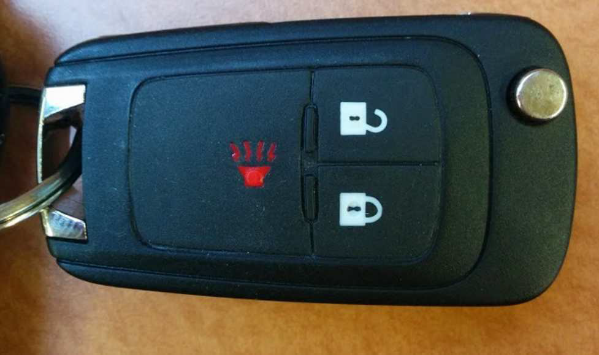
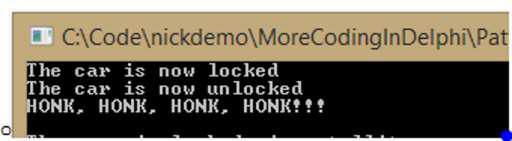
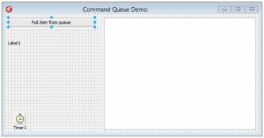
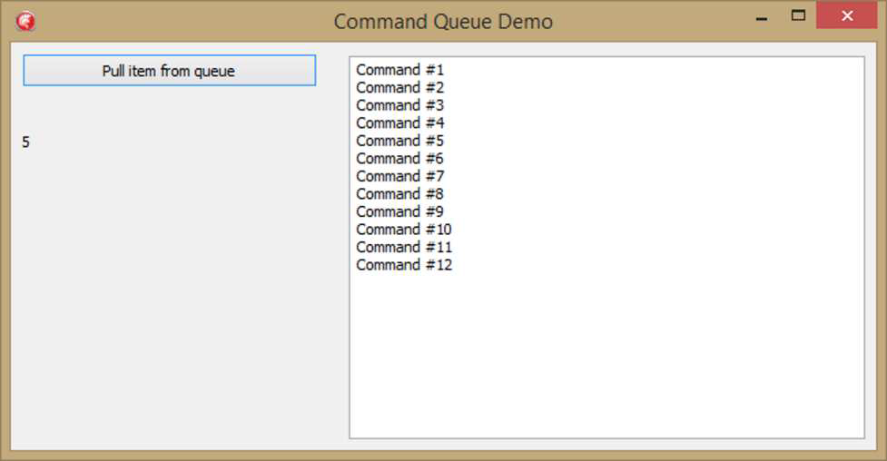

### **Введение** 

В первой главе я рассказывал о важности инкапсуляции. Надеюсь, в итоге вам захотелось инкапсулировать всё, что только можно. В этой главе мы рассмотрим инкапсуляцию вызова методов. Мы научимся инкапсулировать выполнение кода так, чтобы объектам, запускающим его, даже не нужно было знать, как и что именно он делает. Мы сможем легко выбирать разный код для запуска в зависимости от ситуации. Ваши объекты будут просто вызывать простой метод, а обработку вызова возьмёт на себя внешний объект. Вы сможете ставить команды в очередь и сохранять их для отмены действий. И заодно мы применим наши навыки внедрения зависимостей (Dependency Injection), чтобы ещё чётче разделить ответственность между объектами и предоставляемой ими функциональностью.

> Если вы использовали компоненты TAction в VCL, вы используете шаблон Command. Действия представляют собой абстракцию от понятия события VCL и позволяют отделить вызов команды от самой команды.

Формальное определение шаблона команд из “Банды четырех” таково:
*Инкапсулируйте запрос как объект, тем самым позволяя вам параметризовать клиентов с различными запросами, запросами очереди или журнала и поддерживать операции, которые невозможно отменить.*

##### **Простой пример: Автомобильный брелок для ключей**

В наши дни большинство новых автомобилей комплектуются не просто набором ключей – к ним прилагается брелок для ключей, который позволяет дистанционно запирать и отпирать автомобиль. В большинстве из них также есть “аварийная кнопка”, которая отключает автомобильный гудок. Некоторые из них даже позволяют удаленно запускать автомобиль. В любом случае, это хороший пример объекта, который выполняет команды, которые могут быть инкапсулированы.

**Брелок от моего Chevrolet Spark 2014 года**


*(Изображение со страницы 77 image_page077.png)*

Сначала определим простой интерфейс:
```pascal
type
  ISimpleCommand = interface
    ['{364D931B-CBE5-44AF-BA40-935DC28B497F}']
    procedure Execute;
  end;
```  
ISimpleCommand определяет, ну, простую команду. У неё есть единственный метод Execute, который мы будем использовать для вызова нужной функциональности. Проще уже некуда.

Настоящая мощь ISimpleCommand проявляется в реализации команд, которые можно выполнять. Большинство таких брелоков работают локально с небольшим передатчиком. Давайте реализуем несколько команд, которые можно выполнять с помощью локального радио для работы в качестве автомобильного брелока:

```pascal
TLocalCarLocker = class(TInterfacedObject, ISimpleCommand)
  procedure Execute;
end;

TLocalCarUnlocker = class(TInterfacedObject, ISimpleCommand)
  procedure Execute;
end;

TLocalEmergencyHorn = class(TInterfacedObject, ISimpleCommand)
  procedure Execute;
end;

procedure TLocalEmergencyHorn.Execute;
begin
  WriteLn('HONK, HONK, HONK, HONK!!!');
end;

procedure TLocalCarUnlocker.Execute;
begin
  WriteLn('The car is now unlocked');
end;

procedure TLocalCarLocker.Execute;
begin
  WriteLn('The car is now locked');
end;
```

Обратите внимание, что эти классы специфичны для функциональности брелока. Они следуют Принципу единственной ответственности (Single Responsibility Principle), делая только одно и ничего более. Всю свою работу они выполняют в методе `Execute` интерфейса `ISimpleCommand`. Но самое важное заключается в том, что их можно легко внедрить в класс с именем `TAutoKeyFob`.

```pascal
type
  TAutoKeyFob = class
  private
    FLockButton: ISimpleCommand;
    FUnlockButton: ISimpleCommand;
    FEmergencyButton: ISimpleCommand;
  public
    constructor Create(aLocker: ISimpleCommand; aUnlocker: ISimpleCommand; aEmergencyHorn: ISimpleCommand);
    procedure PressLockButton;
    procedure PressUnlockButton;
    procedure PressEmergencyButton;
  end;

constructor TAutoKeyFob.Create(aLocker: ISimpleCommand; aUnlocker: ISimpleCommand;
  aEmergencyHorn: ISimpleCommand);
begin
  inherited Create;
  FLockButton := aLocker;
  FUnlockButton := aUnlocker;
  FEmergencyButton := aEmergencyHorn;
end;

procedure TAutoKeyFob.PressEmergencyButton;
begin
  FEmergencyButton.Execute;
end;

procedure TAutoKeyFob.PressLockButton;
begin
  FLockButton.Execute;
end;

procedure TAutoKeyFob.PressUnlockButton;
begin
  FUnlockButton.Execute;
end;
```

Вот несколько моментов, на которые стоит обратить внимание в приведенном выше классе:

- Он использует внедрение зависимостей (Dependency Injection) — конкретно, внедрение через конструктор — для получения своих зависимостей. Это всегда хорошо.
- Все его зависимости имеют тип `ISimpleCommand`.
- У брелока есть три кнопки и, следовательно, три метода, которые «нажимают» каждую из этих трех кнопок.
- Итог: Этот класс не может быть проще, но он все равно выполняет свою работу.

Затем вы можете создать экземпляр `TAutoKeyFob` и выполнить его команды следующим образом:

```pascal
var
  AutoKeyFob: TAutoKeyFob;
begin
  AutoKeyFob := TAutoKeyFob.Create(TLocalCarLocker.Create,
                                   TLocalCarUnlocker.Create,
                                   TLocalEmergencyHorn.Create);
  try
    AutoKeyFob.PressLockButton;
    AutoKeyFob.PressUnlockButton;
    AutoKeyFob.PressEmergencyButton;
  finally
    AutoKeyFob.Free;
  end;
end;
```

и вы получите следующий вывод: 


*(Изображение со страницы 79 image_page079.png)*

Так в чем же суть? Зачем обеспечивать такой уровень косвенности, когда вы могли бы так же легко добавить функциональность прямо в методы `TAutoKeyFob`? Что ж, я расскажу вам, а затем покажу. Во-первых, косвенность позволяет самой функциональности быть должным образом инкапсулированной в отдельных классах. Во-вторых, и... что более важно, это позволяет очень легко заменить, обновить или иным образом изменить функциональность класса, не вскрывая его. Таким образом, паттерн Команда не только обеспечивает соблюдение Принципа единственной ответственности, но и демонстрирует Принцип открытости/закрытости (Open/Closed Principle).

Каким образом? Позволяя вам полностью изменить то, что происходит при нажатии кнопок, не изменяя и не касаясь кода в `TAutoKeyFob`. Смотрите: Сначала мы объявляем новый вид функциональности. В мою машину встроено приложение, которое позволяет мне удаленно управлять ею с помощью приложения на телефоне через спутник. Мы можем создать набор команд, которые используют этот спутник для управления автомобилем вместо локального передатчика.

```pascal
TSatelliteCarLocker = class(TInterfacedObject, ISimpleCommand)
  procedure Execute;
end;

TSatelliteCarUnlocker = class(TInterfacedObject, ISimpleCommand)
  procedure Execute;
end;

TSatelliteEmergencyHorn = class(TInterfacedObject, ISimpleCommand)
  procedure Execute;
end;

procedure TSatelliteCarLocker.Execute;
begin
  WriteLn('Машина заблокирована через спутник'); 
end;

procedure TSatelliteCarUnlocker.Execute;
begin
  WriteLn('Машина разблокирована через спутник'); 
end;

procedure TSatelliteEmergencyHorn.Execute;
begin
  WriteLn('Машина сигналит "БИП" через спутник');
end;
```

Здесь функциональность снова инкапсулирована в простых, чистых классах. И мы можем легко назначить эту функциональность брелоку:

```pascal
AutoKeyFob := TAutoKeyFob.Create(TSatelliteCarLocker.Create,
                                 TSatelliteCarUnlocker.Create,
                                 TSatelliteEmergencyHorn.Create);
try
  AutoKeyFob.PressLockButton;
  AutoKeyFob.PressUnlockButton;
  AutoKeyFob.PressEmergencyButton;
finally
  AutoKeyFob.Free;
end;
```

И теперь, не изменяя брелок, мы получили тот, который связывается с машиной через спутник. Обратите внимание, что мы могли бы даже комбинировать функциональность, скажем, заблокировать и разблокировать двери через спутник, а функцию аварийного сигнала выполнить через локальное радио.

Ключевое сообщение здесь заключается в том, что паттерн Команд разделяет функциональность и объект, который её использует. Брелок понятия не имеет, что произойдет, когда его кнопки будут нажаты. Он просто знает, что работа будет выполнена при вызове `Execute`. Теоретически, мы могли бы легко заставить одну из кнопок включать фары автомобиля или запускать двигатель. Мы могли бы даже написать код для изменения функциональности во время выполнения, если бы это было нужно. Черт возьми, мы могли бы запрограммировать брелок на управление тостером. Вот сила и гибкость, которые мы получаем при использовании паттерна Команд.

### Отмена команд (Undoing Commands)

Паттерн Команда также делает возможной реализацию функциональности отмены действий. Для этого ваша команда должна знать, как отменить саму себя, а ваше приложение должно поддерживать стек выполненных команд, позволяя вам вызывать эту функциональность отмены в обратном порядке.

Чтобы это произошло, наш интерфейс команды добавляет еще один метод, называемый — что неудивительно — `Undo`:
```pascal
type
  IPointCommand = interface
    ['{5D792581-9D05-4A52-BE44-4EB0CB0D3B3B}']
    procedure Execute;
    procedure Undo;
  end;
```
Теперь интерфейс сможет представлять класс, который может выполнить (`Execute`) свою команду, а затем отменить (`Undo`) эту команду, когда его об этом попросят.

Чтобы продемонстрировать это, я собираюсь использовать VCL-приложение, которое рисует и «стирает» маленькие красные точки. Вот шаги для начала работы:

1. Создайте новое VCL-приложение.
2. Разместите компонент `TPanel`, очистите его свойство `Caption`, а затем установите свойство `Align` в значение `alTop`.
3. Разместите компонент `TPaintBox` в основной области формы и установите его свойство `Align` в значение `alClient`.
4. Разместите две кнопки `TButton` на панели `TPanel`, задав одной заголовок (Caption) «Undo» (Отмена), а другой — «Clear» (Очистить).
5. Разместите метку `TLabel` на панели.
6. Выровняйте их все и сделайте так, чтобы они выглядели красиво. У вас должно получиться что-то похожее на это:
   

*(Изображение со страницы 82 / image_page082.png)*

Далее создайте отдельный модуль и назовите его `uPointCommand.pas`. Сначала мы добавим приведенный выше интерфейс `IPointCommand` в этот модуль. Затем мы добавим реализацию `IPointCommand`:
```pascal
type
  IPointCommand = interface
    ['{5D792581-9D05-4A52-BE44-4EB0CB0D3B3B}']
    procedure Execute;
    procedure Undo;
  end;

  TPointPlacerCommand = class(TInterfacedObject, IPointCommand)
  private
    FCanvas: TCanvas;
    FPoint: TPoint;
  public
    constructor Create(aCanvas: TCanvas; aPoint: TPoint);
    procedure Execute;
    procedure Undo;
  end;

const
  CircleDiameter = 15;

constructor TPointPlacerCommand.Create(aCanvas: TCanvas; aPoint: TPoint);
begin
  inherited Create;
  FCanvas := aCanvas;
  FPoint := aPoint;
end;

procedure TPointPlacerCommand.Execute;
var
  FOriginalColor: TColor;
begin
  FOriginalColor := FCanvas.Brush.Color;
  try
    FCanvas.Brush.Color := clRed;
    FCanvas.Pen.Color := clRed;
    FCanvas.Ellipse(FPoint.X, FPoint.Y, FPoint.X + CircleDiameter, FPoint.Y + CircleDiameter);
  finally
    FCanvas.Brush.Color := FOriginalColor;
    FCanvas.Pen.Color := FOriginalColor;
  end;
end;

procedure TPointPlacerCommand.Undo;
begin
  FCanvas.Ellipse(FPoint.X, FPoint.Y, FPoint.X + CircleDiameter, FPoint.Y + CircleDiameter);
end;
```
Обратите внимание, что команда выполняет всю работу по рисованию на холсте (Canvas), который ей передается. Конструктор принимает `TCanvas` и `TPoint`. Они сохраняются, чтобы команда могла их «помнить». В команде `Execute` она рисует маленькую красную точку на холсте. Команда `Undo` просто закрашивает то же самое место исходным цветом холста.

Теперь вернемся к главной форме. Во-первых, нам нужен способ собирать и управлять всеми точками, которые мы планируем размещать на `TPaintBox` щелчком мыши. Нам также захочется запоминать их в обратном порядке, чтобы мы могли отменять их в порядке, обратном их появлению. И что может сделать эту работу лучше, чем стек? Мы порыщем в нашем мешке с трюками, иначе известном как Spring для Delphi, и используем его реализацию `IStack`. Таким образом, мы объявим эту переменную как приватную:
```pascal
FDots: IStack<IPointCommand>;
```
и мы инициализируем её в событии `OnCreate` формы:
```pascal
procedure TUndoExampleForm.FormCreate(Sender: TObject);
begin
  FDots := TCollections.CreateStack<IPointCommand>;
end;
```
Далее мы будем создавать `IPointCommand` каждый раз, когда происходит событие  `OnMouseUp`:
```pascal
procedure TUndoExampleForm.PaintBox1MouseUp(Sender: TObject; Button:
  TMouseButton; Shift:
  TShiftState; X, Y: Integer);
var
  LCommand: IPointCommand;
begin
  LCommand := TPointPlacerCommand.Create(PaintBox1.Canvas, TPoint.Create(X, Y));
  LCommand.Execute;
  FDots.Push(LCommand);
  UpdateLabel;
end;
```
Здесь мы создаем новую команду, вызываем метод `Execute`, который рисует точку на `TPaintBox`, а затем помещаем её в стек для дальнейшего использования в процессе отмены (Undo). `UpdateLabel` — это простой метод, который обновляет `TLabel`, выводящий общее количество точек на экране.
```pascal
procedure TUndoExampleForm.UpdateInfo;
begin
  Label1.Caption := 'Number of Dots: ' + FDots.Count.ToString();
end;
```
Теперь перейдем к части «зачем мы здесь»: собственно отмене точек. Помните, что команды сохранены в стеке и что они помнят, где находятся. Поэтому отменять действия довольно легко. Мы предоставляем обработчик события `OnClick` для кнопки Undo:
```pascal
procedure TUndoExampleForm.btnUndoClick(Sender: TObject);
begin
  if FDots.Count > 0 then
  begin
    FDots.Pop.Undo;
  end;
  UpdateLabel;
end;
```
Сначала мы проверяем, есть ли вообще точки, и если есть, мы просто делаем `Pop` верхней — то есть последней точки, которую мы положили — со стека. Затем мы вызываем метод `Undo` для команды, чтобы последняя нарисованная нами точка была закрашена исходным цветом холста.

Кнопка Clear делает то же самое для всех точек:
```pascal
procedure TUndoExampleForm.btnClearClick(Sender: TObject);
begin
  if FDots.Count > 0 then
  begin
    repeat
      FDots.Pop.Undo;
    until FDots.Count = 0;
  end;
  UpdateLabel;
end;
```

И последнее — любое хорошее Окно должно уметь перерисовывать себя по требованию, поэтому мы предоставляем обработчик `OnPaint` для paintbox, который просто вызывает метод `Execute` для каждой точки.
```pascal
procedure TUndoExampleForm.PaintBox1Paint(Sender: TObject);
var
  LDot: IPointCommand;
begin
  for LDot in FDots do
  begin
    LDot.Execute;
  end;
end;
```
И на этом всё. Запустите приложение, и вы должны увидеть красную точку везде, где щелкнете мышью на paintbox. Нажмите кнопку «Undo», и они будут «отменены» в обратном порядке. Нажатие кнопки «Clear» заставит их всех исчезнуть. Если вы хотите увидеть работу отмены в действии, щелкните кучу раз в одном и том же месте, а затем отмените их. Вы должны увидеть части точек, которые были закрашены, когда точки поверх них удаляются.

Форма на самом деле знает только об `IPointCommand` — мы, вероятно, использовали бы Фабрику или контейнер внедрения зависимостей (Dependency Injection), чтобы фактически создать экземпляр `TPointPlacerCommand` за нас, чтобы форма могла не знать о реализации. Интерфейс `IPointCommand` дает нам метод `Execute`, который рисует точку, и метод `Undo`, который знает, как «стереть» точку. Таким образом, мы по сути разделили вызов команд от выполнения фактического кода, предоставив возможности отмены. Довольно гладко. Опять же — разделение ответственности делает код чистым и поддерживаемым.

### **Простая очередь команд**

Часть определения паттерна Команда гласит, что вы можете ставить команды в очередь и выполнять их по мере необходимости или желания. В этом разделе мы рассмотрим простое применение этой идеи, помещая команды в очередь с помощью таймера, а затем извлекая их, когда вы нажимаете кнопку. Таким образом, вы можете собирать команды для последующего выполнения. Вы можете определить команду как угодно и заставить её делать свое дело в методе `Execute`. Это просто еще один пример возможности «накопить» функциональность для выполнения в более позднее время.

#### Очередь команд (QueueCommand

Сначала мы определим простой интерфейс команды:
```pascal
type
  IQueueCommand = interface
    ['{380B35B6-3157-4835-BDC7-6BD7746F1147}']
    procedure Execute(aMemo: TMemo);
  end;
```

Метод `Execute` принимает `TMemo`, потому что команда будет просто сообщать о своем существовании в Memo. Мы реализуем этот интерфейс следующим образом:

```pascal
TQueueCommand = class(TInterfacedObject, IQueueCommand)
private
  FID: integer;
public
  constructor Create(aID: integer);
  procedure Execute(aMemo: TMemo);
  property ID: integer read FID;
end;
```

Вот реализации конструктора и метода Execute:

```pascal
constructor TQueueCommand.Create(aID: integer);
begin
  inherited Create;
  FID := aID;
end;

procedure TQueueCommand.Execute(aMemo: TMemo);
begin
  aMemo.Lines.Add('Command #' + ID.ToString());
end;
```

Конструктор просто сохраняет ID для команды. Метод `Execute` просто берет переданное memo и выписывает номер команды. Это очень просто и наглядно. Опять же, ваш интерфейс команды будет простым, но реализация команды может делать всё, что вам нужно.

Давайте создадим новое VCL-приложение, которое выглядит так:


*(Изображение со страницы 86 / image_page086.png)*

Таймер будет использоваться для добавления до десяти команд в очередь, а кнопка будет вытаскивать их и выполнять.

Мы будем использовать модуль `Spring.Collections`, поэтому добавьте его в секцию `uses` вашего интерфейса. Далее добавьте эти две переменные в приватную секцию вашей формы:

```pascal
Counter: integer;
CommandQueue: IQueue<IQueueCommand>;
```

Дважды щелкните по форме и добавьте следующий код в событие `OnCreate` формы:

```pascal
procedure TForm49.FormCreate(Sender: TObject);
begin
  Counter := 1;
  CommandQueue := TCollections.CreateQueue<IQueueCommand>;
end;
```

Здесь мы просто настраиваем вещи для запуска приложения. Дважды щелкните по таймеру и добавьте следующий код в его событие `OnTimer`:

```pascal
procedure TForm49.Timer1Timer(Sender: TObject);
var
  LCommand: IQueueCommand;
begin
  if CommandQueue.Count <= 10 then
  begin
    LCommand := TQueueCommand.Create(Counter);
    Inc(Counter);
    CommandQueue.Enqueue(LCommand);
    Label1.Caption := CommandQueue.Count.ToString();
  end;
end;
```

Сначала мы разрешаем только десять элементов в очереди. Если их меньше десяти, мы создаем новую команду, присваиваем её интерфейсу, увеличиваем счетчик, добавляем команду в очередь, а затем обновляем метку с количеством элементов в очереди. Таймер запустится, когда запустится приложение, и начнет размещать команды в очереди.

Затем дважды щелкните по кнопке и добавьте следующий код в её обработчик события `OnClick`:

```pascal
procedure TForm49.Button1Click(Sender: TObject);
var
  LCommand: IQueueCommand;
begin
  if CommandQueue.Count > 0 then
  begin
    LCommand := CommandQueue.Dequeue;
    LCommand.Execute(Memo1);
    Label1.Caption := CommandQueue.Count.ToString();
  end;
end;
```

Если в очереди что-то есть, мы извлекаем (`Dequeue`) ведущий элемент (Очереди — это структуры данных «Первым пришел, первым вышел») и вызываем его метод `Execute`. Наконец, мы обновляем метку с количеством элементов в очереди, так как оно изменилось.
Теперь вы сможете запустить приложение и наблюдать, как команды добавляются в очередь. Вы можете нажать кнопку, чтобы удалить элементы из очереди, и увидите, как они отобразятся в поле мемо.


*(Изображение со страницы 88 image_page088.png)*

Это довольно простое приложение, но оно иллюстрирует важную часть паттерна «Команда» — возможность ставить выполнение кода в очередь. Можно представить себе ведение очереди внешних запросов или запросов, поступающих через TCP/IP-соединение или какой-либо другой канал связи. Можно даже создать отдельные потоки для каждой команды. Паттерн позволяет гибко выполнять конкретные действия. Возможно, вам потребуется ограничить количество запросов, обрабатываемых в любой момент времени, из-за ограничений ресурсов. (Представьте, что поступают запросы на печать, а у вас есть только два принтера.)

Вы также можете использовать паттерн «Команда» для создания транзакционной системы, накапливая команды, а затем обеспечивая условие, при котором выполняются либо все они, либо ни одна.

### **Резюме**

Мы рассмотрели несколько различных способов, с помощью которых паттерн «Команда» может разделить ответственность в вашем коде, при этом обеспечивая мощную функциональность. Мы развязали действия автомобильного брелока с тем, что именно делают кнопки. Вы могли бы сделать то же самое в своих приложениях. На самом деле, если вы используете `TActions` в своих приложениях, вы делаете именно это.

Мы увидели, как можно использовать этот паттерн для добавления функции отмены (Undo) в наше приложение. Мы смогли стирать точки на нашей форме, используя стек команд, которые «знали», как отменить свое рисование.

И наконец, мы увидели, как можно накапливать команды для последующего выполнения, используя очередь для управления входящими запросами и выполнения их по требованию.

Паттерн «Команда» — это просто еще один пример того, как мы можем развязать наш код. В данном случае мы можем отделить код для данного действия от механизма, который выполняет этот код. Это еще один пример того, как написание чистого кода, разделяющего ответственность, может способствовать созданию кода, удобного для сопровождения и расширения. В дополнение к уменьшению связности, паттерн «Команда» также может быть отличным способом управления изменяемостью, не только для реализации отмены действий, как мы сделали здесь, но, возможно, путем его расширения так, чтобы вы могли откатиться к любому предыдущему состоянию базовых объектов.
