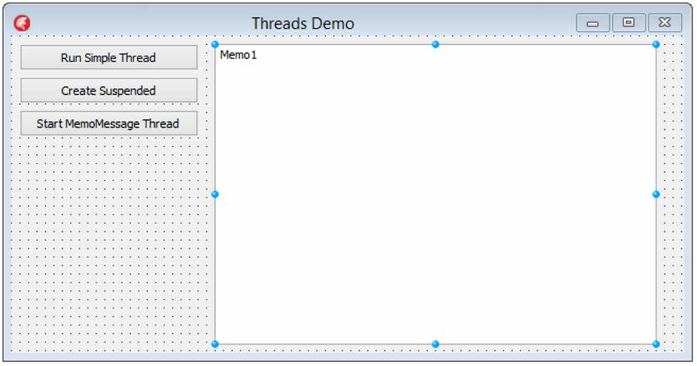
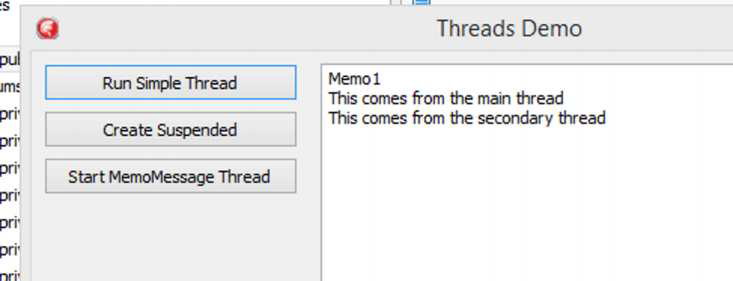
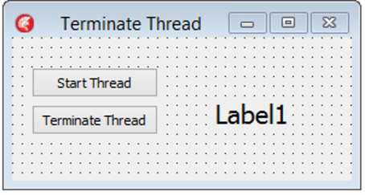
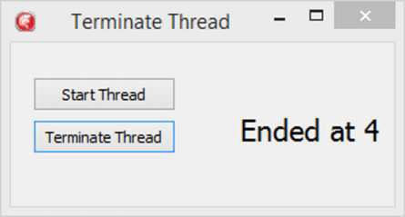
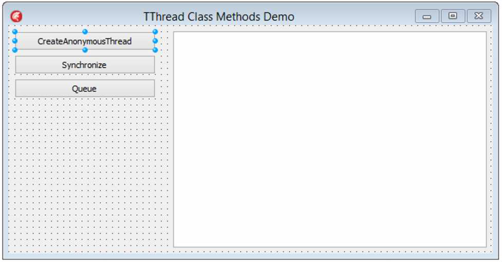
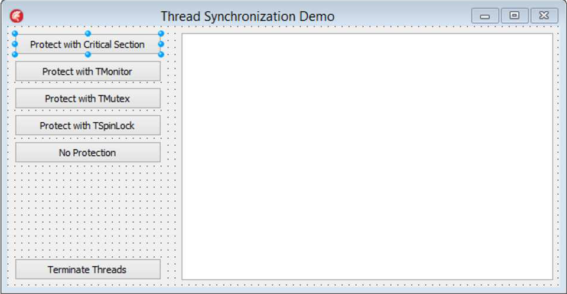
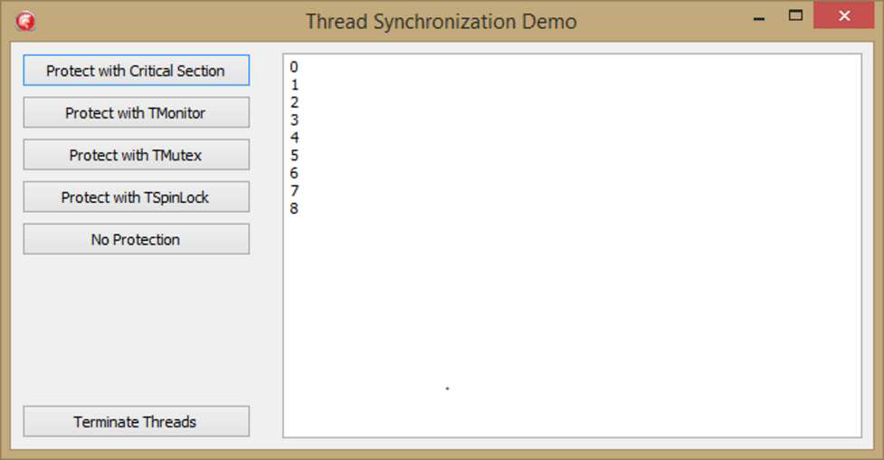
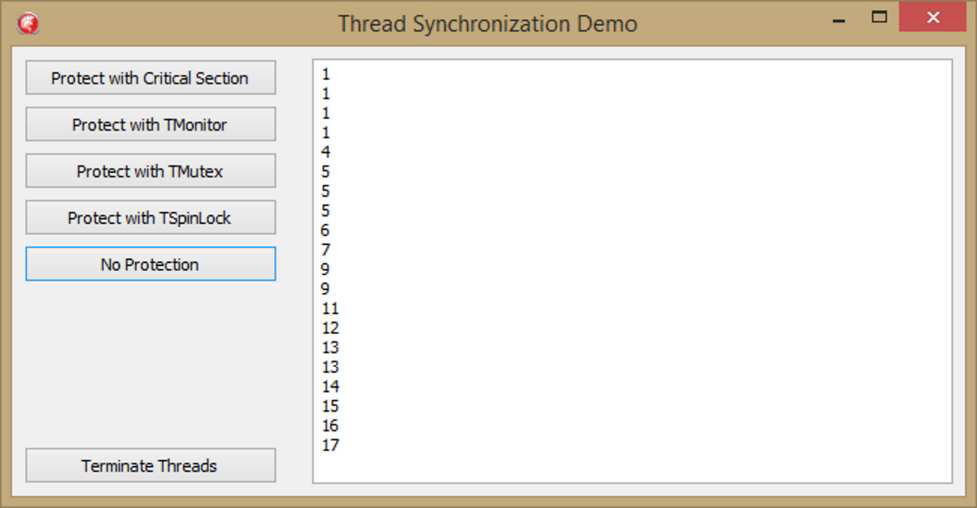

### **Введение**

Когда был представлен Delphi 1 — это было давно, в 1995 году — это был 16-битный инструмент, работавший на Windows 3.1. Это были деньки, а? В любом случае, Windows 3.1 не поддерживала многопоточность; она использовала нечто под названием «кооперативная многозадачность» (cooperative multitasking). Это означало, что ОС управляла «передачей эстафетной палочки» между различными процессами, имитируя многопоточную систему. Проблемы могли и легко возникали, когда приложение отказывалось отдавать палочку. Это было, мягко говоря, неоптимально.

Delphi 2 вышел примерно через год после Delphi 1, и это была 32-битная система, работавшая на Windows 95. Windows 95 позволяла настоящую многопоточность, и, таким образом, Delphi 2 поддерживал потоки через класс под названием `TThread`.

`TThread` в Delphi 2 был довольно простым, и с тех пор `TThread` был улучшен и расширен, используя такие вещи, как анонимные методы.

Эта глава охватит основы `TThread`. Мы не будем углубляться в низкоуровневые вызовы Win32/64 API, которые инкапсулирует `TThread`. Вместо этого мы сосредоточимся на функциональности, которую предоставляет Delphi.

### **Наследование от TThread**

##### **TVerySimpleThread**

Хорошо, давайте начнем с очень, очень простого демо, которое иллюстрирует основы того, как создать класс потока и как поток занимается своими делами. Первое, что мы хотим сделать, — это создать потомка `TThread`. Вот один из них:

```pascal
unit uVerySimpleThread;

interface

uses
  System.Classes, VCL.StdCtrl, System.SysUtils;

type
  TVerySimpleThread = class(TThread)
  private
    FMemo: TMemo;
    FConcatenatedString: string;
  protected
    procedure Execute; override;
  public
    constructor Create(aMemo: TMemo; String1, String2: string);
end;

implementation

constructor TVerySimpleThread.Create(aMemo: TMemo; String1, String2: string);
begin
  if aMemo = nil then
  begin
    raise Exception.Create('You must pass a valid Memo'); 
    // Вы должны передать действительный Memo
  end;

  inherited Create(False);
  FreeOnTerminate := True;
  FMemo := aMemo;
  FConcatenatedString := String1 + ' ' + String2;
end;

procedure TVerySimpleThread.Execute;
begin
  Synchronize(procedure
  begin
    FMemo.Lines.Add('The concatenated string is: ' + FConcatenatedString); // Результирующая строка:
  end);
end;

end.
```

`TVerySimpleThread` — это — сюрприз! — очень простой поток, который не делает ничего, кроме как берет две строки, объединяет их и записывает результат в `TMemo`. Вот несколько вещей, на которые стоит обратить внимание:

*   `TVerySimpleThread` наследуется от `TThread`. `TThread` — это обертка вокруг понятия потока. Я говорю «понятие», потому что `TThread` — это кроссплатформенная абстракция потока.
*   Любой создатель потомка `TThread` обязан переопределить абстрактный метод `Execute`, что `TVerySimpleThread` и делает. Метод `Execute` — это место, где поток выполняет свою работу. Ничто в потоке не происходит вне `Execute`. Поток ничего не будет делать, пока не будет вызван его метод `Execute`. Метод `Execute` всегда вызывается новым потоком после того, как он создан операционной системой как часть инкапсуляции `TThread`. Вы никогда не должны вызывать `Execute` самостоятельно.
*   Конструктор делает несколько интересных вещей. Во-первых, он проверяет, не передаете ли вы `nil` в memo. Затем он вызывает унаследованный конструктор, передавая `False`. `TThread` имеет единственный конструктор, который принимает булевский параметр с именем `CreateSuspended`. Этот параметр определяет, должен ли поток запуститься сразу или ждать ручного запуска. В данном случае мы передаем `False`, что означает, что поток не будет приостановлен при создании. Что это значит? Это значит, что метод `Execute` будет вызван, когда поток будет создан. И помните, ничто в потоке не происходит, пока не вызван `Execute`. Следующая строка кода конструктора устанавливает `FreeOnTerminate` в `True`. Это указывает, что поток будет освобожден автоматически, когда он закончит делать то, что должен — то есть, когда метод `Execute` завершится. Когда метод `Execute` заканчивается, поток завершается. То есть, его свойство `Terminated` устанавливается в `True`. Как только это происходит, поток уничтожает сам себя. Теперь, когда вы делаете это, вы должны быть осторожны, что метод `Execute` определенно завершится и не зависнет или не выйдет за пределы завершения приложения, так как у вас не будет контроля над потоком, как только он установлен. Поток все еще может работать, когда приложение завершается, так что используйте это с осторожностью.

*   Конструктор принимает `TMemo` в качестве параметра и сохраняет его для последующего использования, убедившись, что он не `nil`.
*   В методе `Execute` мы записываем простое сообщение в сохраненное нами memo.

Довольно просто, как я и сказал. Но подождите, в методе `Execute` происходит что-то интересное, да? Там есть вызов `Synchronize` с анонимным методом, оборачивающим вызов к memo. Что это все значит?

VCL не является «потокобезопасным» (thread-safe). Это означает, что вы не можете полагаться на VCL в том, что он сделает правильную вещь в многопоточной среде. VCL включает отрисовку, рисование и мониторинг ввода UI и всевозможные вещи, которые не могут функционировать должным образом, когда задействовано несколько потоков. Таким образом, любые действия в VCL, которые выполняет поток, должны быть «синхронизированы» с главным потоком. Это то, что делает вызов `Synchronize` здесь. По сути, он говорит: «Эй, у меня есть код VCL, который нужно запустить здесь. Давайте остановим все, дадим коду VCL выполниться в главном потоке, а затем вернемся к делам». Таким образом, всякий раз, когда вы хотите запустить код VCL в потоке, вам нужно использовать `Synchronize`. (Или `Queue`, что мы рассмотрим чуть позже.)

#### **Использование TVerySimpleThread**

Хорошо, мы создали очень простой поток — теперь как нам его использовать?

Я создал простое VCL приложение, которое выглядит так:


*(Изображение со страницы 107 / image_page107.png)*

Дважды щелкните на первой кнопке и добавьте этот код:

```pascal
procedure TThreadsDemoForm.Button1Click(Sender: TObject);
begin
  TVerySimpleThread.Create(Memo1, );
  Memo1.Lines.Add('This comes from the main thread'); // Это приходит из главного потока
end;
```

Когда вы запустите приложение и нажмете кнопку, вы должны увидеть следующее:


*(Изображение со страницы 108 / image_page108.png)*

Ну, это интересно. Первая строка кода выполняется второй, а вторая строка — первой. Хммм. Почему? Ну, потому что потоки работают независимо и, возможно, одновременно на разных ядрах ЦП. При синхронизации доступа к общему ресурсу (в данном случае memo), какой поток получит доступ первым, непредсказуемо. Как мы увидим в следующих главах о параллелизме, потоки часто могут выполняться по-разному и непредсказуемо.

Другая интересная вещь заключается в том, что когда мы вызвали поток, мы просто вызвали конструктор, оставив ссылку не присвоенной никакой переменной. Мы можем это сделать, потому что поток создается не приостановленным (unsuspended) и с `FreeOnTerminate`, установленным в `True`. Это означает, что поток запустится при вызове и освободит себя, когда закончит. Мне нравится называть это потоком «Выстрелил и забыл» (Fire and Forget) — таким, который вы можете создать и отправить в путь, не беспокоясь о нем больше.

### **Создание приостановленного потока**

Но мы не всегда хотим, чтобы наши потоки были «Выстрелил и забыл». Как насчет того, чтобы создать похожий, который создается приостановленным:

```pascal
unit uMemoMessageThread;

interface

uses
  System.Classes, VCL.StdCtrls;

type
  TMemoMessageThread = class(TThread)
  private
    FMemo: TMemo;
    FMemoMessage: string;
  protected
    procedure Execute; override;
  public
    constructor Create(aMemo: TMemo);
    property MemoMessage: string read FMemoMessage write FMemoMessage;
  end;

implementation

uses
  uSlowCode;

{ TMemoMessageThread }
constructor TMemoMessageThread.Create(aMemo: TMemo);
begin
  inherited Create(True);
  FreeOnTerminate := True;
  FMemo := aMemo;
end;

procedure TMemoMessageThread.Execute;
begin
  // Do Something busy // Сделать что-то трудоемкое
  PrimesBelow(150000);
  Synchronize(procedure
  begin
    FMemo.Lines.Add(FMemoMessage);
  end);
end;

end.
```

`TMemoMessageThread` немного отличается от `TVerySimpleThread`. Во-первых, он создается приостановленным (suspended), что означает, что он просто сидит там, ожидая, пока кто-то или что-то вызовет метод `Execute`. Он все еще устанавливает `FreeOnTerminate` в `True` и хранит ссылку на переданное ему memo.

> Когда вы создаете потомка `TThread`, вы почти наверняка будете передавать зависимости в конструктор. Это, конечно, классический случай внедрения зависимостей (Dependency Injection) через внедрение через конструктор (Constructor Injection). Очень часто поток будет использовать внешние данные, и лучший способ передать эту информацию в поток — через конструктор.

Реализация `Execute` также немного отличается. Она содержит вызов `PrimesBelow`, который займет некоторое процессорное время, вещь, которую потоки часто просят делать. И, так как поток создан приостановленным, нам нужно будет вызвать `Start`, чтобы запустить его. Дважды щелкните на третьей кнопке и добавьте этот код:

```pascal
procedure TThreadsDemoForm.Button3Click(Sender: TObject);
begin
  MemoMessageThread.Start;
  MemoMessageThread := nil;
end;
```

Итак, давайте используем этот поток. Дважды щелкните на второй кнопке на форме и введите следующее в ее обработчике OnClick:

```pascal
procedure TThreadsDemoForm.Button2Click(Sender: TObject);
begin
  MemoMessageThread := TMemoMessageThread.Create(Memo1);
  MemoMessageThread.MemoMessage := 'Привет от потока TMemoMessageThread';
end;
```

Обратите внимание, что на этот раз мы сохранили ссылку на поток после его создания, чтобы мы могли запустить его позже (ссылка является полем формы). Также обратите внимание, что мы обнуляем поток после вызова Start. Поскольку FreeOnTerminate равно True, поток может быть уничтожен немедленно. Причина, конечно же, в планировании: главный поток может завершить свой квант времени сразу после запуска потока, но до того, как он фактически вернется. Затем, в зависимости от загрузки системы и CPU, поток может запуститься и выполнить свою работу до того, как главный поток будет запланирован на возобновление выполнения. И поскольку мы используем Synchronize, это может произойти сразу после выполнения OnClick. Без Synchronize он мог бы быть уничтожен к моменту возврата Start. Таким образом, если бы мы попытались использовать ссылку в другом месте — например, чтобы установить Terminate — мы могли бы сделать это для уже уничтоженного объекта. Лучше попытаться сделать это для обнуленного объекта, чем для висячего указателя.

Далее нажмите третью кнопку (убедитесь, что сначала нажали вторую!), и поток запустится. Он вычислит кучу простых чисел примерно за пять секунд, но поскольку он делает это в отдельном потоке, приложение останется отзывчивым в течение этих пяти секунд. После того как вы нажмете кнопку запуска, захватите окно за заголовок и подвигайте его. Вы можете это сделать, и если делать это достаточно долго, сообщение появится в поле memo, пока вы это делаете. Таким образом, вы увидели первое использование потока для создания более отзывчивого приложения.

## Завершение потока

Я упоминал выше, что установка свойства Terminated в True сигнализирует о том, что поток должен быть уничтожен. Давайте посмотрим на это. Вот поток, который не делает ничего, кроме как инкрементирует и отображает целое число:

```pascal
unit uTerminatedDemoThread;

interface

uses
  System.Classes, VCL.StdCtrls;

type
  TCountUntilTerminatedThread = class(TThread)
  private
    FLabel: TLabel;
    i: integer;
  protected
    procedure Execute; override;
  public
    constructor Create(aLabel: TLabel);
  end;

implementation

uses
  System.SysUtils, WinAPI.Windows;

{ TCountUntilTerminatedThread }

constructor TCountUntilTerminatedThread.Create(aLabel: TLabel);
begin
  inherited Create(True);
  FLabel := aLabel;
end;

procedure TCountUntilTerminatedThread.Execute;
begin
  inherited;
  while not Terminated do
  begin
    Synchronize(procedure
      begin
        FLabel.Caption := i.ToString;
      end);
    Sleep(1000);
    TInterlocked.Increment(i);
  end;
end;

end.
```

Этот поток содержит немного больше вещей, чем предыдущие примеры. Конструктор прост. Но метод Execute более интересен.

Во-первых, он начинается с цикла while, который ждет, пока свойство Terminated потока не станет True. Другими словами, поток будет работать, пока не будет запрошено его завершение. Затем он выводит через Synchronize значение переменной поля.

> На самом деле, он устанавливает внутреннее поле потока FTerminated в True. Как только это происходит, поток замечает, что Terminated установлен, и завершает то, что он делает, вызывает событие OnTerminate (которое мы обсудим ниже) и уничтожает себя. Обратите внимание, что поток не обязательно уничтожается сразу после вызова Terminate, потому что у него может быть еще код для выполнения.

Затем он использует TInterlocked.Increment для безопасного инкрементирования переменной i. TInterlocked находится в модуле System.SyncObjs и является запечатанным классом (sealed class), который реализует ряд общих действий, которые могут быть выполнены с переменными, к которым могут обращаться разные потоки. Мы обсудим больше о синхронизации потоков ниже. Интересная вещь здесь в том, как мы в итоге уничтожаем этот поток. Создайте форму, которая выглядит примерно так:


*(Изображение со страницы 112 / "image_page112.png")*

Добавьте приватное поле для хранения ссылки на созданный поток:

`FThread: TCountUntilTerminatedThread;`

Дважды щелкните на первой кнопке и добавьте этот обработчик события:

```pascal
procedure TForm49.Button1Click(Sender: TObject);
begin
  FThread := TCountUntilTerminatedThread.Create(Label1);
  FThread.FreeOnTerminate := True;
  FThread.OnTerminate := HandleTermination;
  FThread.Start;
end;
```

Интересная часть здесь — это третья строка кода после begin. У TThread есть событие с именем OnTerminate. Оно происходит, когда вы ожидаете — когда поток завершается. Событие вызывается в главном потоке через Synchronize. Давайте добавим метод к форме, который может быть назначен на это событие (как мы сделали выше). Реализация проста:

```pascal
procedure TForm49.HandleTermination(Sender: TObject);
begin
  Label1.Caption := 'Завершено на ' + FThread.i.ToString;
end;
```

Затем давайте фактически завершим поток в обработчике OnClick для второй кнопки:

```pascal
procedure TForm49.Button2Click(Sender: TObject);
begin
  FThread.Terminate;
end;
```

Теперь запустите приложение и нажмите кнопку "Start Thread" (Запустить поток). Метка (Label) начнет считать вверх и будет продолжать делать это, пока не достигнет MaxInt, если только вы не нажмете вторую кнопку, которая просто вызывает FThread.Terminate. Это, ну, завершит поток.

Вот как выглядит приложение после завершения потока:


*(Изображение со страницы 113 / "image_page113.png")*

Событие OnTerminated также является хорошим местом для передачи информации от потока в VCL. Обратите внимание, что приложение знало конечное значение целого числа, когда было вызвано событие OnTerminated. Мы использовали поле FThread, но мы могли бы так же хорошо использовать параметр Sender, который в случае события OnTerminate является завершаемым потоком.

## Обработка исключений в потоках

Что происходит, если исключение возникает в середине выполнения потока? Что ж, давайте выясним.

Первое, что нужно знать: если исключение возникает во время выполнения потока, поток немедленно завершается. Поскольку необработанное исключение во вторичном потоке немедленно убило бы ваше приложение и заставило бы его немедленно исчезнуть, TThread достаточно любезен, чтобы перехватить исключение и обработать его за вас. Он берет исключение и упаковывает его в свойство TThread.FatalException.

Таким образом, вы можете назначить вашему потоку обработчик события OnTerminated и работать с исключением так, как вам нравится. Если вы этого не сделаете, исключение будет просто "съедено". Если сделаете, вы сможете обработать исключение по желанию.

Вот поток, который делает немного работы, а затем вызывает исключение:

```pascal
unit uExceptionInThread;

interface

uses
  System.Classes, VCL.StdCtrls, uSlowCode, System.SysUtils;

type
  TExceptionThread = class(TThread)
  private
    FMemo: TMemo;
  public
    constructor Create(aMemo: TMemo);
    procedure Execute; override;
  end;
  
implementation

{ TExceptionThread }

constructor TExceptionThread.Create(aMemo: TMemo);
begin
  inherited Create(True);
  FreeOnTerminate := True;
  FMemo := aMemo;
end;

procedure TExceptionThread.Execute;
begin
  PrimesBelow(50000);
  raise Exception.Create('Это исключение было вызвано намеренно');
end;

end.
```

Мы снова используем нашу классическую форму с кнопкой/memo и создадим поток следующим образом:

```pascal
procedure TForm52.Button1Click(Sender: TObject);
begin
  FThread := TExceptionThread.Create(Memo1);
  FThread.OnTerminate := HandleException;
  FThread.Start;
end;
```

Метод HandleException будет выглядеть так:

```pascal
procedure TForm52.HandleException(Sender: TObject);
var
  LThread: TExceptionThread;
begin
  if Sender is TExceptionThread then
  begin
    LThread := TExceptionThread(Sender);
  end else
  begin
    Memo1.Lines.Add('Sender не является TExceptionThread');
    Exit;
  end;

  if LThread.FatalException <> nil then
  begin
    if LThread.FatalException is Exception then
    begin
      // Приведение к Exception необходимо, потому что FatalException это TObject
      Memo1.Lines.Add(Exception(LThread.FatalException).Message)
    end;
  end;
end;
```

Метод HandleException сначала гарантирует, что параметр Sender является исключением (Exception), и если это так, приводит его к локальной переменной. Затем он убеждается, что исключение не равно nil, и если это не так, выводит сообщение об исключении в мемо. Довольно просто, но это показывает, как можно перехватывать и обрабатывать исключения в ваших потоках.

### **Методы класса TThread**

До сих пор мы рассматривали создание потомков TThread как способ запуска кода в отдельном потоке. Но что, если у вас есть небольшой фрагмент кода, который вы хотите запустить в потоке, и вы не хотите создавать целый новый класс потока для его выполнения?

TThread предоставляет три метода класса, которые позволяют выполнять код в контексте потока без необходимости фактически создавать потомка потока.

Первый метод класса, который мы рассмотрим — это TThread.CreateAnonymousThread. Этот метод принимает анонимный метод, который вы ему передаете, создает отдельный поток, выполняет анонимный метод, а затем очищает все за вас. Это простой и легкий способ выполнения некоторого кода в отдельном потоке.

Давайте создадим еще одну форму VCL, которая выглядит так:


*(Изображение со страницы 115 / "image_page115")*

Дважды щелкните на первой кнопке и добавьте следующий код:

```pascal
procedure TForm50.Button1Click(Sender: TObject);
var
  LTotal: integer;
begin
  TThread.CreateAnonymousThread(procedure
  begin
    LTotal := PrimesBelow(150000);
    TThread.Synchronize(TThread.CurrentThread,
      procedure
      begin
        Memo1.Lines.Add('Total: ' + LTotal.ToString);
        Memo1.Lines.Add('All Done from an Anonymous thread');
      end);
  end).Start;
end;
```

Первое, что вы заметите — это то, что CreateAnonymousThread принимает анонимный метод в качестве единственного параметра. Затем он вычисляет, сколько простых чисел находится ниже (числа) 150000. После этого он использует второй метод класса, который мы видели — Synchronize — для вывода информации в мемо. Обратите внимание, что вычисления простых чисел происходят вне вызова Synchronize. (Мы обсудим вызов Synchronize ниже.)

Если вы запустите это приложение, вычисления простых чисел займут некоторое время. Однако следует отметить, что форма остается отзывчивой, потому что код выполняется в контексте отдельного потока. Вы можете перемещать форму во время выполнения вычислений.

####  **Queue и Synchronize**

Два других доступных метода класса — и часто используемых, должен добавить — это Queue и Synchronize. Оба обычно используются для координации событий в контексте другого потока, как мы видели выше. В предстоящих главах о библиотеке параллельного программирования вы увидите, как они используются постоянно. Как правило, они используются для координации обработки фонового потокового кода с основным потоком. Например, рассмотрим этот код из OnClick второй кнопки на нашей форме:

```pascal
procedure TForm50.Button2Click(Sender: TObject);
var
  LTotal: integer;
begin
  TThread.Synchronize(TThread.CurrentThread, procedure
  begin
    LTotal := PrimesBelow(150000);
    Memo1.Lines.Add('Total: ' + LTotal.ToString);
    Memo1.Lines.Add('All done from the Synchronize class procedure');
  end);
end;
```

Вызов Synchronize принимает два параметра. Один — это поток, в контексте которого будет выполняться код, а затем анонимный метод для выполнения самого кода. В данном случае нет особого смысла делать то, что мы делаем здесь, потому что анонимный метод в конечном итоге выполняется в текущем — в данном случае основном — потоке. Если вы
запустите приложение и затем нажмете вторую кнопку, вы заметите, что код выполняется, но само приложение не отвечает, потому что код выполняется в контексте основного потока. То же самое происходит, когда мы используем Queue вместо Synchronize.

```pascal
procedure TForm50.Button3Click(Sender: TObject);
var
  LTotal: integer;
begin
  TThread.Queue(TThread.CurrentThread, procedure
  begin
    LTotal := PrimesBelow(150000);
    Memo1.Lines.Add('Total: ' + LTotal.ToString);
    Memo1.Lines.Add('All Done from the Queue class procedure');
  end);
end;
```

#### **Queue против Synchronize**

Мы видели схожие способы использования Queue и Synchronize, и к этому времени вы, несомненно, спрашиваете: «Когда мне следует использовать один или другой?» Быстрый ответ: вы почти всегда должны использовать Queue.

Более длинный ответ заключается в том, что вам следует избегать Synchronize, потому что он всегда приостанавливает работу текущего потока для выполнения кода в своем анонимном методе. Если есть два или более активных вызова Synchronize, они все заблокируют основной поток и будут вызваны последовательно. Это не похоже на то, чего бы вам обязательно хотелось, особенно часть с блокировкой.

Вместо этого лучше ставить запросы в очередь и выполнять их по одному. Таким образом, вызов Queue обычно предпочтительнее. Queue отправляет запрос основному потоку и немедленно возвращается. Когда основной поток не имеет работы/простаивает, он проверит наличие ожидающих запросов и выполнит соответствующий анонимный метод.

Synchronize делает то же самое, но ждет, пока основной поток выполнит анонимную процедуру, прежде чем вернуться.

#### **Синхронизация**

До сих пор мы рассматривали только одиночные потоки, работающие параллельно основному потоку. Нам не приходилось слишком беспокоиться о координации действий между потоками. Однако, как вы можете себе представить, это довольно важно.

Потоки могут совместно использовать данные, и когда они это делают, существует опасность того, что они попытаются получить доступ к этим общим данным одновременно, в разное время и в непредсказуемые моменты.

> Опять же, это причина, по которой VCL не может быть сделана потокобезопасной. Она обильно использует общие данные, и вся синхронизация потоков, которая должна была бы происходить, сделала бы VCL медленной как улитку.

Таким образом, мы должны иметь способ обеспечить безопасное чтение и запись общих данных.

#### **Классы синхронизации**

Когда вы занимаетесь многопоточным программированием, вам очень часто приходится совместно использовать данные между потоками. Для этого необходимо синхронизировать выполнение этих потоков, чтобы безопасно получать доступ к этим общим данным. Когда вы синхронизируете два потока, вы фактически просите предоставить одному потоку доступ к общему ресурсу с исключением всех остальных. Другими словами, вы упорядочиваете доступ к этому ресурсу.

Поэтому вам следует стремиться синхронизировать как можно меньше, так как любая синхронизация фактически сводит на нет параллельную природу многопоточности. Однако синхронизация необходима. Без тщательной и правильной синхронизации ваше приложение может иметь непредсказуемые результаты и даже оказаться в замороженном состоянии. А это плохо.

Поэтому Delphi RTL предоставляет несколько различных способов синхронизации потоков, каждый со своим собственным способом выполнения и своими преимуществами и недостатками. Хотя в этой главе нет примеров кода для каждого из этих типов синхронизации, код в репозитории книги включает пример приложения, которое использует каждую из этих техник для защиты общего ресурса.

##### **TCriticalSection**

Вероятно, самой базовой техникой синхронизации является критическая секция. Критическая секция предоставляет исключительное место для выполнения вашего кода, куда не может проникнуть никакой другой поток. Вы можете войти (Enter) в критическую секцию, выполнить свой код, а затем выйти (Leave). Другие потоки могут продолжать выполняться, но только один поток за раз может находиться внутри критической секции, и таким образом код внутри критической секции является потокобезопасным.

Если Поток A входит в критическую секцию, а Поток B пытается войти, он будет заблокирован, пока Поток A не выйдет. Поскольку другие потоки могут быть заблокированы, когда вы входите в критическую секцию, ваши критические секции должны быть короткими и по существу.

Кроме того, критические секции могут быть рекурсивными — то есть, если поток находится внутри критической секции, он фактически может войти в эту критическую секцию снова. Конечно, это означает, что поток должен выйти из потока точно столько же раз, сколько он вошел.

Критические секции являются частью Win32/64 API, но, конечно, Delphi не оставляет вас на произвол судьбы — RTL предоставляет TCriticalSection, который является хорошей инкапсуляцией критической секции. TCriticalSection даже кроссплатформенный, функционируя одинаково на всех платформах, которые поддерживает Delphi. TCriticalSection можно найти в модуле System.SyncObjs.

Однако, как общее понятие, а не как конкретная реализация, существует несколько способов обеспечения защиты кода, выполняющегося в контексте нескольких потоков. Я не могу рекомендовать один вместо другого, так как все они обеспечивают одинаковую базовую функциональность, но с разными целями.

#### **TMonitor**

Класс TMonitor — это еще один способ синхронизации потоков, работающий очень похожим образом на TCriticalSection. TMonitor объявлен в модуле System и работает на основе понятия объекта-токена. Вы создаете объект — подойдет любой объект — а затем передаете этот объект в TMonitor. Затем объект-токен может быть заблокирован и разблокирован для обеспечения защиты кода внутри блокировки.

#### **TInterlocked**

Мы видели использование TInterlocked выше для безопасного инкремента общей целочисленной переменной между потоками без блокировки. Он выполняет ряд других функций потокобезопасным, безблокировочным образом, включая инкремент и декремент переменных, добавление к переменной и безопасный обмен значениями двух переменных. Все операции TInterlocked являются атомарными, что означает, что они могут рассматриваться как единая операция для целей многопоточного кода.

Используйте TInterlocked для выполнения простых операций, таких как инкремент или декремент целых чисел. Вы обнаружите, что это проще, чем использование критической секции или некоторых других техник синхронизации для простых математических операций и, безусловно, более производительно, чем другие техники блокировки.

#### **TMutex**

Мьютекс — это конструкция, которая обеспечивает механизм взаимного исключения (MUTually EXclusive). Мьютексы предназначены для работы как эстафетная палочка в эстафете — только один процесс может иметь палочку за раз. Таким образом, только один поток может иметь доступ к мьютексу в данный момент времени, и поэтому его можно использовать для защиты кода, который должен выполняться потокобезопасным образом.

Мьютексы создаются с определенным именем и затем ссылаются по этому конкретному имени. Они также являются межпроцессными и могут использоваться для защиты ресурсов между несколькими приложениями. В результате они медленнее, чем критическая секция.

#### **TEvent**

TEvent — это класс в модуле System.SyncObjs, который позволяет вам сигнализировать потоку о том, что произошло событие. Часто вы хотите, чтобы поток либо ждал, пока произойдет что-то конкретное, либо выполнялся до тех пор, пока это что-то не произойдет. В любом случае, TEvent может быть использован для отправки этого сигнала, чтобы остановить или запустить выполнение потока. Они не принуждают к взаимному исключению; скорее, они посылают сигналы, чтобы сообщить потокам, как они должны себя вести.

Как отмечает Мартин Харви в своей превосходной статье о многопоточности [^23], события подобны светофору — они либо красные, либо зеленые, и они либо заставляют вас остановиться, либо позволяют двигаться дальше. Событие — это замечательный способ позволить потоку спать и не занимать процессор вообще, а затем быть разбуженным, когда срабатывает условие. Это отличный способ написать эффективный по использованию процессора и чисто спроектированный код.

Например, у вас может быть набор потоков, которые вы хотите запустить, и вы хотите знать, когда они все завершатся. Вы можете передать TEvent каждому из потоков и пометить каждый поток как «зеленый», а затем, когда поток завершится, пометить TEvent как «красный». Затем вы можете использовать вызов TEvent.WaitForMultiple, чтобы проверить все потоки и узнать, когда они все завершены. Код на BitBucket, который сопровождает эту книгу, содержит демо-приложение под названием EventDemo.exe, которое показывает именно эту технику.

TEvent может быть именованным, как TMutex, в этом случае его можно использовать для связи между процессами. Однако для использования в пределах одного процесса предпочтительнее использовать события без имени (анонимные события).
[^23]: http://www.nickhodges.com/MultiThreadingInDelphi/toc.html

#### **TSpinLock**

Спинлок — это синхронизатор потоков, который работает на основе понятия, что существует определенная накладная стоимость на запуск и остановку выполнения данного потока. Подумайте о машине, подъезжающей к светофору. Это было бы определенной накладной стоимостью, если бы каждый раз, когда вы подъезжали к красному светофору, вы останавливались и выключали двигатель.

Затем, когда загорится зеленый свет, вам придется снова завести машину, прежде чем продолжить движение. Это похоже на понятие потока, останавливающегося в критической секции. Спинлок (spinlock) — это техника синхронизации, которая эквивалентна оставлению работающего двигателя на светофоре — она позволяет потоку «вращаться» (spin), а не полностью останавливаться, пока выполняется критическая секция кода.

Pascal предоставляет `TSpinLock` для инкапсуляции понятия спинлока. Спинлоки следует использовать в случаях очень высокой конкуренции, когда производительность имеет решающее значение — т.е. когда ожидание, вероятно, будет очень коротким, и накладные расходы на полную остановку не имеют смысла. «Вращение» потребляет циклы процессора и, таким образом, может препятствовать запуску других потоков. Поэтому его следует использовать с осторожностью. Если у вас нет очень специфической причины для использования `TSpinLock`, я рекомендую оставить его в покое.

### TMultiReadExclusiveWriteSynchronizer

Ого, это сложно выговорить. Давайте для краткости называть его TMREWS. TMREWS — это еще один метод синхронизации, который следует использовать в конкретной ситуации: когда вы ожидаете, что к общим ресурсам внутри него будут обращаться для чтения гораздо чаще, чем для записи. TMREWS предоставит блокировку, пока никто не пытается записать в защищенный ресурс. Если вам нужно записать в ресурс, то TMREWS заблокирует все чтения, пока запись не будет завершена. Если вам нужно прочитать ресурс, это может сделать любое количество потоков, пока никто не пытается записать в ресурс. По этой причине TMREWS реализует следующий интерфейс, который предоставляет всю функциональность, необходимую вам от TMREWS. Вам следует предпочесть использование интерфейса ссылке на сам класс:

```pascal
type
  IReadWriteSync = interface
    ['{7B108C52-1D8F-4CDB-9CDF-57E071193D3F}']
    procedure BeginRead;
    procedure EndRead;
    function BeginWrite: Boolean;
    procedure EndWrite;
  end;
```

Как видите, интерфейс позволяет вам выбрать, собираетесь ли вы читать или писать в общий ресурс.
Помните, используйте TMREWS, когда чтение встречается гораздо чаще, чем запись.

### Абстрагирование понятия синхронизации

Все вышеперечисленные методы синхронизации обеспечивают одно и то же понятие: блокировку и разблокировку доступа к блоку кода. Что ж, разве это не наталкивает вас на мысль о чем-то вроде этого:

```pascal
type
  ILockable = interface
    ['{FBDA6E23-E5F2-4CFD-8F23-75D3C36227E8}']
    procedure Lock;
    procedure Unlock;
  end;
```

Мы можем использовать этот интерфейс для написания классов, которые блокируют код, используя различные описанные выше техники. Например, вот реализация `ILockable`, которая использует критическую секцию для блокировки:

```pascal
type
  TCriticalSectionLocker = class(TInterfacedObject, ILockable)
  private
    FCS: TCriticalSection;
    FCurrentlyInside: Boolean;
  public
    constructor Create;
    destructor Destroy; override;
    procedure Lock;
    procedure Unlock;
  end;

constructor TCriticalSectionLocker.Create;
begin
  FCS := TCriticalSection.Create;
end;

destructor TCriticalSectionLocker.Destroy;
begin
  if FCurrentlyInside then
  begin
    FCS.Leave;
  end;
  FCS.Free;
  inherited;
end;

procedure TCriticalSectionLocker.Lock;
begin
  FCS.Enter;
  FCurrentlyInside := True;
end;

procedure TCriticalSectionLocker.Unlock;
begin
  FCurrentlyInside := False;
  FCS.Leave;
end;
```

Давайте создадим приложение, которое использует ряд этих техник синхронизации потоков и интерфейс `ILockable`.

Сначала давайте создадим форму, которая выглядит так:


*(Изображение со страницы 122 / "image_page122")*

Во-вторых, давайте объявим поток, который будет выполнять работу по инкременту простого целого числа. Мы создадим несколько таких потоков, которые будут конкурировать за значение целого числа, и, таким образом, используем реализации `ILockable` для защиты этого целого числа. Вот объявление потока:

```pascal
type
  TIncrementerThread = class(TThread)
  private
    FLock: ILockable;
    FMemo: TMemo;
  protected
    procedure Execute; override;
  public
    constructor Create(aLock: ILockable; aMemo: TMemo);
  end;

constructor TIncrementerThread.Create(aLock: ILockable; aMemo: TMemo);
begin
  inherited Create(False);
  FreeOnTerminate := True;
  FLock := aLock;
  FMemo := aMemo;
end;

procedure TIncrementerThread.Execute;
begin
  i := 0;
  while not Terminated do
  begin
    FLock.Lock;
    try
      i := i + 1;  // i is a global variable
      Synchronize(procedure
      begin
        FMemo.Lines.Add(i.ToString);
      end);
      Sleep(1000);
    finally
      FLock.Unlock;
    end;
  end;
end;
```

`TIncrementerThread` принимает значение `ILockable` в качестве параметра и сохраняет его для дальнейшего использования. Он также принимает `TMemo` для отчетности о том, что он делает. Естественно, работа выполняется в методе `Execute`. Здесь он вызывает `Lock`, записывает в общее целое число, а затем сообщает текущее значение. Он будет делать это, пока `Terminated` не станет равным `True`.

Теперь дважды щелкните по первой кнопке — той, что с критической секцией — и добавьте следующий код:

```pascal
procedure TForm51.Button1Click(Sender: TObject);
begin
  FCSLocker := TCriticalSectionLocker.Create;
  CreateThreads(FCSLocker);
end;
```

Метод `CreateThreads` объявлен следующим образом:

```pascal
procedure TForm51.CreateThreads(aLocker: ILockable);
var
  i: Integer;
begin
  Memo1.Clear;
  for i := 0 to MaxThreads - 1 do
  begin
    ThreadArray[i] := TIncrementerThread.Create(aLocker, Memo1);
  end;
end;
```

Этот код, очевидно, создает столько потоков, сколько установлено в `MaxThread` (я установил его равным четырем, но вы можете поэкспериментировать с этим числом). Потоки не запускаются в приостановленном состоянии, поэтому они немедленно начинают отсчет и помещают счет в мемо, раз в секунду, благодаря вызову `Sleep`.

Если вы запустите приложение и нажмете первую кнопку, вы должны увидеть что-то вроде этого:

*(Изображение со страницы 124 / "image_page124")*

Поскольку доступ к целому числу контролируется, вы должны видеть, что числа появляются в мемо по порядку. Приложение должно работать точно так же для трех других техник синхронизации. Вы можете увидеть остальной код приложения на BitBucket. (Смотрите Приложение для получения дополнительной информации.)

Самое интересное начинается, когда вы пытаетесь инкрементировать целое число без какой-либо защиты. Последняя кнопка использует `TNoLocker` для «защиты» общего целого числа:

```pascal
type
  TNoLocker = class(TInterfacedObject, ILockable)
  public
    procedure Lock;
    procedure Unlock;
  end;

procedure TNoLocker.Lock;
begin
  // Do Nothing
end;

procedure TNoLocker.Unlock;
begin
  // Do Nothing
end;
```

Нажмите кнопку «No Protection» (Без защиты), и вы увидите, что значение, ну, немного странное. Невозможно предсказать, как это будет выглядеть на вашей системе, но на моей это выглядело так (хотя это почти каждый раз выглядит по-разному...):


*(Изображение со страницы 125 / "image_page125")*

Еще один момент, прежде чем мы двинемся дальше — в левом нижнем углу есть кнопка с надписью «Terminate Threads» (Завершить потоки). Ее событие OnClick выглядит следующим образом:

```pascal
procedure TForm51.Button2Click(Sender: TObject);
var
  i: Integer;
begin
  for i := 0 to MaxThreads - 1 do
  begin
    ThreadArray[i].Terminate;
  end;
end;
```

Все просто — здесь просто вызывается `Terminate` для всех потоков. Однако это иллюстрирует, как работает `Terminate`. Запустите приложение, нажмите любую из кнопок, чтобы запустить потоки, а затем нажмите кнопку «Terminate Threads». Вы заметите, что подсчет останавливается, но не мгновенно. Он продолжается еще на несколько чисел перед остановкой. Помните, что вызов `Terminate` для потока просто устанавливает внутренний флаг `FTerminated` в значение `True`. В этот момент поток все еще может выполнять работу, и эта работа завершается до того, как поток действительно остановится.

### TThread.WaitFor

Продолжение выполнения, упомянутое в предыдущем разделе, подчеркивает важный момент: вторичные потоки — то есть потоки, созданные основным потоком — предоставлены сами себе. Они работают до тех пор, пока не будут завершены. Как мы видели, вы можете установить их на самостоятельное завершение, но часто они используют блок `while not Terminated` и будут работать до завершения.

Однако основной поток — то есть поток, в котором работает ваш объект Application — может завершиться, и это немедленно завершит все вторичные потоки. Но это не всегда желательно; некоторые из этих вторичных потоков могут еще иметь работу. Им может потребоваться записать файл на диск, сохранить данные в базу данных или выполнить какую-либо другую функцию «очистки».

Что делать? Что ж, хороший «гражданин» многопоточности обеспечит правильное завершение всех своих вторичных потоков. И когда я говорю «правильное», я имею в виду, что вы должны гарантировать, что потоки не оставят необходимую работу невыполненной. Как это сделать?

Что ж, вы вежливо просите любые вторичные потоки закончить работу и завершиться. Мы видели один способ сделать это — через вызов `Terminate`. Однако, как только вы вызовете `Terminate` — скажем, в деструкторе формы — вам все равно нужно убедиться, что вы дожидаетесь завершения потока. Вот тут на сцену выходит `WaitFor`. Вы можете вызвать `WaitFor`, чтобы, ну, подождать, пока завершаемый поток закончит работу, прежде чем продолжать закрытие вашего приложения и его основного потока. Например:

```pascal
MyThread.Terminate;
MyThread.WaitFor;
```

позволит вашему приложению корректно завершить `MyThread`, дождавшись его окончания. Если вы пишете деструктор для класса, который использует потоки, нуждающиеся в завершении, это шаблон, который вы должны использовать, чтобы убедиться, что все правильно очищено.

Однако нужно быть немного осторожным, так как `WaitFor` может ждать вечно, если соответствующий поток попал во взаимную блокировку (deadlock) или иначе завис. Если это вызывает беспокойство, вы можете использовать Windows API `WaitForSingleObject`, чтобы ожидать поток с установленным значением тайм-аута.

### Опасности многопоточности

Я предупреждал вас во введении, что многопоточное программирование хитро и полно опасностей. Вот пара плохих вещей, которые могут произойти:

Вы можете оказаться в «состоянии гонки» (race condition). Ранее мы говорили о том, как защитить свои переменные с помощью техник синхронизации. Вы должны правильно использовать эти техники, иначе у вас может возникнуть ситуация, когда несколько потоков соревнуются друг с другом, чтобы первыми добраться до переменной или ресурса. Поскольку система планирования потоков операционной системы может переключать контексты потоков в любой момент, вы не можете предсказать, какой поток выиграет гонку — и если вы не будете осторожны, вы можете даже не осознавать, что гонка происходит. Я думаю, мы все согласимся, что непредсказуемость — это нехорошо в вашем приложении. Решение? Правильно защищайте свои переменные и ресурсы с помощью техник синхронизации.

Потоки могут попасть во взаимную блокировку (deadlock). То есть, иногда поток ожидает, пока другой поток закончит что-то делать. Но если Поток A заблокирован в ожидании завершения Потока B, а Поток B ожидает завершения Потока A, то у вас взаимная блокировка. Ни один поток не освободится, потому что каждый ждет хода другого. Решение? Не удерживайте один ресурс, а затем запрашивайте другой. Не вкладывайте свои блокировки один в другую. Другими словами, убедитесь, что ваши блокировки коротки, просты и единичны по своей природе. Если это невозможно, всегда убедитесь, что ваши блокировки приобретаются в четком, хорошо определенном порядке. Например, блокировки должны освобождаться в порядке, обратном тому, в котором они были получены. Или, выражаясь иначе, «Не пересекайте потоки» (для фанатов «Охотников за привидениями»...)

Потоки могут голодать (starvation). Если в вашей системе есть несколько потоков и вы приоритезируете одни потоки больше, чем другие, потоки с более низким приоритетом могут в итоге получать мало или совсем не получать процессорного времени, и, таким образом, они никогда не завершат свою работу. Голодание потока происходит, когда жадный поток удерживает ресурсы и не позволяет другим потокам получать процессорное время или доступ к общему ресурсу. Решение, конечно же, состоит в том, чтобы никогда не создавать жадный поток; убедитесь, что ваш поток ладит с другими и не монополизирует ресурсы.

### Заключение

Мы рассмотрели основы потоков. Мы увидели, как можно создавать потомков `TThread` для выполнения конкретных задач в отдельном потоке. Мы увидели правильный способ управления временем жизни потоков и того, как защищать общие данные между потоками. И мы рассмотрели некоторые ямы, в которые можно попасть, если не быть осторожным при многопоточном программировании.

Следующим естественным шагом в многопоточности является параллелизм. В следующих двух главах мы рассмотрим новую библиотеку в Delphi, которая позволяет очень легко использовать преимущества нескольких ядер в вашем компьютере.