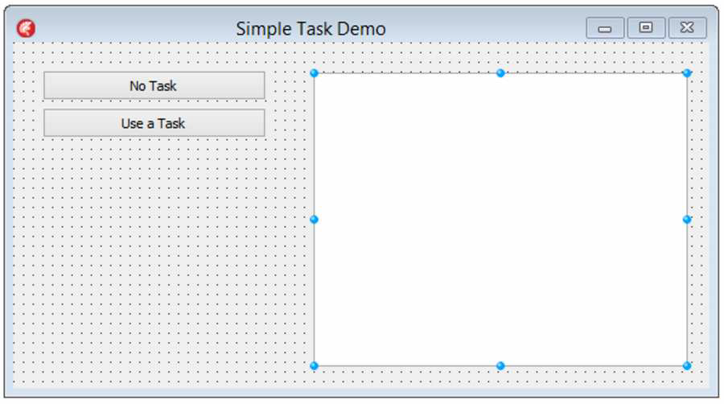
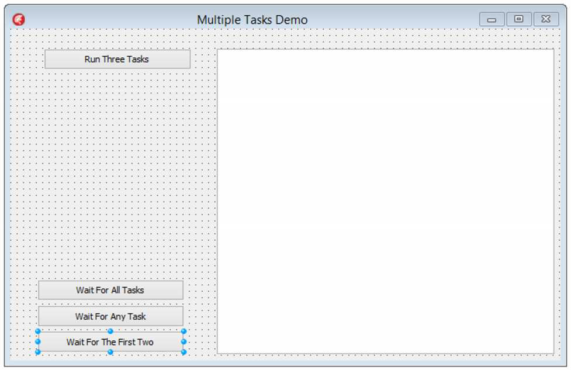
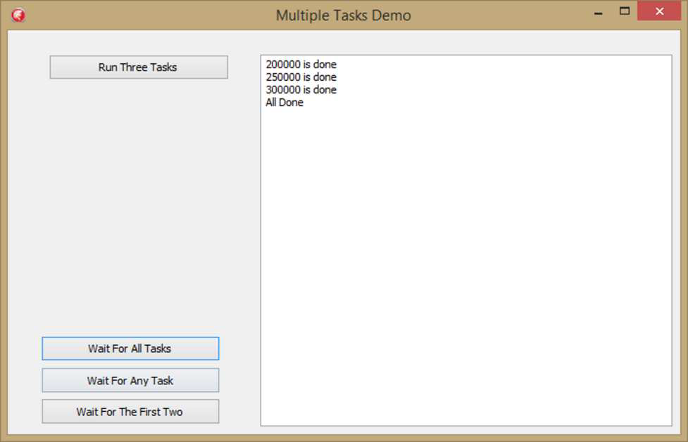
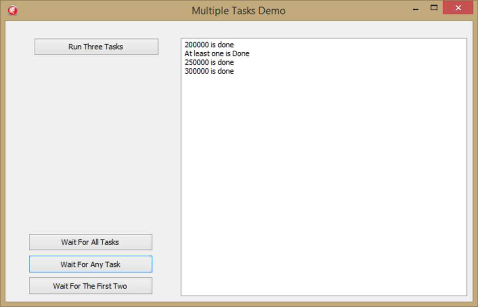
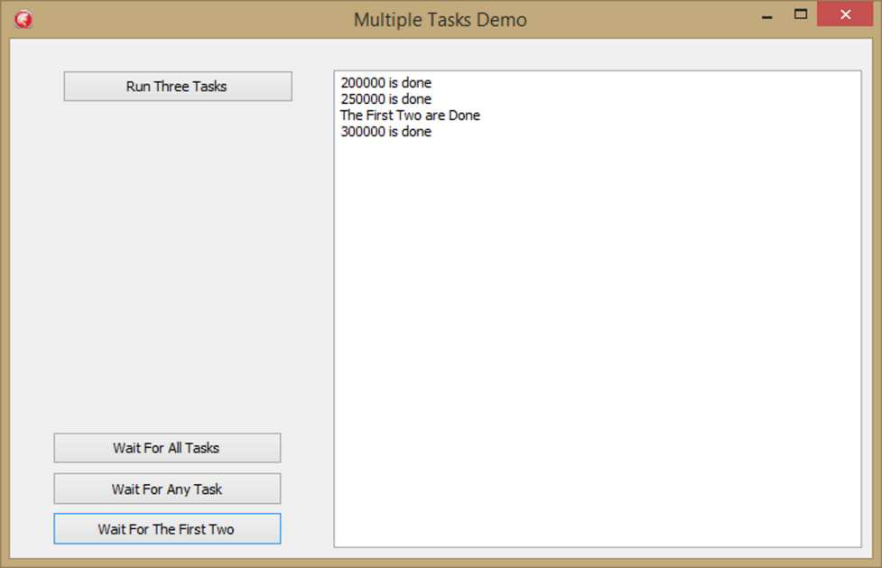
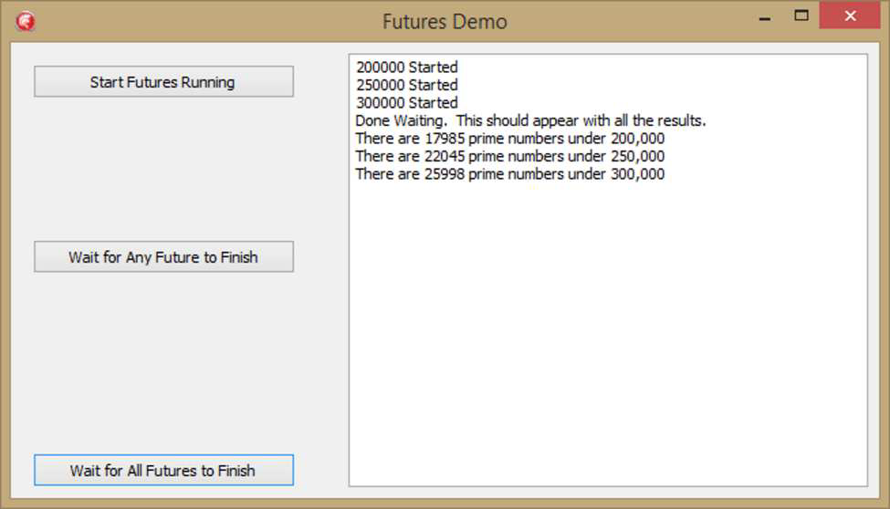
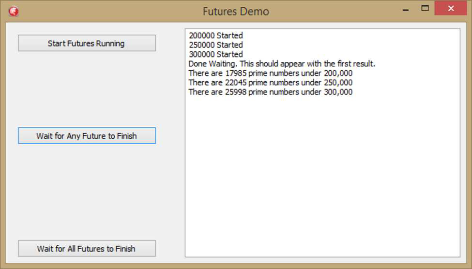
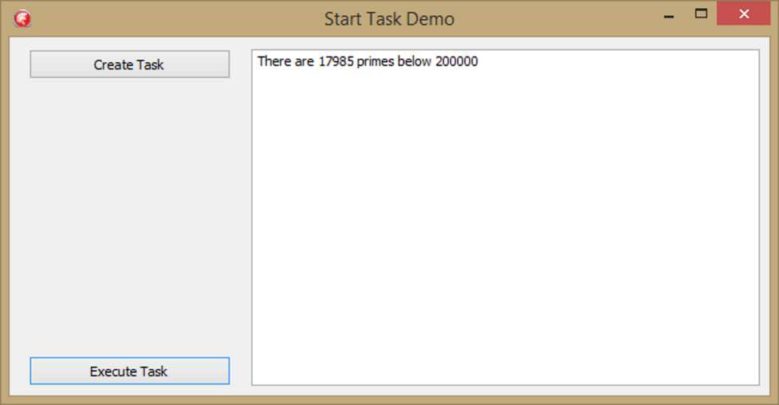

#### Библиотека параллельного программирования

Представленная в Delphi XE7, Библиотека параллельного программирования (PPL) находится в модуле System.Threading.pas. Это дальнейшая абстракция понятия многопоточности, содержащая три основные абстракции, которые позволяют писать многопоточный код и использовать преимущества нескольких ядер в вашем устройстве, будь то ноутбук, настольный компьютер или телефон.

*   **TTask** позволяет быстро и легко запускать отдельные фрагменты кода в отдельном потоке.
*   **TFuture** позволяет отложить получение заданного значения до тех пор, пока оно не понадобится.
*   **Parallel.for()**  параллельный цикл for разбивает цикл на отдельные TTasks и позволяет каждой итерации выполняться как собственной задаче. Мы рассмотрим TParallel.For в отдельной главе.

Кстати, PPL полностью кроссплатформенна. Вы также заметите, что в модуле нет ни одной директивы `{$IFDEF}`. Это потому, что это хорошая, чистая абстракция библиотек более низкого уровня. На самом деле, как только вы начнете использовать PPL, вы обнаружите, что, вероятно, вам больше не нужно использовать TThread, потому что библиотека выполнит большую часть работы по потокам за вас. Разве абстракции не круты?

#### Tasks (Задачи)

Помните этот код из введения в потоки и параллельное кодирование?

```pascal
Stopwatch := TStopwatch.StartNew;
Total := PrimesBelow(200000);
ElapsedSeconds := StopWatch.Elapsed.TotalSeconds;
WriteLn('There are ', Total, ' primes under 100,000');
WriteLn('It took ', ElapsedSeconds, ' seconds to calculate that') ;
ReadLn;
```

Приведенный выше код не выполняется в фоновом потоке и никоим образом не распараллелен. Запустите его в консольном приложении, и он ничего не сообщит, пока вычисления не будут завершены. Поместите этот код в приложение VCL — заменив вызовы `WriteLn` на вызовы записи в `TMemo` — и приложение не будет отвечать, пока процессор не закончит вычислять все эти простые числа. Но PPL предоставляет простой способ сделать приложение VCL отзывчивым во время интенсивных вычислений на процессоре, подобных приведенному выше коду.

Я опущу шаги по размещению компонентов и т.д., и просто скажу: создайте приложение VCL, которое выглядит так:


*(Изображение со страницы 129 image_page129.png)*

Это `TMemo`, на случай, если вам было интересно.

Дважды щелкните на первой кнопке и добавьте следующий код:

```pascal
procedure TSimpleTaskForm.Button1Click(Sender: TObject);
var
  Stopwatch: TStopWatch;
  Total: Integer;
  ElapsedSeconds: Double;
begin
  Stopwatch := TStopwatch.StartNew;
  Total := PrimesBelow(200000);
  ElapsedSeconds := StopWatch.Elapsed.TotalSeconds;
  Memo1.Lines.Add(Format('There are %d primes under 200,000', [Total]));
  Memo1.Lines.Add(Format('It took %:2f seconds to calculate that', [ElapsedSeconds]));
end;
```

Этот код просто запускает нашу медленную процедуру, измеряет, сколько времени это занимает, и сообщает эту информацию в `TMemo`. Довольно просто. Запустите программу и нажмите кнопку; приложение сделает то, что вы ожидаете — за исключением того, что во время вычислений окно не будет реагировать. Попробуйте переместить его, и ничего не произойдет, пока вычисление не завершится. Это плохо. И даже не думайте пытаться использовать `Application.ProcessMessages`. PPL, однако, имеет простое решение этой проблемы — `TTask`.

Дважды щелкните на второй кнопке и добавьте этот код:

```pascal
procedure TSimpleTaskForm.Button2Click(Sender: TObject);
begin
  TTask.Run(procedure
  var
    Stopwatch: TStopWatch;
    Total: Integer;
    ElapsedSeconds: Double;
  begin
    Stopwatch := TStopwatch.StartNew;
    Total := PrimesBelow(200000);
    ElapsedSeconds := StopWatch.Elapsed.TotalSeconds;
    TThread.Synchronize(nil, procedure
    begin
      Memo1.Lines.Add(Format('There are %d' + 'primes under 200,000',[Total]));
      Memo1.Lines.Add(Format('It took %:2f seconds' + 
                             ' to calculate that', [ElapsedSeconds]));
    end);
  end);
end;
```

Этот код сложнее кода для первой кнопки, но если вы запустите приложение, нажмете вторую кнопку и попытаетесь переместить форму во время вычислений, она действительно переместится. Это потому, что код выполняется в контексте `TTask`. Вы заметите, что код не работает быстрее — это тот же самый код, работающий в другом потоке — но поскольку он работает в другом потоке, приложение реагирует на ввод.

Обратите также внимание, что технически это одна строка кода: `TTask.Run` с единственным параметром в виде анонимного метода, запускающего наш медленный код с таймингом `TStopwatch`. Затем он записывает результаты в мемо. Но поскольку мы не работаем в контексте главного потока (подробнее об этом через минуту), нам нужно синхронизировать вывод информации в `TMemo`. Мы делаем это с помощью вызова `TThread.Synchronize`. Обратите также внимание, что все переменные теперь являются переменными самого анонимного метода. Опять же, это одна строка кода.

Итак, что здесь происходит? В PPL задача — это отдельный фрагмент кода. Думайте об этом как о параллельной процедуре — процедуре, выполняемой в контексте потока. Этот поток создается и управляется внутренним Пулом Потоков (Thread Pool), который поддерживает PPL. Этот пул потоков станет более актуальным через минуту, когда у нас будет несколько задач, работающих одновременно. Пул потоков является «самонастраивающимся» в том смысле, что он автоматически учитывает количество ядер, которые есть у вашего процессора, а также текущую нагрузку на эти ядра. Он создает потоки по мере необходимости, стараясь максимизировать возможности вашей машины. Когда система свободна, она создает больше потоков, а когда система начинает загружаться, она попытается выполнить работу как можно быстрее, чтобы освободить эти потоки.

> PPL позволит вам предоставить свой собственный `TThreadPool`, но в подавляющем большинстве случаев это не обязательно, и пул потоков по умолчанию будет достаточным. Мы не будем рассматривать возможность предоставления собственного пула потоков в этой книге.

Самое интересное начинается, когда несколько задач запускаются вместе, и Пул Потоков может действительно развернуться и использовать преимущества нескольких ядер, сохраняя при этом ваше приложение отзывчивым.

Снова создайте приложение VCL, которое выглядит так:


*(Изображение со страницы 131 image_page131.png)*

Сначала в секцию `private` кода формы добавьте следующее объявление массива:

```pascal
AllTasks: array[0..2] of ITask;
```

Этот массив будет содержать три задачи, которые мы собираемся создать. Обратите внимание, что это массив `ITask`. Вызов `TTask.Run` вернет экземпляр этого интерфейса, который ссылается на свою задачу. Мы можем сохранить это для последующего использования в массиве. Мы увидим, почему, через минуту.

К верхней кнопке мы добавим следующий обработчик событий:

```pascal
procedure TMultipleTasksDemoForm.Button3Click(Sender: TObject);
begin
  AllTasks[0] := TTask.Run(procedure
  begin
    PrimesBelow(200000);
    TThread.Synchronize(TThread.Current,
      procedure
      begin
        Memo1.Lines.Add('200000 is done');
      end);
  end);

  AllTasks[1] := TTask.Run(procedure
  begin
    PrimesBelow(250000);
    TThread.Synchronize(TThread.Current,
      procedure
      begin
        Memo1.Lines.Add('250000 is done');
      end);
  end);

  AllTasks[2] := TTask.Run(procedure
  begin
    PrimesBelow(300000);
    TThread.Synchronize(TThread.Current,
      procedure
      begin
        Memo1.Lines.Add('300000 is done');
      end);
  end);
end;
```

Эти три задачи в основном одинаковы, за исключением того, сколько простых чисел они вычисляют. Сначала они вычисляют простые числа, а затем просто сообщают, что закончили. Ничего особенного. Опять же, вывод в `TMemo` осуществляется в вызове `TThread.Synchronize`, потому что мы работаем в многопоточной среде.

А теперь самое интересное. Когда у вас запущено несколько задач — как это будет, когда мы нажмем верхнюю кнопку — вы можете захотеть узнать, когда некоторые или все эти задачи завершены. Поэтому у `TTask` есть два метода — `WaitForAll` и `WaitForAny` — которые блокируют выполнение до тех пор, пока соответственно все или одна из задач в массиве не будут завершены, или пока не будет достигнут заданный тайм-аут. Они объявлены следующим образом:

```pascal
class function WaitForAll(const Tasks: array of ITask): Boolean; overload; static;
class function WaitForAll(const Tasks: array of ITask; Timeout: LongWord): Boolean; overload; static;
class function WaitForAll(const Tasks: array of ITask; const Timeout: TimeSpan): Boolean; overload; static;
class function WaitForAny(const Tasks: array of ITask): Integer; overload; static;
class function WaitForAny(const Tasks: array of ITask; Timeout: LongWord): Integer; overload; static;
class function WaitForAny(const Tasks: array of ITask; const Timeout: TimeSpan): Integer; overload; static;
```

Все перегрузки принимают массив `ITask` в качестве первого параметра. Вам не обязательно ждать вечно — вы можете предоставить параметр `Timeout`, который ограничит ваше ожидание, если хотите.

Итак, давайте посмотрим, как работают эти ребята. Вот обработчики событий для двух нижних кнопок:

```pascal
procedure TMultipleTasksDemoForm.Button4Click(Sender: TObject);
begin
  TTask.Run(procedure
  begin
    TTask.WaitForAll(AllTasks);
    TThread.Synchronize(nil,
      procedure
      begin
        Memo1.Lines.Add('All Done');
      end);
  end);
end;

procedure TMultipleTasksDemoForm.Button5Click(Sender: TObject);
begin
  TTask.Run(procedure
  begin
    TTask.WaitForAny(AllTasks);
    TThread.Synchronize(nil,
      procedure
      begin
        Memo1.Lines.Add('At least one is Done');
      end);
  end);
end;
```

Когда мы нажимаем верхнюю кнопку, задачи добавляются в массив задач, который мы объявили. Как только они запущены и находятся в процессе выполнения, мы хотим знать, когда они завершатся. Поэтому мы можем нажать кнопку «Wait for All Tasks» (Ждать все задачи), и мы получим вывод, который выглядит так:


*(Изображение со страницы 134 image_page134.png)*

Нажатие кнопки «Wait For All Tasks» вызывает метод `TTask.WaitForAll` и принимает наш массив задач в качестве параметра. Вас не удивит узнать, что этот вызов будет ждать завершения всех задач в массиве, прежде чем продолжить — отсюда мы и получаем «All Done» (Все готово) в конце отчета трех задач о том, что они завершены.

> Обратите внимание, что в течение всего цикла выполнения этого приложения сама форма остается отзывчивой и перемещаемой.

На другой кнопке написано «Wait for Any Task» (Ждать любую задачу). Нажмите верхнюю кнопку, чтобы запустить задачи, а затем нажмите кнопку «Wait For Any Task», и вы получите следующий результат:


*(Изображение со страницы 135 image_page135.png)*

Обратите внимание, что вы получаете сообщение «At least one is Done» (По крайней мере одна готова) сразу после завершения первой из задач. Неважно, какая именно — как только любая задача в массиве завершится, вызов `WaitForAny` завершится и продолжит выполнение. Незавершенные задачи продолжают работать и завершаются после возврата вызова `WaitForAny`.

Один последний пример — давайте добавим еще одну кнопку под двумя нижними, установим ее подпись в «Wait For The First Two» (Ждать первые две) и добавим к ней следующий обработчик событий:

```pascal
procedure TMultipleTasksDemoForm.Button6Click(Sender: TObject);
begin
  TTask.Run(procedure
  var
    SomeTasks: array[0..1] of ITask;
  begin
    SomeTasks[0] := AllTasks[0];
    SomeTasks[1] := AllTasks[1];
    TTask.WaitForAll(SomeTasks);
    TThread.Synchronize(nil,
      procedure
      begin
        Memo1.Lines.Add('The First Two are Done');
      end);
  end);
end;
```

Теперь этот код немного отличается. Он объявляет массив с двумя `ITask`, помещает в него первые две задачи из `AllTasks`, а затем вызывает `WaitForAll` для этого «подмассива» основного массива. Вывод затем будет выглядеть так:


*(Изображение со страницы 136 image_page136.png)*

Обратите внимание, что вызов «wait for» (ожидание) произошел после завершения первых двух задач. Какое удивительное совпадение, что это оказались именно те две, которые мы поместили в «подмассив»!

Таким образом, вы должны увидеть, что можете делать все, что захотите, в отношении нескольких задач, что становится гораздо проще, чем создание потомков `TThread`, и гораздо проще в координации, чем множественные вызовы `TThread.Synchronize` или `TThread.Queue`.

#### **Фьючерсы (Futures)**

Фьючерс (Future) — это специализированная задача, которая возвращает значение. Думайте об этом как о параллельной функции — функции, которая запускается в потоке, а затем возвращает значение. Фьючерсы могут быть объявлены и запущены, когда вы знаете, что вычисление не нужно прямо сейчас и что результат может быть получен позже. Если вы все же попытаетесь запросить результат до того, как фьючерс завершится, он будет блокировать выполнение до тех пор, пока результат не будет готов.

Фьючерсы реализованы с использованием дженериков (generics) и параметризуются их типом возвращаемого значения. Таким образом,

```pascal
FutureInteger: IFuture<Integer>;
```

является переменной `IFuture`, которая вернет целочисленное значение, когда вы запросите его через `FutureInteger.GetValue`.

По сути, Фьючерс позволяет вам вернуть результат из задачи. Это «обещание» предоставить значение в какой-то момент в будущем. Если у вас есть значение — скажем, количество простых чисел ниже фиксированного порога — для вычисления которого, как вы знаете, потребуется некоторое время, и вы хотите выполнить это вычисление в отдельном потоке, сохраняя при этом отзывчивость вашего приложения, вы можете сделать это во Фьючерсе.
Хорошо, давайте посмотрим, как они работают. Помните, Фьючерсы — это просто Задачи, которые возвращают значение, поэтому они могут делать все то же, что и Задачи, в дополнение к возвращению значений. Мы будем использовать классическое приложение с двумя кнопками и одним мемо, и объявим следующие переменные в секции `private` формы:

```pascal
Result200000: IFuture<Integer>;
Result250000: IFuture<Integer>;
Result300000: IFuture<Integer>;
Futures: array[0..2] of ITask;
```

Затем мы дадим первой кнопке следующий обработчик событий:

```pascal
procedure TFuturesDemoForm.Button1Click(Sender: TObject);
begin
  Result200000 := TTask.Future<Integer>(function: Integer
  begin
    Result := PrimesBelow(200000);
  end);

  Memo1.Lines.Add('200000 Started');
  Futures[0] := Result200000;

  Result250000 := TTask.Future<Integer>(function: Integer
  begin
    Result := PrimesBelow(250000);
  end);

  Memo1.Lines.Add('250000 Started');
  Futures[1] := Result250000;

  Result300000 := TTask.Future<Integer>(function: Integer
  begin
    Result := PrimesBelow(300000);
  end);

  Memo1.Lines.Add('300000 Started');
  Futures[2] := Result300000;
end;
```

Вот несколько вещей, которые следует отметить в приведенном выше коде:

*   Он объявляет `IFuture<Integer>` для каждого из трех результатов, которые мы собираемся вычислить.
*   Каждый Фьючерс записывает в мемо, что он начался.
*   Каждый Фьючерс помещается в массив Задач. Обратите внимание, что массив может быть типа `ITask`, потому что `IFuture` дополняет интерфейс `ITask`.
*   Результатом являются три отдельных фьючерса, вычисляющих значения, и массив, на котором мы можем ожидать.

Итак, давайте подождем этот массив. Присоедините следующий обработчик событий к нашей второй кнопке:

```pascal
TFuture<Integer>.WaitForAll(Futures);
Memo1.Lines.Add('Done Waiting.  This should appear with all the results.');
Memo1.Lines.Add('There are ' + Result200000.GetValue.ToString + ' prime numbers under 200,000');
Memo1.Lines.Add('There are ' + Result250000.GetValue.ToString + ' prime numbers under 250,000');
Memo1.Lines.Add('There are ' + Result300000.GetValue.ToString + ' prime numbers under 300,000');
```

Мне не стоит объяснять, что делает вызов `TTask.WaitForAll`, но я сделаю это, на всякий случай. Он ожидает вычисления всех трех Фьючерсов. Когда они готовы, вызов завершается, и затем код отображает эти значения. Он получает значения из `IFuture`, вызывая `GetValue` для Фьючерса. Обратите внимание, что первая строка текста появляется точно в то же время, что и следующие три строки. Это потому, что мы дождались завершения всех фьючерсов, прежде чем продолжили.


*(Изображение со страницы 138 image_page138.png)*

Что, если вы не хотите ждать их все — как насчет того, чтобы подождать только один, а остальным позволить завершиться самостоятельно? Добавьте еще одну кнопку между двумя другими и дайте ей следующий обработчик `OnClick`:

```pascal
Memo1.Lines.Add('There are ' + Result200000.GetValue.ToString + ' prime numbers under 200,000');
Memo1.Lines.Add('Done Waiting. This should appear with the first result.');
Memo1.Lines.Add('There are ' + Result250000.GetValue.ToString + ' prime numbers under 250,000');
Memo1.Lines.Add('There are ' + Result300000.GetValue.ToString + ' prime numbers under 300,000');
```

Обратите внимание, что вам не нужно вызывать метод `WaitFor`. Вместо этого вы можете просто запросить значение через `GetValue`, и тогда код вернет управление после вычисления каждого из фьючерсов. Помните, вызов `GetValue` будет блокировать выполнение до тех пор, пока Фьючерс не будет вычислен.


*(Изображение со страницы 138 image_page139.png)*

Таким образом, Фьючерсы на самом деле не что иное, как Задачи, возвращающие значение. Фактически, они происходят от `ITask` и `TTask` соответственно.

#### **Запуск Задач**

Одно последнее простое демо, прежде чем мы двинемся дальше. Вы можете создавать задачи и заставлять их не запускаться сразу. Давайте быстро посмотрим на это, используя еще одно приложение VCL с двумя кнопками и одним мемо.

Сначала в секции `private` формы добавьте следующую переменную:

```pascal
Task: ITask;
```

В обработчике событий `OnClick` первой кнопки поместите этот код:

```pascal
Task := TTask.Create(procedure
var
  Num: integer;
begin
  Num := PrimesBelow(200000);
  TThread.Synchronize(nil,
    procedure
    begin
      Memo1.Lines.Add('There are ' + Num.ToString() + ' primes below \ 200000');
    end);
end);
```

Этот код должен выглядеть знакомо, но он немного отличается. Вместо вызова `Run` на `TTask`, мы просто вызываем конструктор и присваиваем результирующее значение переменной `Task`. Он не выполняет ни одной строки кода, содержащегося в задаче; он просто создает задачу. Вы можете запустить приложение и нажимать кнопку и ждать сколько угодно — ничего не произойдет.

Вместо этого, чтобы заставить задачу выполниться, мы нажимаем вторую кнопку, у которой в обработчике событий `OnClick` есть следующее:

```pascal
Task.Start;
```

Как только вы нажмете вторую кнопку, код запустится, и мемо будет обновлено через несколько секунд, почти так же, как в самом первом демо в этой главе. Обратите внимание, что вы не можете сделать такой отложенный старт с `IFuture`.


*(Изображение со страницы 138 image_page140.png)*

**Обработка Исключений в Задачах**

> Я обязан блогу Роберта Лаву (Robert Love) за этот раздел. Пожалуйста, смотрите Библиографию для ссылок на отличный блог Роберта и его посты об использовании `TTask`.

Теперь мы видели, как Задачи и Фьючерсы могут быть использованы, чтобы сделать ваши приложения производительными и отзывчивыми. Пока все было хорошо. Но неизбежно, что что-то пойдет не так, и исключение будет выброшено. Что нам делать, когда исключение возникает в `TTask`?

Что ж, ваша естественная тенденция была бы просто позволить исключению случиться и позволить системе обработки исключений по умолчанию разобраться с вещами.

Мы попробуем это в нашей теперь уже классической форме с тремя кнопками/одним мемо. Вот реализация возникновения исключения и того, как мы просто позволяем вещам течь, как обычно:

```pascal
procedure TForm61.Button1Click(Sender: TObject);
begin
  TTask.Run(procedure
  var
    Stopwatch: TStopWatch;
    Total: Integer;
    ElapsedSeconds: Double;
  begin
    Stopwatch := TStopwatch.StartNew;
    // oops, something happened!
    raise Exception.Create('An error of some sort occurred in the task');
    Total := PrimesBelow(200000);
    ElapsedSeconds := StopWatch.Elapsed.TotalSeconds;
    TThread.Synchronize(nil, procedure
    begin
      Memo1.Lines.Add(Format('There are %d primes under' +
        ' 200,000', [Total]));
      Memo1.Lines.Add(Format('It took %:2f seconds to ' +
        'calcluate that', [ElapsedSeconds]));
    end);
  end);
end;
```

Запустите это вне отладчика, и нажмите кнопку, и... ничего не происходит. (Обратите внимание, что если вы запустите это в отладчике, исключение будет показано, но оно не распространится на главный поток и, следовательно, не будет видно пользователю.) Почему это так? Ну, исключение выбрасывается в контексте `TTask`, но оно никогда не выходит — оно перехватывается и никогда не показывается пользователю. Это нам решать.

Итак, мы сделаем это; мы перехватим исключение в блоке `try...finally` и выбросим его в главном потоке:

```pascal
procedure TForm61.Button2Click(Sender: TObject);
begin
  TTask.Run(procedure
  var
    Stopwatch: TStopWatch;
    Total: Integer;
    ElapsedSeconds: Double;
  begin
    try
      Stopwatch := TStopwatch.StartNew;
      // oops, something happened!
      raise ETaskException.Create('An error of some sort occurred in the task');
      Total := PrimesBelow(200000);
      ElapsedSeconds := StopWatch.Elapsed.TotalSeconds;
      TThread.Synchronize(nil, procedure
      begin
        Memo1.Lines.Add(Format('There are %d primes under 200,000', [Total]));
        Memo1.Lines.Add(Format('It took %:2f seconds to calcluate that',                                            [\ElapsedSeconds]));
      end);
    except
      on e: ETaskException do
      begin
        TThread.Queue(TThread.CurrentThread,
          procedure
          begin
            raise E;
          end);
      end;
    end;
  end);
end;
```

Теперь давайте запустим это, нажмем кнопку (опять же, запуская вне отладчика), и все выйдет из-под контроля. Вы получите серию уродливых сообщений об ошибках.

Почему? Ну, на этот раз переменная `E`, которая содержит исключение, фактически освобождается до того, как попадает в главный поток, и, таким образом, вы получаете некоторые уродливые сообщения и нарушение доступа.

Что делать? Что ж, `TTask` предоставляет способ получить исключение, которое было выброшено, и позволяет вам обработать его самостоятельно безопасным образом. Это делается через вызов `AcquireExceptionObject`.

```pascal
procedure TForm61.Button3Click(Sender: TObject);
var
  AcquiredException: Exception;
  // В действительности тип Exception как указан в книге 
  // В современных версия Delphi 12.1 приводит к ошибке 
  // Решением было исправить на AcquiredException: TObject;
begin
  TTask.Run(procedure
  var
    Stopwatch: TStopWatch;
    Total: Integer;
    ElapsedSeconds: Double;
  begin
    try
      Stopwatch := TStopwatch.StartNew;
      // oops, something happened!
      raise ETaskException.Create('An error of some sort occurred in the task');
      Total := PrimesBelow(200000);
      ElapsedSeconds := StopWatch.Elapsed.TotalSeconds;
      TThread.Synchronize(nil, procedure
      begin
        Memo1.Lines.Add(Format('There are %d primes' + ' under 200,000',
                               [Total]));
        Memo1.Lines.Add(Format('It took %:2f seconds' + ' to calcluate that',
                                [ElapsedSeconds]));
      end);
    except
      on e: ETaskException do
      begin
        AcquiredException := AcquireExceptionObject;
        TThread.Queue(TThread.CurrentThread, procedure
        begin
          raise AcquiredException;
        end);
    end;
  end);
end;
```

Мы сохраняем, через локальную переменную, исключение, которое возвращается вызовом `AcquireExceptionObject`, и затем мы можем безопасно вызвать его в вызове `TThread.Queue`. Как вы можете представить, распространение исключений через `TTask` — это сложная вещь. Фреймворк управляет обработкой исключений за вас, и все, что вам нужно сделать, это запросить ссылку на `Exception` и использовать её самостоятельно. Нажмите эту третью кнопку, и пользователь получит сообщение об исключении, как и ожидалось.

#### **Остановка Задачи**

Иногда задача может занимать много времени. Что, если вы захотите отменить её посередине? Что ж, на самом деле это довольно просто. Давайте создадим новое приложение VCL и добавим две кнопки и мемо (я знаю, это становится скучным, но это хорошее, чистое демо, и если оно работает, почему бы не придерживаться его?).

Сделайте подпись первой кнопки «Start Long Task» (Запустить долгую задачу), а второй — «Cancel» (Отмена). Затем добавьте приватную переменную в форму:

```pascal
Task: ITask;
```

Дважды щелкните на первой кнопке и добавьте этот код:

```pascal
procedure TForm62.Button1Click(Sender: TObject);
begin
  Task := TTask.Run(procedure
  var
    i: Integer;
  begin
    for i := 1 to 100000 do
    begin
      Sleep(1000);
      if TTask.CurrentTask.Status = TTaskStatus.Canceled then
      begin
        Exit;
      end;
      
		(*	
		
		// Это еще один способ остановки TTask через
		// Обработку исключения EOperationCancelled
		// Это дополнено в книке от DELPHI SOLUTIONS
		// https://t.me/delphi_solutions
	
		try
		  TTask.CurrentTask.CheckCanceled;
		Except
		  On E: EOperationCancelled do
		  begin
			TThread.Queue(TThread.Current,
			  procedure
			  begin
				// С выходом диалогового окна
				MessageBox(Handle,
				   Pchar('Задача остановлена по требованию пользователя'),
				   PChar('CancelTaskDemo'), MB_ICONWARNING);	
			  end);
			 Exit;
		  end;	
		end;
		*)
            
      TThread.Queue(TThread.CurrentThread,
        procedure
        begin
          Memo1.Lines.Add(i.ToString());
        end);
    end;
  end);
end;
```

Этот код просто считает до 100 000, отправляя текущее значение счетчика в мемо каждую секунду (через вызов `Sleep`). Но интересная часть наступает после вызова `Sleep`. Код проверяет, установлен ли статус текущей Задачи в `TTaskStatus.Canceled`. Если да, он выходит из метода. Если нет, он продолжает работу.

Как отменить поток? Просто. Просто поместите следующий код в `OnClick` для кнопки Cancel:

```pascal
procedure TForm62.Button2Click(Sender: TObject);
begin
  Task.Cancel;
end;
```

Вот и всё. Это устанавливает задачу в состояние отмены, и если вы нажмете эту кнопку (после запуска задачи, конечно), задача остановится как вкопанная. Вы можете установить это значение, пока задача выполняется, потому что задача выполняется в фоновом потоке, а вызов `TTask.Cancel` производится в главном потоке.

Итак, вот как можно отменить поток. Говорю вам, PPL предусмотрела всё.

**Резюме**

Фьючерсы (Futures) и Задачи (Tasks) — это мощный способ полного использования вашего процессора без потери отзывчивости вашего приложения. И самое лучшее — их очень легко использовать. Ни один из кодов, которые мы видели до сих пор, не является таким уж сложным — это просто анонимные методы, передаваемые методам `TTask`. Однако, несмотря на их простой синтаксис, в их использовании все еще есть много подводных камней и других опасностей. При их использовании необходимо соблюдать осторожность. Несмотря на потенциальные ловушки, я призываю вас начать использовать `TTask` и `IFuture<T>` для распараллеливания вашего кода.

В следующей главе мы рассмотрим цикл `TParallel.For`, который является третьим способом ускорить ваш код на многоядерных машинах.
