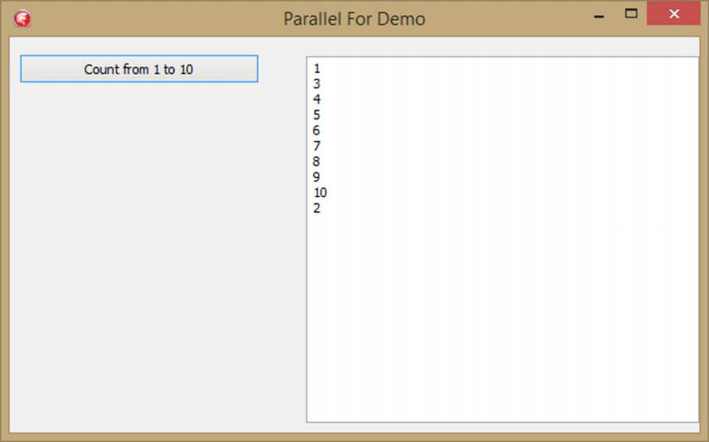
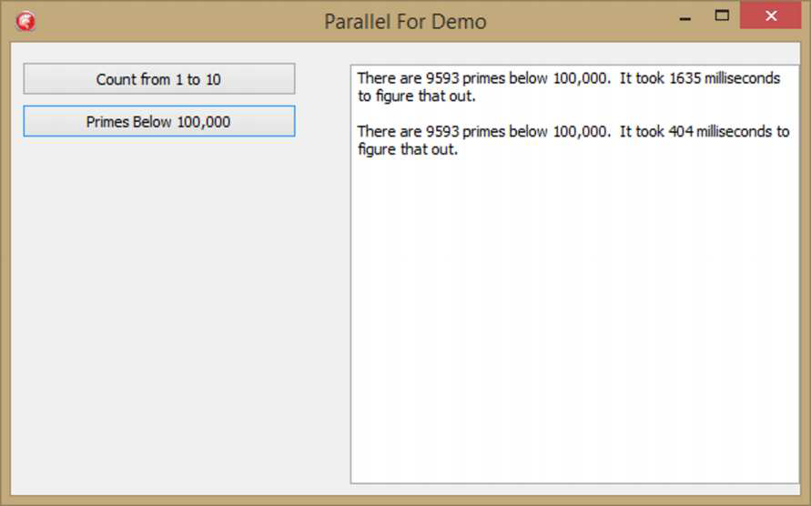
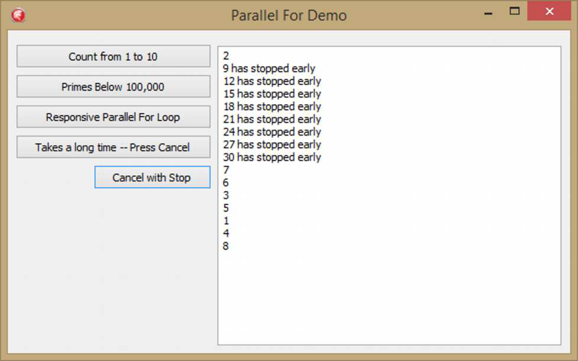
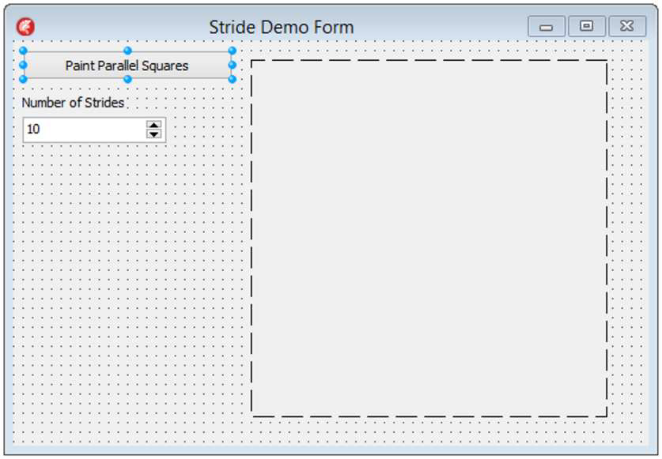
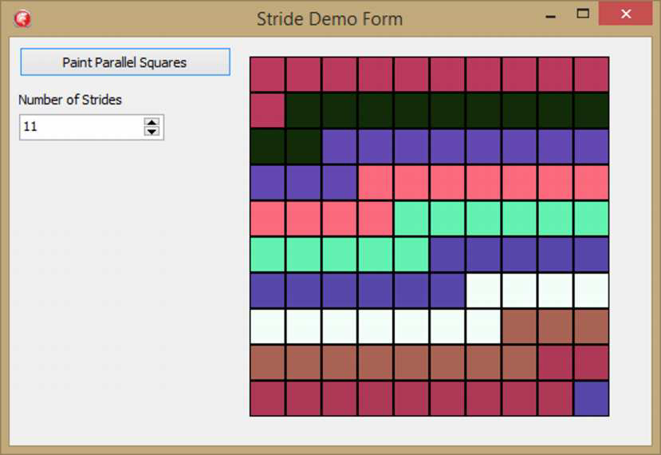

### Введение

Циклы `for` кажутся тем, с чего большинство людей начинает разговор о PPL (Parallel Programming Library), но я оставил их напоследок, в основном потому, что они, ну, не так просты и очевидны, как вы могли бы подумать. На самом деле, информации здесь достаточно, чтобы я решил выделить эту тему в отдельную главу.

Цикл `for` — одна из самых распространенных конструкций в программировании: простая, мощная и точная. PPL предоставляет цикл `TParallel.For`, который при правильном использовании может радикально увеличить скорость ваших циклов `for` за счет распараллеливания их выполнения на нескольких ядрах. Довольно легко преобразовать обычный цикл `for` в параллельный, но также легко всё испортить, сделав это. Вот несколько правил, которым следует следовать при принятии решения об использовании `TParallel.For`.

*   Шаги в теле цикла должны быть полностью независимы друг от друга и спроектированы таким образом, чтобы их не нужно было выполнять в каком-либо определенном порядке. `TParallel.For` разделит каждую итерацию на отдельный `TTask` и выполнит её на любом доступном ядре вашего процессора. Если ваш цикл зависит от определенного порядка выполнения, не используйте цикл `TParallel.For`, так как весьма вероятно, что каждая итерация не будет завершена по порядку.
*   Не записывайте данные в общие ресурсы внутри тела цикла `for`: если вы это сделаете, велика вероятность повреждения данных. Если вам приходится синхронизировать свой код внутри цикла `TParallel.For`, вы теряете большую часть преимуществ его использования.

Причина, по которой я оставил `TParallel.For` напоследок, заключается в том, что как только вы поймете, как работают Задачи (Tasks), понимание работы `TParallel.For` станет проще простого. `TParallel.For` просто берет каждую итерацию цикла `for`, превращает её в `TTask` и помещает в Пул Потоков (Thread Pool). Затем они выполняются как множественные операторы `TTask`, как мы видели в прошлой главе.

#### Основы

Начнем с еще одного простого VCL-приложения — с кнопкой и полем ввода (memo). Дважды щелкните по кнопке и добавьте этот код:

```pascal
procedure TParallelForDemoForm.Button1Click(Sender: TObject);
begin
  Memo1.Clear;
  Memo1.Update;
  TParallel.&For(1, 10,
    procedure (aIndex: integer)
    begin
      PrimesBelow(50000);
      TThread.Queue(TThread.CurrentThread,
        procedure
        begin
          Memo1.Lines.Add(aIndex.ToString());
        end);
    end);
end;
```

Запустите приложение и нажмите кнопку. По моему опыту, в первый раз, когда вы нажимаете кнопку, цикл выполняется по порядку. Однако во второй и последующие разы, когда вы нажимаете кнопку, все числа появляются, но не по порядку:


*(Изображение со страницы 146 image_page146.png)*

Мы использовали калькулятор простых чисел для выполнения нашей CPU-интенсивной деятельности. Вот пример:

```pascal
function PrimesBelow(100000): integer;
var
  i: integer;
begin
  Result := 0;
  for i := 1 to 100000 do
  begin
    if SlowIsPrime(i) then
    begin
      Result := Result + 1;
    end;
  end;
end;
```

Держу пари, мы можем использовать `TParallel.For`, чтобы ускорить это:

```pascal
function PrimesBelowParallel(aInteger: integer): integer;
var
  Temp: integer;
begin
  Temp := 0;
  TParallel.For(1, aInteger, procedure(aIndex: integer)
    begin
      if SlowIsPrime(aIndex) then
      begin
        TInterlocked.Increment(Temp);
      end;
    end);

  Result := Temp;
end;
```

Вот код, который покажет, что цикл `TParallel.For` ускоряет наш код примерно в четыре раза на моей машине, у которой четыре ядра. Ваши результаты могут отличаться в зависимости от архитектуры вашего процессора.

```pascal
procedure TParallelForDemoForm.Button2Click(Sender: TObject);
var
  PrimeTotal: integer;
  TotalTime: integer;
  StopWatch: TStopWatch;
  S: string;
begin
  StopWatch := TStopWatch.StartNew;
  PrimeTotal := PrimesBelow(100000);
  StopWatch.Stop;
  TotalTime := StopWatch.ElapsedMilliseconds;
  S := Format('There are %d primes below 100,000.  It took %d milliseconds' +
              ' to figure that out.', [PrimeTotal, TotalTime]);
  Memo1.Lines.Add(S);
  Memo1.Lines.Add('');
  StopWatch := TStopWatch.StartNew;
  PrimeTotal := PrimesBelowParallel(100000);
  StopWatch.Stop;
  TotalTime := StopWatch.ElapsedMilliseconds;
  S := Format('There are %d primes below 100,000.  It took %d milliseconds' +
              ' to figure that out.', [PrimeTotal, TotalTime]);
  Memo1.Lines.Add(S);

end;
```

Вот вывод с моей машины:


*(Изображение со страницы 148 image_page148.png)*

`TParallel.For` может радикально ускорить ваши циклы, обычно в количество раз, равное количеству ядер, которые есть у вашего компьютера.

## Делаем параллельный цикл отзывчивым

Помните, я говорил вам, что эти вещи хитрые? Пока что всё было не так плохо. Что ж, сейчас станет действительно сложно.

Вы могли заметить, что примеры, которые мы делали для `TParallel.For` до сих пор, оставляют приложение неотзывчивым. Попробуйте переместить окно, пока цикл крутится, и вы не сможете — оно ждет, пока цикл завершится, прежде чем переместить окно.

Причина этого в том, что, хотя содержимое цикла выполняется в разных потоках, сам цикл заблокирован в главном потоке. Главный поток отвечает за перемещение окна путем обработки сообщения `WM_SIZE`. Однако главный поток заблокирован вызовом `TParallel.For`, и поэтому любые сообщения не будут обрабатываться, пока `TParallel.For` не завершится. Вас может возникнуть соблазн добавить в код `Application.ProcessMessages`, но сопротивляйтесь этому искушению: этот вызов даже отдаленно не является потокобезопасным и приведет к непредсказуемым результатам.

Так что же делать? Что ж, запустите код в отдельном потоке. И какой самый простой способ сделать это для нас? Конечно, с помощью `TTask.Run`!

Мы добавим еще одну кнопку и дадим её событию `OnClick` следующий код:

```pascal
procedure TParallelForDemoForm.Button6Click(Sender: TObject);
var
  LoopResult: TParallel.TLoopResult;
begin
  Memo1.Clear;

  TTask.Run(
    procedure
    begin
      LoopResult := TParallel.&For(1, 30,
        procedure(aIndex: integer)
        begin
          PrimesBelow(50000);
          TThread.Queue(TThread.Current,
            procedure
            begin
              Memo1.Lines.Add(aIndex.ToString());
            end);
        end);

      if LoopResult.Completed then
      begin
        Memo1.Lines.Add('The loop completed.')
      end;
    end);
end;
```

Да, это три анонимных метода, вложенных друг в друга. Первый — для `TTask`, второй — для самого `TParallel.For`, а третий — для вызова `TThread.Queue`. Но если вы запустите это приложение и нажмете кнопку, вы сможете перемещать приложение, пока оно медленно считает до тридцати (очень вероятно, не по порядку).

Обратите внимание также, что вызов `TParallel.For` — это функция, возвращающая тип `TParallel.TLoopResult`, тип, вложенный внутрь `TParallel`. Он объявлен следующим образом:

```pascal
TLoopResult = record
private
  FCompleted: Boolean;
  FLowestBreakIteration: Variant;
public
  property Completed: Boolean read FCompleted;
  property LowestBreakIteration: Variant read FLowestBreakIteration;
end;
```

В коде выше мы перехватываем результат вызова `TParallel.For`, а затем, когда цикл завершается, мы проверяем, завершился ли он. Если да, мы сообщаем об этом в memo.
Почему мы всегда используем `TThread.Queue`, а не `TThread.Synchronize`? Как отмечалось в предыдущей главе, это потому, что `Synchronize` блокирует главный поток, что может вызвать проблемы при работе с множеством потоков на многоядерных процессорах.

### Остановка параллельного цикла

Что делать, если вам надоело ждать и вы хотите остановить долго работающий параллельный цикл? Что ж, это сложно, как я уже говорил. Если вы посмотрите на подсказки по коду (Code Insight) для `TParallel.For`, то заметите серьезное количество перегрузок. Я насчитал — их 32. До сих пор мы использовали только одну, которая принимает целые числа «от» и «до» и `TProc<Integer>` в качестве параметров. Чтобы получить контроль над остановкой цикла, мы рассмотрим конкретно эту перегрузку:

```pascal
class function TParallel.&For(ALowInclusive, AHighInclusive: Integer; const AIteratorEvent: TProc<Integer, TLoopState>): TLoopResult; overload; static; inline;
```

Обратите внимание, что этот метод принимает анонимный метод с двумя параметрами, где второй параметр — это `TLoopState`, который является внутренним классом `TParallel`. Переменная типа `TLoopState` передается в анонимный метод во время каждой итерации для вашего использования. У неё есть три метода и три свойства, представляющих интерес:

```pascal
public
  procedure Break;
  procedure Stop;
  function ShouldExit: Boolean;

  property Faulted: Boolean read GetFaulted;
  property Stopped: Boolean read GetStopped;
  property LowestBreakIteration: Variant read GetLowestBreakIteration;
```

Методы `Break` и `Stop` — это те, которые позволяют уведомить параллельный цикл о том, что он должен завершиться досрочно.

Первое, что нужно осознать: когда вы пытаетесь остановить параллельный цикл, уже существует ряд активных итераций, которые выполняются и завершатся независимо от того, когда вы решите попытаться их остановить. Помните, что данный пакет (chunk) из них работает одновременно — и, таким образом, запрос на остановку цикла приведет к тому, что некоторая обработка продолжится даже после того, как запрос будет сделан.

Если вы вызываете `Break`, вы говорите циклу не запускать больше итераций с момента вызова `Break`. Если есть какие-либо итерации с более высокими значениями индекса, чем та, на которой был вызван `Break`, то они должны завершить свою работу как можно быстрее. Вот в чем суть: итерации, которые **ниже**, чем итерация, где был вызван `Break`, не затрагиваются и все равно будут выполнены. Помните, что вполне возможно, что вы вызовете `Break` в итерации семь, в то время как пять и шесть еще не были запущены. В этом случае итерации пять и шесть будут выполнены и завершены, а любые итерации больше семи, которые уже были запущены, также будут завершены.

`Stop` отличается тем, что как только он вызван, никакие новые итерации не будут запущены, и все существующие итерации будут завершены как можно скорее.

Поняли? Я говорил вам, что все становится сложно.

Так как же это работает? Что ж, нам нужны две новые кнопки — одна для запуска цикла, а другая для его остановки. Но сначала добавьте форме приватную переменную поля типа `ITask`:
```pascal
ForLoopTask: ITask;
```

Это будет ссылка, которую мы будем проверять, чтобы увидеть, был ли цикл остановлен. Затем в событии `OnClick` первой новой кнопки поместите следующий код:

```pascal
procedure TParallelForDemoForm.Button3Click(Sender: TObject);
var
  LoopResult: TParallel.TLoopResult;
begin
  Memo1.Clear;
  Memo1.Update;
  ForLoopTask := TTask.Create(
    procedure
    begin
      LoopResult := TParallel.&For(1, 30,
        procedure (aIndex: integer; LoopState: TParallel.TLoopState)
        begin
          if (ForLoopTask.Status = TTaskStatus.Canceled) 
            and (not LoopState.Stopped) then
          begin
            LoopState.Stop;
          end;
          if LoopState.Stopped then
          begin
            TThread.Queue(TThread.Current,
              procedure
              begin
                Memo1.Lines.Add(aIndex.ToString + ' has stopped early');
              end);
            Exit;
          end;
          PrimesBelow(150000);
          TThread.Queue(TThread.Current,
            procedure
            begin
              Memo1.Lines.Add(aIndex.ToString());
            end
          );
        end);
      if LoopResult.Completed then
      begin
        Memo1.Lines.Add('The Loop Completed')
      end else
      begin
        Memo1.Lines.Add('The loop stopped before the end')
      end;
    end
  );
  ForLoopTask.Start;
end;
```

и в кнопку Cancel (Stop) мы поместим это:

```pascal
procedure TParallelForDemoForm.Button4Click(Sender: TObject);
begin
  if Assigned(ForLoopTask) then
  begin
    ForLoopTask.Cancel;
  end;
end;
```

Нам нужно что-то внутри приложения, чтобы указать, что цикл должен остановиться, и то, что мы используем — это статус `ForLoopTask`. Когда вы нажимаете кнопку Cancel, она вызовет метод `Cancel`, пометив сам `ITask` как отмененный, и, как вы увидите, мы проверим это в цикле.

Хорошо, так что настоящая суть дела находится в `OnClick` первой кнопки. Во-первых, мы создаем задачу. Мы передаем ей анонимный метод. Этот анонимный метод целиком состоит из цикла `TParallel.For`. Он итерируется от 1 до 30, каждый раз выполняя другой анонимный метод, который принимает индекс итератора и экземпляр `TLoopState` в качестве параметров. Этот анонимный метод разделен на три части, и мы рассмотрим их по одной.

Первая:

```pascal
if (ForLoopTask.Status = TTaskStatus.Canceled) and (not LoopState.Stopped) then
begin
  LoopState.Stop;
end;
```

Этот код проверяет значение `ForLoopTask.Status`, чтобы увидеть, установлено ли оно в `TTaskStatus.Canceled`. Оно будет таким, если мы нажали кнопку Cancel. Если мы еще не остановлены, то мы вызываем `LoopState.Stop`, что сигнализирует циклу `TParallel.For`, что он должен прекратить создание новых итераций и завершить любые итерации, которые он уже запустил.

Следующий кусок кода в цикле — это:

```pascal
if LoopState.Stopped then
begin
  TThread.Queue(nil, procedure
    begin
      Memo1.Lines.Add(aIndex.ToString + ' has stopped early');
    end);
  Exit;
end;
```

Этот код говорит: «Если эта итерация остановлена, продолжай и скажи, что она остановилась досрочно, а затем выйди из всей процедуры». Другими словами, если был вызван `Stop`, завершите работу как можно скорее.

Наконец, если дело дошло до этого — то есть, если вещи не остановлены, тогда происходит нормальная работа:

```pascal
PrimesBelow50000;
TThread.Queue(nil, procedure
  begin
    Memo1.Lines.Add(aIndex.ToString());
  end
```

Запуск этого кода приводит к некоторым неожиданным результатам. Чтобы запустить его, нажмите первую кнопку, а затем вторую как можно быстрее. Вывод на самом деле никогда не бывает одинаковым дважды, но в целом он выглядит примерно так:


*(Изображение со страницы 153 image_page153.png)*

Теперь этот вывод интересен. Обратите внимание, что он сообщает о завершении примерно одной итерации. Затем, после того как я нажал кнопку Cancel, он сообщает о куче итераций, которые остановились досрочно, включая некоторые из самых последних. Наконец, он сообщает о куче завершенных итераций. Ваши результаты будут варьироваться в зависимости от того, как быстро вы нажмете кнопку Cancel, но в этом запуске было запущено всего шестнадцать итераций из тридцати, восемь из них остановились досрочно, и восемь завершились.

Поиграйте немного со временем, которое вы позволяете циклу работать, и посмотрите, как это влияет на вывод. Посмотрите, сможете ли вы понять, почему разное время между нажатиями кнопок приводит к разным результатам.

Я оставлю это в качестве упражнения для читателя: измените строку `LoopState.Stop;` на `LoopState.Break;` и посмотрите, что произойдет. И что произойдет, если вы затем проверите `LoopState.ShouldExit` вместо `LoopState.Stopped`.

### Strides (Шаги)

Последняя тема в этом разделе будет о Strides (шагах). Strides позволяют вам группировать последовательные итерации в один и тот же поток. Например, если у вас есть десять итераций, и вы установите свой Stride равным двум, первые две итерации будут прикреплены к одному потоку, затем следующие две ко второму потоку, следующие две к третьему потоку и так далее.

Вы устанавливаете `Stride` для вашего цикла `TParallel.For`, добавляя параметр в начало списка параметров. (Как упоминалось выше, у `TParallel.For` много перегрузок....) Stride может быть любым значением меньше, чем верхнее значение вашего цикла.

Чтобы более наглядно продемонстрировать, как работают шаги (strides), я создал версию демо на VCL, которое изначально было сделано моим коллегой, Embarcadero MVP Дэнни Уиндом (Danny Wind), в его видео CodeRage 9 под названием *Parallel Programming Library: Create Responsive Object Pascal Apps*. Дэнни любезно дал мне разрешение адаптировать его код в моем демо здесь.

Это демо будет рисовать квадраты на PaintBox в соответствии с количеством шагов (strides), которые мы установим для параллельного цикла. Квадратам будет присвоен цвет потока, который их рисует, и мы немного замедлим рисование, чтобы увидеть, как возникают паттерны с различными настройками Stride.

Для начала мы создадим простое VCL-приложение с кнопкой, SpinEdit, меткой (label) и PaintBox. Это должно выглядеть примерно так:


*(Изображение со страницы 154 image_page154.png)*

Установите `MaxValue` SpinEdit в 100, а `MinValue` в 1. Сделайте PaintBox ровно 300 на 300 пикселей. Затем создайте следующий метод на форме:

```pascal
procedure TStrideDemoForm.ClearRectangle;
begin
  PaintBox1.Canvas.Brush.Color := Self.Color;
  PaintBox1.Canvas.Rectangle(0, 0, PaintBox1.Width, PaintBox1.Height);
end;
```

Это очистит PaintBox после того, как мы закончим рисовать на нем, убедившись, что он готов к выполнению задач.

Мы также установим три константы:

```pascal
const
  SquareSize = 30;
  SquaresPerRow = 10;
  TotalSquares = 100;
```

PaintBox будет разделен на 100 квадратов, каждый размером 30 на 30 пикселей, что дает 10 квадратов в ряд.

Сначала мы создадим метод на форме, который будет рисовать прямоугольник. Это будет метод-итератор (в отличие от анонимных методов, которые мы использовали до сих пор), который мы передадим циклу `TParallel.For`:

```pascal
procedure TStrideDemoForm.PaintRectangle(aIndex: integer);
var
  LTop, LLeft: integer;
  LRed, LGreen, LBlue: Byte;
  LColor: TAlphaColor;
begin
  Sleep(100);
  LTop := (aIndex div SquaresPerRow) * SquareSize;
  LLeft := (aIndex mod SquaresPerRow) * SquareSize;

  LGreen := TThread.CurrentThread.ThreadID MOD High(Byte);
  LRed := (16 * LGreen) MOD High(Byte);
  LBlue := (4 * LGreen) MOD High(Byte);
  LColor := RGB(LRed, LGreen, LBlue);
  TThread.Queue(TThread.CurrentThread,
    procedure
    begin
      Paintbox1.Canvas.Brush.Color := LColor;
      Paintbox1.Canvas.Rectangle(LLeft, LTop, LLeft + SquareSize, 
                                 LTop + SquareSize);
    end);
end;
```

Сначала мы делаем паузу (sleep) на 100 миллисекунд. Это даст нам возможность увидеть паттерн появления квадратов. Вы можете установить это значение больше, если хотите замедлить процесс еще сильнее. Затем мы вычисляем верхнюю и левую координаты квадрата. Помните, нам просто передается число от 0 до 99. Затем мы генерируем цвет на основе текущего потока, который используется для рисования. Наконец, мы просто устанавливаем цвет кисти и рисуем прямоугольник.

> Вначале я забыл использовать `TThread.Queue` для обертки кода рисования VCL, и, боже мой, это не сработало правильно. Блоки появлялись в странное время, и не все блоки были нарисованы. Очень раздражает. Затем я вспомнил: «Ага, точно, нужно поместить этот код в Queue, потому что это вызов к VCL», и все заработало как надо.

Наконец, давайте сделаем сам цикл: дважды щелкните по кнопке и добавьте следующий код обработчика:

```pascal
procedure TStrideDemoForm.Button1Click(Sender: TObject);
begin
  ClearRectangle;
  TTask.Run(procedure
    begin
      TParallel.For(SpinEdit1.Value, 0, TotalSquares - 1, PaintRectangle)
    end)
end;
```

Обратите внимание, что у нас есть задача (task), оборачивающая параллельный код, чтобы он работал в собственном потоке, обеспечивая отзывчивость приложения во время работы по рисованию квадратов. Параметр `Stride` определяется значением `SpinEdit`, а код, который вызывается для каждой итерации, — это метод формы `PaintRectangle`.

Теперь начинается самое интересное. Это на самом деле довольно крутое демо. Запустите его и нажмите кнопку со значением stride, равным 10. Вы увидите, как прямоугольники перемещаются по paintbox примерно с одинаковой скоростью, причем каждый ряд имеет свой цвет. В зависимости от того, сколько у вас ядер, вы увидите все десять рядов разных цветов, каждый из которых был нарисован вместе.

Вы можете получить интересные узоры, если установите свойство `Stride` в разные значения. Например, установите свойство `Stride` равным 11, и вы увидите, как рисуется интересный узор. Вот как это выглядело на моей машине при значении `Stride`, равном 11.


*(Изображение со страницы 156 image_page156.png)*

Обратите внимание на один одинокий квадрат в нижнем правом углу, «оставшийся» после 99 квадратов, нарисованных при значении `Stride` равном 11. Попробуйте 12 и 13. Вы должны увидеть эволюцию узора. Попробуйте 50 или 99. Они дают интересные результаты. Что произойдет, если вы установите stride равным 100?

### Некоторые заключительные мысли о конкурентном и параллельном программировании

Вот несколько советов, которые стоит учесть, чтобы помочь вам избежать ловушек параллельного программирования:

*   **Параллельное программирование не всегда улучшает производительность.** Иногда, если вы не будете осторожны, оно может фактически замедлить работу из-за чрезмерных накладных расходов, а если вы не будете действительно осторожны, это может привести все к полной остановке из-за взаимной блокировки (deadlock).
*   **Ошибки в конкурентном коде часто очень трудно отследить.** Ошибки многопоточности часто рассматриваются как «разовые случаи» или «Призраки в машине», потому что они часто являются преходящими, периодическими и трудными для воспроизведения. Они также могут быть невозможны для воспроизведения на одном оборудовании, мгновенно вызывая проблемы на других машинах.
*   **Один хороший способ избежать трудностей в параллельном программировании — это тщательно следовать Принципу единственной ответственности (Single Responsibility Principle).** Код, который делает одну вещь, очень часто будет автономным и несвязанным (decoupled), ограничивая состояния гонки (race conditions), которые могут вызвать взаимные блокировки.
*   **Строго ограничьте совместное использование данных в вашем конкурентном коде.** Это понятие, схожее с предыдущим пунктом. Когда разные модули разделяют данные в конкурентном коде, взаимные блокировки и состояния гонки гораздо более вероятны. Защищайте весь общий код критическими секциями или другими подобными инструментами блокировки, которые гарантируют отсутствие состояний гонки. Еще лучше: не пишите никакой общий код, который нужно блокировать.
*   **Держите конкурентный и параллельный код небольшим.** Если у вас есть код в `TTask` или цикле `TParallel.For`, держите его коротким, приятным и по существу. Не позволяйте ему «бродить», так как это повышает вероятность того, что вы начнете смешивать его с непараллельным кодом, а это может быть плохо.
*   **Итог (Bottom Line):** Следуйте хорошим практикам кодирования, держите свои задачи правильно разделенными, и вы сможете значительно уменьшить опасности, которые могут возникнуть при написании параллельного кода.

### Заключение

Итак, вы поняли идею, что параллельное программирование — это сложно и требует большой осторожности? Я пытался напугать вас во Введении, но теперь, когда мы взглянули на вещи и на то, как библиотека времени выполнения (runtime library) поддерживает параллельное программирование в довольно высокой степени, я надеюсь, что вы не *слишком* боитесь ступить в мир многопоточного программирования, учитывая, что есть большие награды, которые могут быть получены бесстрашным разработчиком, рискующим войти в эти воды. Просто помните, что сказал дядя Человека-паука: «С великой силой приходит великая ответственность». Это так же верно для разработчиков, как и для супергероев.
