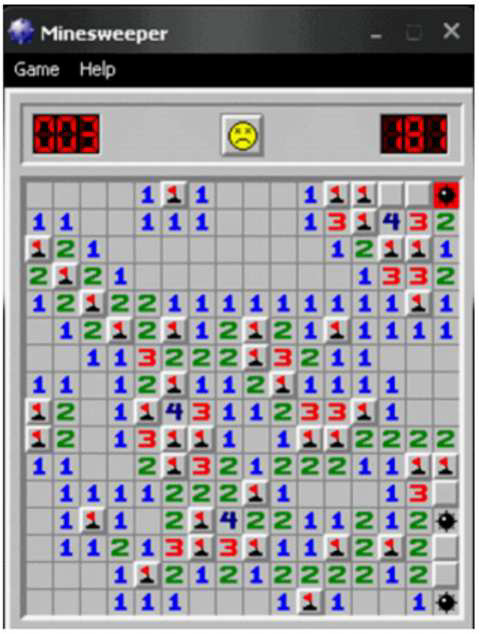
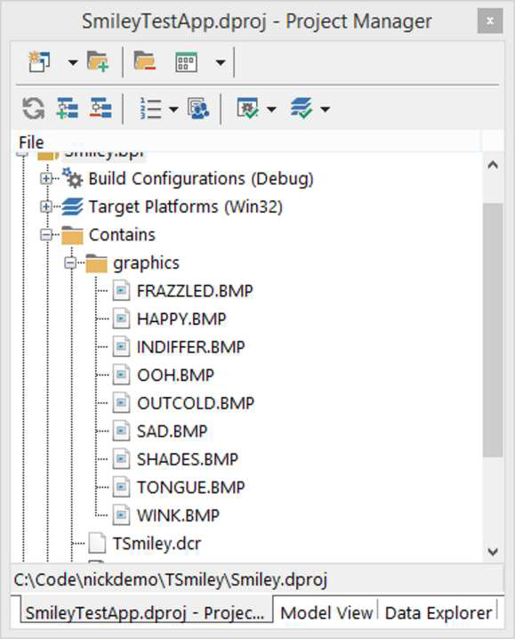
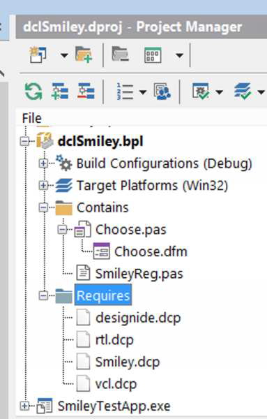
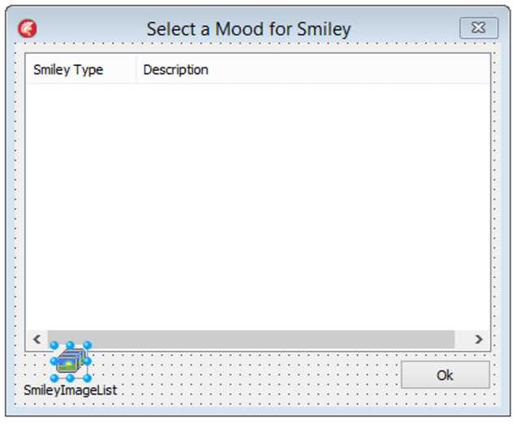
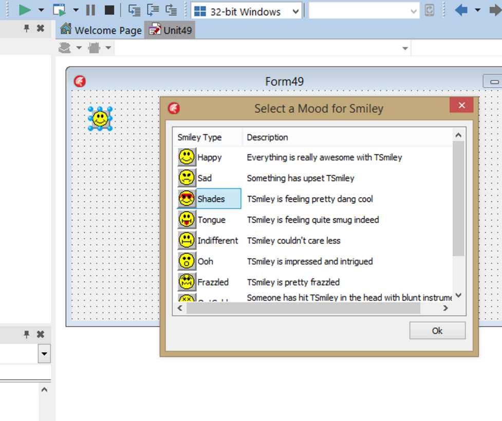
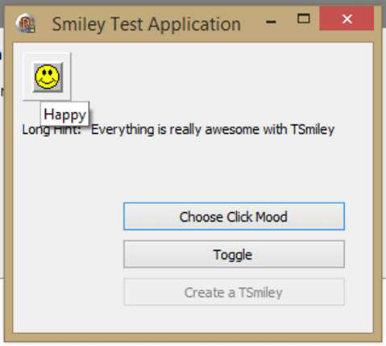

## Введение

Хорошо, эта глава немного выбивается из общего строя книги. Она о написании компонентов VCL. Конечно, это про код, но это также про VCL, про IDE, и поэтому она не совсем вписывается в остальной контекст. Но мой друг и коллега по сообществу Delphi Боб Доусон (Bob Dawson) предположил, что с момента первого появления TSmiley утекло много воды. Также прошло немало времени с тех пор, как разработка компонентов подвергалась тщательному разбору, насколько я могу судить.

Полагаю, для некоторых это может быть «старой шляпой», но вот оно. Я не буду претендовать на то, чтобы охватить все аспекты построения компонентов — для этого я рекомендую книгу Рэя Конопки (Ray Konopka) «Developing Custom Delphi 3 Components»². Эта глава просто охватит добрый старый TSmiley и уроки, найденные в нем.

## TSmiley - Краткая история

Если бы я получал по доллару за каждый раз, когда меня дразнили из-за TSmiley, я мог бы финансировать свой собственный стартап. Я почти уверен, что мне никогда не дадут об этом забыть.

TSmiley, для тех из вас, кто не знает или не слышал о нем (есть ли такие?), возможно, является самым первым сторонним компонентом VCL. Я создал его впервые еще осенью 1994 года, когда работал над оригинальной бета-версией Delphi 1. VCL был совершенно новым и находился в разработке, и идея создания компонента на Pascal была такой крутой, что я не мог устоять.

> Помните, это были дни, когда единственными «компонентами» были элементы управления VBX, используемые в Visual Basic, но написанные на C++. Помните, когда Delphi фактически мог потреблять элементы управления VBX? Помните, как круто было писать компоненты на том же языке, на котором вы программировали?

Я не мог дождаться, чтобы писать компоненты, и, конечно, половина битвы — это придумать идею — не всегда легко. Windows 95 была тогда совершенно новой, как и Minesweeper (Сапер). Помните старую школьную версию Minesweeper с маленьким смайликом наверху? Это была веселая игра.

---
²⁵ https://www.amazon.com/gp/yourstore/home/?ie=UTF8&camp=1789&creative=390957&linkCode=ur2&tag=nickhodgeshomepa&linkId=TMT4IIAHYRZ2PPIV
***
*(Изображение игры Minesweeper)*

*(Изображение со страницы 175 image_page175.png)*

Minesweeper – я проиграл эту партию, и смайлик грустный.

Я привык играть на самом маленьком размере, чтобы посмотреть, как быстро я смогу очистить поле. В любом случае — я подумал, что круто, что там есть этот маленький смайлик, который строит вам рожи, если вы проиграли, и т.д. Поэтому я решил создать версию этого маленького элемента управления на базе Delphi.

Я создал эту вещь с двумя целями: научиться создавать компоненты и создать что-то, чему другие могли бы научиться. Это началось как потомок TImage (имело смысл в то время — поверьте мне), и я сделал несколько вещей, таких как переопределение защищенных методов, которые вызывают события, перехват и обработка сообщений Windows и т.д. Я даже figured out, как создать редактор свойств для него.

Я опубликовал его на форумах Compuserve (помните те?), и следующее, что я знаю, Чарли Калверт (Charlie Calvert), Дэвид Ай (David I) и банда Borland использовали его в демо-версиях Delphi по всему миру. Это стало довольно хорошей шуткой (до сих пор Хавьер Пачеко (Xavier Pacheco) дразнит меня этим. Отпусти, Х...), и я как бы побежал с этим. У меня был пресс-релиз, я говорил такие вещи, как «Полезность TSmiley нельзя измерить», и я в целом оседлал этот удобный маленький компонент к славе и величию. Хорошо, может быть, не такой уж славы и величия, но это было весело, и я действительно верю, что люди узнали из него одну или две вещи. Я имею в виду, вещь была в основном бесполезной (хотя у меня были люди, которые говорили мне, что они использовали её в production приложениях...), но она показала некоторые интересные способы создания компонентов.

💡 Если вы хотите совершить путешествие по дороге памяти, очень ранняя версия страницы TSmiley доступна на Wayback machine²⁶, так же как и копия «пресс-релиза»²⁷, который я написал.

---
² http://web.archive.org/web/19990220044534/www.icss.net/~nhodges/smiley.htm
²⁷ http://web.archive.org/web/19990210172731/www.icss.net/~nhodges/SmileyRelease.htm

Я недавно взглянул на оригинальный код, и, как вы можете себе представить, он был действительно, действительно смущающим. Поэтому я обновил его, чтобы сделать гораздо, гораздо чище и использовать более современные техники кодирования. Вы можете найти текущую версию TSmiley на BitBucket²⁸.

Итак, давайте взглянем.

## Начнем с нуля

### Функциональность времени выполнения

Итак, я подумал, что путь здесь будет в том, чтобы начать с нуля и построить TSmiley с самого основания. Итак, чтобы начать дела, давайте создадим пакет и назовем его Smiley.bpl, назвав основной файл пакета Smiley.dpk. Я не буду вдаваться в пакеты больше, чем сказать, что это специализированные DLL, которые могут содержать классы и компоненты Delphi. (Я предполагаю, что вы уже знаете, что такое пакет Delphi к этому моменту...)

Smiley.bpl будет содержать весь runtime код для TSmiley и ничего кроме runtime кода. Позже мы создадим другой пакет, чтобы содержать весь код времени дизайна (design-time), и этот пакет времени дизайна будет требовать runtime пакет. Мы обсудим почему, когда придет время.

Чтобы сделать вещи официальными, щелкните правой кнопкой мыши на пакете и выберите «Options» (Опции), а затем выберите элемент «Description» (Описание) в дереве справа. Оттуда выберите «Runtime only» (Только время выполнения) в группе «Usage Options» (Опции использования). Это скажет компилятору сделать пакет runtime пакетом — то есть, таким, который не может быть установлен в IDE, но может быть использован приложениями и другими пакетами во время выполнения.

Далее добавьте новый юнит в пакет и назовите его uSmiley.pas. В этот юнит добавьте следующую секцию `uses` в секции `interface`:

```pascal
uses
  Classes,
  Graphics,
  Controls;
```

и в секции `implementation` добавьте следующее:

```pascal
uses
  TypInfo,
  SysUtils;
```

Это юниты, которые мы в конечном итоге будем использовать.

И чтобы действительно начать дела, давайте объявим TSmiley:

---
²⁸ https://bitbucket.org/NickHodges/nickdemocode/src/af47c608363c097156cb3688215e530f3c391727/TSmiley/?at=default
***

```pascal
TSmiley = class(TGraphicControl)

end;
```

Вот оно. TSmiley является потомком TGraphicControl. TGraphicControl происходит от TControl, который, в свою очередь, происходит от TComponent.

TComponent — это базовый класс для — сюрприз! — всех компонентов. TComponent включает достаточно кода для поддержки невизуального компонента. Он содержит множество различных типов служебного кода (plumbing code), но в самом своем ядре он предоставляет возможность дать компоненту Name (Имя), быть владельцем других компонентов, а также потоковую передачу (streaming), необходимую для сохранения себя в файле DFM.

TControl добавляет понятие размера и местоположения к TComponent, а также сообщения мыши, видимость, цвет, шрифт и подсказки, среди прочих функций.

Если ваш компонент требует ввода с мыши или клавиатуры, или способности содержать другие элементы управления, вы должны использовать TWinControl. TWinControl также происходит от TControl и является полноценным окном (proper window) в смысле WinAPI: он имеет дескриптор окна (window handle) и участвует в системе обмена сообщениями окон.

TGraphicControl дополняет TControl одной вещью: TCanvas и, следовательно, способностью быть нарисованным. Вот почему TSmiley происходит от него, потому что все, что мы собираемся делать, — это рисовать на компоненте, и TGraphicControl — это самый низкий класс в иерархии VCL, который позволяет рисование. TSmiley — это ничего, кроме битмапов, нарисованных на экране, и, таким образом, является естественным выбором (fit) для TGraphicControl.

Хорошо, теперь у нас есть некоторая подготовительная работа (house-keeping). В юните uSmiley объявите следующее перечисление:

```pascal
type
  TMood = (smHappy, smSad, smShades, smTongue, smIndifferent, smOoh, smFrazzled, smOutCold, smWink);
```

Это перечисление представляет девять различных «настроений», которые TSmiley может принимать. На самом деле, они представляют девять различных битмапов. Теперь я не собираюсь просить вас рисовать свои собственные битмапы, но вместо этого я укажу вам на битмапы, которые идут с TSmiley на BitBucket. Ссылка здесь:

http://bit.ly/TSmileyGraphics

Загрузите битмапы и поместите их в поддиректорию с именем «graphics» под директорией, где вы сохраняете TSmiley. В результате у вас должно быть девять битмапов. Чтобы сделать эти битмапы полезными для TSmiley, мы должны включить их как ресурсы Windows. Мы делаем это, просто добавляя их в проект через Project Manager (Менеджер проектов):


*(Изображение со страницы 178 image_page178.png)*
*(Изображение Project Manager)*

Далее создайте новый юнит, назовите его uSmileyConsts.pas и сделайте его похожим на этот:

```pascal
unit uSmileyConsts;

interface

resourcestring
  strHappy       = 'Happy';
  strSad         = 'Sad';
  strShades      = 'Shades';
  strTongue      = 'Tongue';
  strIndifferent = 'Indifferent';
  strOoh         = 'Ooh';
  strFrazzled    = 'Frazzled';
  strOutCold     = 'OutCold';
  strWink        = 'Wink';

  strHappyDesc       = 'Everything is really awesome with TSmiley';
  strSadDesc         = 'Something has upset TSmiley';
  strShadesDesc      = 'TSmiley is feeling pretty dang cool';
  strTongueDesc      = 'TSmiley is feeling quite smug indeed';
  strIndifferentDesc = 'TSmiley couldn''t care less';
  strOohDesc         = 'TSmiley is impressed and intrigued';
  strFrazzledDesc  = 'TSmiley is pretty frazzled';
  strOutColdDesc   = 'Someone has hit TSmiley in the head with a blunt instrument of some sort';
  strWinkDesc      = 'TSmiley is feeling pretty coy';

const
  HintStringTemplate = '%s|%s';
  MaxHeight = 26;
  MaxWidth  = 26;

implementation

end.
```

Этот юнит содержит ничего, кроме констант, в частности строк для короткой подсказки и длинной подсказки для каждого из различных настроений, которые будет показывать TSmiley. Мне нравится держать константы в отдельном юните, чтобы не загромождать код. Обратите внимание, что они объявлены как `resourcestring`, что упрощает перевод подсказок TSmiley на другой язык, отличный от английского.

Далее, давайте создадим массив, который позволит легко получать доступ к этим строкам на основе перечисления TMood:

```pascal
type
  TMoodStrings: array [TMood] of string = (strHappy, strSad, strShades, strTongue,
                                           strIndifferent, strOoh, strFrazzled,
                                           strOutCold, strWink);
```

Это должно войти в юнит uSmiley.pas. И, о да, давайте добавим uSmileyConsts в секцию `uses` юнита uSmiley.pas.

Давайте сделаем то же самое для длинных описаний:

```pascal
type
  TMoodDescriptions: array [TMood] of string = (strHappyDesc, strSadDesc, strShadesDesc, strTongueDesc, strIndifferentDesc, strOohDesc, strFrazzledDesc, strOutColdDesc, strWinkDesc);
```

Это должно убрать большую часть предварительной, организационной работы с пути. Теперь мы готовы начать добавлять некоторую функциональность нашему приятелю TSmiley.

Первое, что мы сделаем, это предоставим конструктор и деструктор для TSmiley и обеспечим правильную инициализацию и очистку. Конструктор переопределит конструктор TComponent следующим образом:

```pascal
public
  constructor Create(AOwner: TComponent); override;
```

Конструктор инициализирует вещи для TSmiley, но сначала нам нужно кое-что инициализировать. Вот новое объявление для TSmiley, которое запустит процесс:

```pascal
TSmiley = class(TGraphicControl)
private
  FMood: TMood;
  FFace: TBitmap;
  procedure SetBitmap;
  procedure SetSmileyHint;
  procedure SetupSmiley;
public
  constructor Create(aOwner: TComponent); override;
  destructor Destroy; override;
  class procedure GetMoodBitmap(aBitmap: TBitmap; aMood: TMood);
end;

constructor TSmiley.Create(aOwner: TComponent);
begin
  inherited Create(AOwner);
  FMood := smHappy;
  FFace := TBitmap.Create;
  Self.Height := MaxHeight;
  Self.Width := MaxWidth;
  SetupSmiley;
end;
```

Сначала мы вызываем унаследованный конструктор, передавая владельца родительскому компоненту. Владелец компонента отвечает за хранение ссылки на компонент и его уничтожение, если сам владелец будет уничтожен.

Далее мы устанавливаем начальное настроение — хранящееся в FMood — в счастливое лицо. Затем мы создаем TBitmap, хранящийся в FFace, чтобы удерживать фактический битмап, который будет отображаться. Затем мы устанавливаем Height и Width компонента. Позже мы обеспечим, чтобы никто не мог изменить размер компонента на что-то отличное от размера по умолчанию.

Есть еще одна вещь, которую нужно сделать: вызвать SetupSmiley. Вот объявление для него:

```pascal
procedure TSmiley.SetupSmiley;
begin
  SetBitmap;
  SetSmileyHint;
end;
```

В свою очередь, он вызывает два метода, которые объявлены ниже:

```pascal
procedure TSmiley.SetBitmap;
begin
  GetMoodBitmap(FFace, FMood);
  Invalidate;
end;

procedure TSmiley.SetSmileyHint;
begin
  Hint := Format(HintStringTemplate, [TMoodStrings[FMood], TMoodDescriptions[FMood]]);
end;
```

SetBitmap, в свою очередь, вызывает GetMoodBitmap, который является классовым методом:

```pascal
class procedure GetMoodBitmap(aBitmap: TBitmap; aMood: TMood);
```

Классовый метод — это метод, который может быть вызван как на самом классе, так и на экземпляре класса. Таким образом, мы предоставляем своего рода "TSmiley API", позволяя классу получать конкретный битмап по запросу без необходимости создавать экземпляр TSmiley. Мы добавим пару других элементов в API чуть позже. Вот его реализация:

```pascal
class procedure TSmiley.GetMoodBitmap(aBitmap: TBitmap; aMood: TMood);
var
  TempName: string;
begin
  if aBitmap = nil then
  begin
    raise ESmileyException.Create('You can''t pass a nil bitmap to TSmiley.GetMoodBitmap');
  end;
  begin
    TempName := UpperCase(GetEnumName(TypeInfo(TMood), Ord(aMood)));
    aBitmap.LoadFromResourceName(hInstance, TempName);
  end;
end;
```

Это интересный кусочек кода. Во-первых, он использует защитное условие (Guard clause), чтобы отказаться принимать nil битмап. Затем он получает имя значения перечисления настроения, используя вызов GetEnumName, который находится в юните TypInfo. Как только он это делает, он использует метод TBitmap.LoadFromResourceName для загрузки правильного битмапа из ресурсов исполняемого файла.

SetBitmap использует FFace и заполняет его битмапом, соответствующим полю FMood, начальное значение которого — smHappy. Таким образом, TSmiley по умолчанию начинает счастливым. Затем он вызывает Invalidate, который сообщает компоненту, что его нужно перерисовать. Мы доберемся до рисования через минуту.

SetSmileyHint делает именно то, что подразумевает его имя — он устанавливает как длинные, так и короткие подсказки для TSmiley. Delphi обрабатывает подсказки, используя одну строку как для длинных, так и для коротких подсказок. Они разделены символом "труба" (|), причем сначала идет короткая подсказка, а за ней длинная. Короткая подсказка отображается, когда мышь наводится на компонент, если его свойство ShowHint установлено в true.

И, конечно, после всей этой настройки мы хотим убедиться, что мы убираем за собой, поэтому мы объявляем деструктор следующим образом:

```pascal
destructor TSmiley.Destroy;
begin
  FFace.Free;
  inherited Destroy;
end;
```

Это просто вызывает Free для объекта битмапа, а затем вызывает унаследованный деструктор. Не так много чтобы объяснить, кроме того, что всегда важно убирать за собой.

Хорошо, мы близки к тому, чтобы получить что-то, что действительно будет работать. У нас есть еще одна последняя вещь, которую нужно сделать, прежде чем мы сможем иметь минимум работающего кода, и это реализовать метод Paint.

Итак, теперь наше объявление TSmiley выглядит так:

```pascal
TSmiley = class(TGraphicControl)
private
  FMood: TMood;
  FFace: TBitmap;
  procedure SetBitmap;
  procedure SetSmileyHint;
  procedure SetupSmiley;
protected
  procedure Paint; override;
public
  constructor Create(AOwner: TComponent); override;
  destructor Destroy; override;
  class procedure GetMoodBitmap(aBitmap: TBitmap; aMood: TMood);
end;
```

Обратите внимание на добавление метода Paint в защищенной секции объявления класса. Также обратите внимание, что он переопределен, потому что он является виртуальным в TGraphicControl. Вот реализация:

```pascal
procedure TSmiley.Paint;
begin
  inherited;
  Canvas.Draw(0, 0, FFace);
end;
```

Сначала он вызывает унаследованный метод, даже though TGraphicControl.Paint ничего не делает. Я думаю, это хорошая привычка — вызывать inherited, если у вас нет действительно веской причины не делать этого. Далее, он просто рисует битмап на холсте в верхнем левом углу. Все битмапы имеют размер 26x26, и поэтому они идеально впишутся в элемент управления, который зафиксирован на той же высоте.

На данный момент у нас есть функциональность — но не инфраструктура — для фактического рисования битмапа на компоненте во время выполнения. Мы продолжим предоставлять функциональность времени выполнения, прежде чем обратим наше внимание на аспекты времени дизайна элемента управления.

Прямо сейчас настроение TSmiley застряло на smHappy. Давайте позволим этому настроению меняться, предоставив свойство под названием Mood. Наше объявление теперь будет выглядеть так:

```pascal
TSmiley = class(TGraphicControl)
private
  FMood: TMood;
  FFace: TBitmap;
  procedure SetBitmap;
  procedure SetMood(aNewMood: TMood)
  procedure SetSmileyHint;
  procedure SetupSmiley;
protected
  procedure Paint; override;
public
  constructor Create(aOwner: TComponent); override;
  destructor Destroy; override;
  class procedure GetMoodBitmap(aBitmap: TBitmap; aMood: TMood);
published
  property Mood: TMood read FMood write SetMood;
end;
```

Свойство читает внутреннее поле, когда запрашивается его значение, но когда мы хотим установить новое значение, оно использует SetMood, который объявлен следующим образом:

```pascal
procedure TSmiley.SetMood(aNewMood: TMood);
begin
  FMood := aNewMood;
  SetupSmiley;
end;
```

Вы должны быть в состоянии понять, что это делает — оно изменяет внутреннее поле и вызывает SetupSmiley, который вы видели ранее. Этот код позволяет вам менять настроение как во время выполнения, так и во время дизайна. Это работает во время дизайна, потому что свойство опубликовано (published), что означает, что оно появится в Инспекторе объектов через информацию о типах времени выполнения (RTTI), а также будет потоково передаваться (streamed) в файл DFM и из него. Поскольку свойство является перечислением, вы можете выбрать любое из его значений во время дизайна. Позже в главе мы создадим редактор свойств для Mood, который позволит вам визуально выбирать новое настроение.

Хорошо, так что мы можем менять настроение программно и в Инспекторе объектов. Мы видели, как переопределить метод Paint, чтобы рисовать все, что мы хотим, на TGraphicControl. Но есть еще больше функциональности, которую мы можем предоставить. Как насчет того, чтобы позволить вам установить лицо для TSmiley, которое будет появляться, когда вы нажимаете на компонент? Да, это хорошая идея, верно? Хорошо, давайте сделаем это.

Сначала нам нужно объявить несколько новых вещей:

```pascal
TSmiley = class(TGraphicControl)
private
  FMood: TMood;
  FOldMood: TMood;
  FClicking: Boolean;
  FClickMood: TMood;
  FFace: TBitmap;
  procedure SetBitmap;
  procedure SetMood(aNewMood: TMood);
  procedure SetSmileyHint;
  procedure SetClickMood(const Value: TMood);
  procedure SetupSmiley;
protected
  procedure Paint; override;
  procedure MouseDown(Button: TMouseButton; Shift: TShiftState; X, Y: Integer); override;
  procedure MouseUp(Button: TMouseButton; Shift: TShiftState; X, Y: Integer); override;
public
  constructor Create(aOwner: TComponent); override;
  destructor Destroy; override;
  class procedure GetMoodBitmap(aBitmap: TBitmap; aMood: TMood);
published
  property Mood: TMood read FMood write SetMood;
  property ClickMood: TMood read FClickMood write SetClickMood;
end;
```

Обратите внимание на новые поля, которые позволят нам присваивать значение настроению, которое будет отображаться при щелчке на компоненте, а также поле, которое будет отслеживать старое значение. `FClicking` будет отслеживать тот факт, что на компоненте происходит щелчок. Мы также добавили свойство `ClickMood` в секцию `published`, которое позволит вам устанавливать свойство `ClickMood` в Инспекторе объектов (а позже и с помощью визуального редактора свойств).

Кроме того, мы переопределили еще два метода, на этот раз из `TControl`, которые срабатывают, когда мышь нажимается на элемент управления и когда отпускается. Это события, которые будут запускаться при щелчке на `TSMiley`, и они будут отвечать за отрисовку «лица при нажатии» для компонента.

> Оригинальный `TSMiley` менял настроение при щелчке, перехватывая сообщения `WM_LBUTTONDOWN` и `WM_LBUTTONUP`. Это работало, но было немного излишним, так как `TControl` уже предоставляет два виртуальных метода, которые вызываются этими сообщениями. Простое переопределение их является более эффективным и правильным способом предоставления этой функциональности.

Эти два метода реализованы следующим образом:

```pascal
procedure TSmiley.MouseDown(Button: TMouseButton; Shift: TShiftState; X, Y: Integer);
begin
  inherited MouseDown(Button, Shift, X, Y);
  FOldMood := Mood;
  FClicking := True;
  SetMood(ClickMood);
end;

procedure TSmiley.MouseUp(Button: TMouseButton; Shift: TShiftState; X, Y: Integer);
begin
  inherited MouseUp(Button, Shift, X, Y);
  SetMood(FOldMood);
  FClicking := False;
end;
```

Код довольно прост. Компонент сначала вызывает унаследованный метод, затем сохраняет свое «старое» настроение, отображает `ClickMood`, когда кнопка мыши нажата, и восстанавливает старое настроение, когда кнопка отпускается. Попутно он устанавливает поле `FClicking` в `True`, а затем снова в `False`. Мы увидим, зачем он это делает, через минуту.

Итак, теперь `TSMiley` может менять лицо, если вы нажмете на него, и вы можете менять его настроение по желанию. Но что, если вы захотите сделать что-то, когда его настроение изменится? В VCL есть понятие событий, и мы можем создать событие, когда настроение `TSMiley` меняется.

Если мы хотим «генерировать» (fire) событие всякий раз, когда свойство `Mood` изменяется, нам нужно будет знать, какое это новое настроение. Таким образом, нам нужно объявить наш собственный тип события:

```pascal
type
  TMoodChangeEvent = procedure(Sender: TObject; NewMood: TMood) of object;
```

Это событие следует типичному шаблону VCL, имея `Sender` в качестве первого параметра. Это будет объект, который сам генерирует событие. Второй параметр будет передавать новое устанавливаемое настроение. Таким образом, вы можете написать код в обработчике события для выполнения действий при изменении настроения. Это делается следующим образом:

```pascal
TSmiley = class(TGraphicControl)
private
  FMood: TMood;
  FOldMood: TMood;
  FClicking: Boolean;
  FClickMood: TMood;
  FOnMoodChange: TMoodChangeEvent;
  FFace: TBitmap;
  procedure SetBitmap;
  procedure SetMood(NewMood: TMood);
  procedure SetSmileyHint;
  procedure SetupSmiley;
protected
  procedure DoMoodChange; virtual;
  procedure Paint; override;
  procedure MouseDown(Button: TMouseButton; Shift: TShiftState; X, Y: Integer); override;
  procedure MouseUp(Button: TMouseButton; Shift: TShiftState; X, Y: Integer); override;
public
  constructor Create(aOwner: TComponent); override;
  destructor Destroy; override;
  class procedure GetMoodBitmap(aBitmap: TBitmap; aMood: TMood);
published
  property Mood: TMood read FMood write SetMood;
  property ClickMood: TMood read FClickMood write SetClickMood;
  property OnMoodChange: TMoodChangeEvent read FOnMoodChange write FOnMoodChange;
end;
```

Обратите внимание, что мы добавили поле `FOnMoodChange` типа `TMoodChangeEvent` для хранения ссылки на обработчик события, который добавит пользователь. Мы объявили свойство `OnMoodChange` как опубликованное (`published`), чтобы поместить событие в Инспектор объектов и позволить пользователям добавлять этот обработчик события во время разработки.

Мы также объявили метод с именем `DoMoodChange`, который объявлен следующим образом:

```pascal
procedure TSmiley.DoMoodChange;
begin
  if Assigned(FOnMoodChange) and (not FClicking) then
  begin
    FOnMoodChange(Self, FMood);
  end;
end;
```

Опять же, это стандартный код VCL. Если обработчик события назначен для `FOnMoodChange`, то мы вызываем код, который прикрепил пользователь. Есть еще один нюанс — мы не должны находиться в режиме «Clicking» (нажатия). Помните, когда мы устанавливали `FClicking` в `True`, когда кнопка мыши была нажата? Мы не хотим, чтобы событие `OnMoodChange` срабатывало в результате изменений настроения, которые происходят при щелчке. В противном случае мы рады запустить код пользователя, вызвав событие и передав в него `Self` и новое устанавливаемое настроение.

Есть еще одно изменение, чтобы заставить все это работать. Нам нужно фактически вызвать `DoMoodChange`, когда настроение меняется. Для этого мы добавим его в метод `SetMood`:

```pascal
procedure TSmiley.SetMood(aNewMood: TMood);
begin
  FMood := aNewMood;
  DoMoodChange;
  SetupSmiley;
end;
```

Теперь, когда свойство `Mood` изменяется, генерируется событие `OnMoodChange`.

> Это хорошая практика — генерировать ваши события в отдельном виртуальном методе. Таким образом, вы позволяете компонентам-потомкам легко расширять поведение, если это желательно. Если у вас есть событие с именем `OnMoodChange`, хорошо иметь метод `DoMoodChange`, который является виртуальным и делает не что иное, как генерирует событие.

Помните про API, о котором я упоминал ранее? Что ж, вот два других классовых метода API и их реализации. Я не думаю, что они требуют какого-либо обсуждения, так как они довольно понятны сами по себе.

```pascal
public
  class function GetMoodName(aMood: TMood): string;
  class function GetMoodDescription(aMood: TMood): string;

class function TSmiley.GetMoodDescription(aMood: TMood): string;
begin
  Result := TMoodDescriptions[aMood];
end;

class function TSmiley.GetMoodName(aMood: TMood): string;
begin
  Result := TMoodStrings[aMood];
end;
```

Битмапы `TSMiley` имеют фиксированный размер, и поэтому мы хотим, чтобы `TSMiley` тоже имел фиксированный размер. Для этого мы можем переопределить метод `ConstrainedResize`, найденный в `TControl`. Этот метод вызывается всякий раз, когда размер элемента управления изменяется, и он позволяет вам установить минимальный и максимальный размер, до которого может быть установлен элемент управления. Таким образом, мы просто используем четыре параметра `var`, которые он предоставляет, и ограничиваем `TSMiley` одним фиксированным размером:

```pascal
procedure TSmiley.ConstrainedResize(var MinWidth, MinHeight, MaxWidth, MaxHeight: Integer);
begin
  MinWidth := cMaxWidth;
  MaxWidth := cMaxWidth;
  MinHeight := cMaxHeight;
  MaxHeight := cMaxHeight;
end;
```

У нас есть еще один публичный метод — метод `Increment`. `Increment` объявлен следующим образом:

```pascal
procedure TSmiley.Increment;
begin
  if FMood = High(TMood) then
  begin
    FMood := Low(TMood)
  end else
  begin
    Inc(FMood);
  end;
  SetMood(FMood);
end;
```

Все, что он делает, это перемещает свойство `Mood` к следующему настроению в перечислении. Если оно достигает конца, оно возвращается к началу. Ничего важного, но это просто показывает другой способ изменения свойства `Mood` в коде. В конце он вызывает `SetMood`, чтобы убедиться, что нарисована новая графика и сгенерировано событие `OnMoodChange`.

Еще одна вещь, которую мы должны сделать. `TComponent`, `TControl` и `TGraphicControl` все имеют события, которые не опубликованы. Они не опубликованы для того, чтобы дать создателям компонентов больше контроля над тем, какие события появляются в Инспекторе объектов. Но мы хотим, чтобы `TSMiley` мог обрабатывать ряд этих событий, поэтому мы добавляем следующее в секцию `published` нашего объявления:

```pascal
property OnClick;
property OnContextPopup;
property OnDblClick;
property OnDragDrop;
property OnDragOver;
property OnEndDock;
property OnEndDrag;
property OnGesture;
property OnMouseActivate;
property OnMouseDown;
property OnMouseMove;
property OnMouseUp;
property OnMouseEnter;
property OnMouseLeave;
property OnStartDock;
property OnStartDrag;
```

Теперь `TSMiley` позволит пользователю предоставить любые обработчики событий для тех событий, которые они захотят.

Итак, это весь код времени выполнения (runtime). Вы могли бы, если бы захотели, создать `TSMiley` в коде следующим образом (предполагая, что вы пишете этот код в методе `TForm`):

```pascal
MySmiley := TSmiley.Create(Self);
MySmiley.Parent := Self;
```

и появится хороший старый `TSMiley` с счастливым лицом. Проще простого.

Однако это не совсем то, как это должно работать. Вы хотите иметь возможность перетаскивать компонент с Палитры компонентов (Tool Palette). Ну, вот тут-то и вступает в дело пакет времени разработки (design-time package).

### Функциональность времени разработки (Design-time Functionality)

Хорошо, это были вещи времени выполнения. Мы упаковали все это в пакет времени выполнения. Теперь пришло время взглянуть на сторону времени разработки.

Сначала создайте новый пакет и назовите его `dclSmiley.bpl`. «dcl» — это давняя конвенция Delphi, которая означает «Design-time Component Library» (Библиотека компонентов времени разработки).

### Регистрация TSmiley

Первое, что нужно сделать для пакета времени разработки, — это установить его. В данном случае нам требуются следующие другие пакеты:


*(Изображение со страницы 189 image_page189.png)*

Далее добавьте новый модуль в пакет и назовите его `SmileyReg.pas`. Сделайте его таким:

```pascal
unit SmileyReg;

interface

uses
  Classes,
  uSmiley,
  Choose,
  DesignEditors,
  DesignIntf;

procedure Register;

implementation

procedure Register;
begin
  RegisterComponents('Custom', [TSmiley]);
  RegisterPropertyEditor(TypeInfo(TMood), TSmiley, '', TMoodProperty);
end;

end.
```

Здесь происходят две вещи. Во-первых, мы объявляем метод в секции `interface` с именем `Register`. И, хотите верьте, хотите нет, имя этого метода чувствительно к регистру из-за необходимости работы с C++Builder. Процедура делает две вещи. Сначала она регистрирует `TSmiley` в IDE, а затем регистрирует Редактор свойств для свойства `TMood` компонента `TSmiley`.

Вызов `RegisterComponents` довольно прост. Первый параметр — это строка, которая называет вкладку в Палитре компонентов, под которой будут зарегистрированы переданные компоненты. Второй параметр — это открытый массив типов классов компонентов, которые будут зарегистрированы.

Зарегистрированный компонент устанавливается в Палитру компонентов и доступен во время разработки. Вы можете перетащить его на форму и затем установить его свойства через Инспектор объектов.

В случае с кодом выше мы делаем это для `TSmiley`. Когда пакет времени разработки регистрируется в IDE, IDE автоматически вызывает метод `Register` и устанавливает перечисленные там компоненты. Он также установит зарегистрированные там Редакторы свойств.

Чтобы придать `TSmiley` правильный битмап в Палитре компонентов, вам нужно включить в проект файл `*.DCR`, который содержит один битмап. Файл `*.DCR` — это переименованный файл `*.RES`, который содержит один ресурс битмапа, который будет отображаться в Палитре компонентов. Проект `TSmiley` включает в себя файл DCR.

### Создание редактора свойств (Building a Property Editor)

Давайте создадим Редактор свойств для свойства `TSmiley.Mood`. Редактор свойств — это особый вид компонента, который устанавливается в Инспектор объектов и позволяет вам редактировать данный тип свойства. Вы уже используете редакторы свойств — например, если вы нажмете маленькую кнопку с многоточием рядом со свойством `Color`, появится окно, позволяющее вам выбрать цвет мышью. Когда вы выбираете перечисление в Инспекторе объектов, вы используете редактор свойств для перечислений.

Чтобы создать форму для нашего редактора свойств `Mood`, выполните следующие шаги:

1.  Создайте новую VCL форму в пакете `dclSmiley.bpl`. Назовите её `TChooseDlg`. Назовите модуль "frmChoose".
2.  Поместите кнопку на форму и установите её `Caption` в "Ok".
3.  Поместите `TListView` на форму. Щелкните правой кнопкой мыши по нему и выберите "Column Editor" (Редактор столбцов).
4.  Добавьте два столбца с заголовками "Smiley Type" (Тип смайлика) и "Description" (Описание).
5.  Поместите `TImageList` на форму. Назовите его "SmileyImageList".

Форма должна выглядеть примерно так:


*(Изображение со страницы 191 image_page191.png)*

Теперь немного кода. Сначала дважды щелкните по форме и добавьте следующее в обработчик события `OnCreate`:

```pascal
procedure TChooseDlg.FormCreate(Sender: TObject);
begin
  FillUpListView;
  SetConstraints;
end;
```

Этот обработчик имеет два вызова методов. Эти методы объявлены ниже:

```pascal
procedure TChooseDlg.SetConstraints;
begin
  Constraints.MinHeight := Height;
  Constraints.MinWidth := Width;
end;

procedure TChooseDlg.FillUpListView;
var
  TempItem: TListItem;
  i: integer;
  TempName: string;
  TempDescription: string;
begin
  PopulateImageList;
  for i := Ord(low(TMood)) to Ord(high(TMood)) do
  begin
    TempItem := SmileyListView.Items.Add;
    TempName := TSmiley.GetMoodName(TMood(i));
    TempItem.Caption := TempName;
    TempDescription := TSmiley.GetMoodDescription(TMood(i));
    TempItem.SubItems.Add(TempDescription);
    TempItem.ImageIndex := i;
    TempItem.Data := Pointer(i);
  end;
end;
```

`PopulateImageList` объявлен следующим образом:

```pascal
procedure TChooseDlg.PopulateImageList;
var
  TempMood: TMood;
  TempBitmap: TBitmap;
  TempName: string;
begin
  SmileyImageList.Height := MaxHeight;
  SmileyImageList.Width := MaxWidth;
  TempBitmap := TBitmap.Create;
  try
    for TempMood := Low(TMood) to High(TMood) do
    begin
      TempName := UpperCase(GetEnumName(TypeInfo(TMood), Ord(TempMood)));
      TSmiley.GetMoodBitmap(TempBitmap, TempMood);
      SmileyImageList.Add(TempBitmap, nil);
    end;
  finally
    TempBitmap.Free;
  end;
end;
```

`SetConstraints` просто устанавливает минимальные `Width` и `Height` диалога, чтобы пользователь не мог сжать его настолько, что он перестанет функционировать.

Метод `FillUpListView` немного сложнее. Он проходит по всем настроениям и создает `TListItem` для каждого из них. Затем он добавляет картинку и описание в список (`ListView`). Он отслеживает индекс каждого элемента, чтобы вы могли выбрать один и иметь ссылку после нажатия кнопки ok. По сути, он отображает все настроения с их длинными описаниями и позволяет вам выбрать настроение.

Дизайн гибок тем, что если вы решите добавить еще одно настроение в `TSmiley`, вам не придется менять код в диалоге.

### Добавление диалога как редактора свойств (Adding the Dialog as a Property Editor)

Пока все, что мы сделали, — это создали простой диалог. Что нам нужно сделать, так это добавить код, чтобы превратить его в редактор свойств. Давайте сделаем это.

Первое, что нам нужно сделать, — это включить два модуля в нашу секцию `uses`: `DesignEditors` и `DesignIntf`. Это два модуля, которые имеют смысл только в пакетах времени разработки. Модуль `DesignIntf` содержит все интерфейсы, необходимые для «общения» с IDE, а также `TBasePropertyEditor`. Модуль `DesignEditors` содержит весь код, определяющий стандартные редакторы свойств, начиная с `TPropertyEditor`.

Стандартный редактор свойств, который нас интересует, — это `TEnumPropertyEditor`. По умолчанию этот редактор свойств предоставляет выпадающий список всех членов данного перечисления. Однако мы хотим предоставить форму `TChooseDlg`, которую мы создали выше, в качестве редактора свойств для свойства `TMood`. Это делается следующим образом:

```pascal
TMoodProperty = class(TEnumProperty)
  function GetAttributes: TPropertyAttributes; override;
  procedure Edit; override;
end;
```

Мы объявляем `TMoodProperty`, который переопределяет два метода `TEnumProperty`. Первый — `GetAttributes`, функция, которая возвращает `TPropertyAttributes`, который является множеством `TPropertyAttribute`. Нам нужно сообщить IDE, что наш редактор свойств будет диалоговым окном, поэтому его реализация выглядит так:

```pascal
function TMoodProperty.GetAttributes: TPropertyAttributes;
begin
  Result := [paDialog];
end;
```

Довольно просто.

Другой метод, `Edit`, немного сложнее. Именно здесь мы фактически создаем диалог и используем его для выбора нового настроения.

```pascal
procedure TMoodProperty.Edit;
var
  ChooseDlg: TChooseDlg;
begin
  ChooseDlg := TChooseDlg.Create(Application);
  try
    ChooseDlg.Mood := TMood(GetOrdValue);
    ChooseDlg.ShowModal;
    SetOrdValue(Ord(ChooseDlg.Mood));
  finally
    ChooseDlg.Free
  end;
end;
```

Это довольно прямолинейно. Мы создаем экземпляр диалога (передавая `Application` в качестве владельца), а затем устанавливаем выбранное настроение в текущее значение свойства `Mood`. Это делается с помощью `GetOrdValue` самого класса `TPropertyEditor`. Затем диалог показывается модально, и когда он возвращается, его свойство `Mood` используется для установки нового значения через `SetOrdValue`, другой метод, унаследованный от `TPropertyEditor`.

На этом все, что касается стороны редактора свойств.

> Важно отделить код времени разработки от кода времени выполнения. Правильный способ настройки компонента — сделать так, как мы сделали: создать два пакета: один, который содержит только код времени выполнения, и пакет времени разработки, который требует пакет времени выполнения и предоставляет всю поддержку времени разработки для компонента. Таким образом, если ваши пользователи решат скомпилировать свое приложение с пакетами, им не придется таскать за собой код времени разработки, который не должен быть частью обычного приложения.

Редактор свойств регистрируется следующим образом:

```pascal
RegisterPropertyEditor(TypeInfo(TMood), TSmiley, '', TMoodProperty);
```

Этот вызов сообщает IDE `TypeInfo` для типа, с которым будет использоваться редактор свойств, против какого компонента должен быть зарегистрирован редактор, и какой класс редактора свойств следует использовать для управления свойством в Инспекторе объектов. Затем IDE знает, что нужно предоставить маленькую кнопку с многоточием для свойства `TMood` на `TSmiley`, и при нажатии на неё мы получаем следующее:


*(Изображение со страницы 194 image_page194.png)*

Это обеспечивает гораздо более приятный пользовательский опыт, чем простой выбор из раскрывающегося списка.

### Демонстрационное приложение, чтобы показать всё это (A Demo App to Show It All Off)

Тестирование ваших компонентов может быть немного сложным. Если в них есть ошибки и вы тестируете их, устанавливая в IDE, а затем перетаскивая на форму, они могут обрушить всю IDE. Ваш компонент, будучи зарегистрированным, работает внутри самой IDE, и проблемный компонент может вызвать сбой IDE. Таким образом, лучший способ протестировать ваш компонент — создать его во время выполнения (runtime). Именно это я и сделал, и вы можете найти тестовое приложение как часть кода для `TSmiley` на BitBucket.

Вот как выглядит приложение в действии:


*(Изображение со страницы 195 image_page195.png)*

Я не буду здесь проходить по всему приложению, а просто укажу, как создать компонент во время выполнения. Вот код для этого:

```pascal
MySmiley := TSmiley.Create(Panel1);

// Centers the TSmiley in the Panel
MySmiley.Left := Panel1.ClientRect.CenterPoint.X - (MySmiley.Width div 2);
MySmiley.Top := Panel1.ClientRect.CenterPoint.Y - (MySmiley.Height div 2);

MySmiley.Parent := Panel1;
```

Первое, конечно, это вызвать `Create`. В данном случае мы передадим `Panel1` в качестве владельца, так как в приложении смайлик размещается на панели. Владелец компонента — это сам компонент, который отвечает за управление временем жизни всех компонентов, которыми он владеет. В данном случае панель уничтожит смайлик, когда будет уничтожена сама (Панель принадлежит форме, которая, в свою очередь, уничтожит панель, когда будет освобождена сама форма).

Затем у нас есть код, который центрирует смайлик на панели. Последняя строка важна — она устанавливает `Parent` (родителя) также на панель. `Parent` компонента — это место, где компонент будет отрисован. Важно при создании компонента во время выполнения установить свойство `Parent`, иначе ваш компонент нигде не появится. Если вы не можете заставить свой компонент появиться, убедитесь, что вы установили его свойство `Parent`.

### Заключение (Conclusion)

Итак, вот оно: `TSmiley` объяснен. Разработка компонентов может быть немного утраченным искусством в блогах и книгах. Еще раз, я рекомендую книгу Рэя Конопки (Ray Konopka). Не отпугивайте себя словом "Delphi 3" в названии — почти всё, что там есть, всё ещё актуально. Компоненты действительно находятся в самом сердце мощи Delphi, и знание того, как их создавать, может значительно улучшить ваши приложения. Надеюсь, этот "привет из прошлого" с `TSmiley` поможет вам вспомнить, на что способны компоненты.