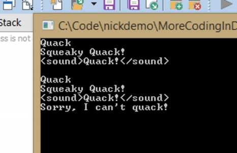
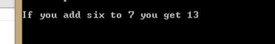
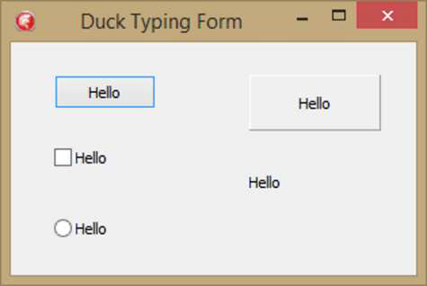

Изначально это была глава в основной части книги. Однако мои рецензенты пришли к выводу, что, хотя утиная типизация — это круто, в Delphi её не стоит слишком сильно поощрять. Но это интересная тема, и глава уже была написана. Поэтому, в качестве компромисса, я перенёс эту главу сюда, в Приложение. Читайте это, имея всё выше сказанное в виду.

#### **Введение**

> Если это выглядит как утка, плавает как утка и крякает как утка, то, вероятно, это утка.

Мы все читали эту цитату. Её происхождение несколько неясно[1], но суть остается той же.

Эта фраза проникла в мир компьютерных наук как «утиная типизация» (duck typing) — понятие, что семантика и ситуация определяют поведение данной переменной. То есть объект будет использоваться исходя из того, что он *может делать*, а не из того, *что он 
есть*. Это кажется довольно противоречащим представлению Delphi о строгой типизации, но, как вы увидите, у этого есть свои преимущества.

Утиная типизация позволяет передавать объект в метод до тех пор, пока этот объект поддерживает то, что ожидает метод. Другими словами, если метод ожидает, что у объекта будет метод `aMakeToast`, вы можете передать ему любой класс, у которого есть метод `MakeToast`, даже если это не тостер. Объект может быть любого типа вообще, лишь бы он поддерживал метод `MakeToast`. Теперь это может показаться странной концепцией для нас, закоренелых разработчиков на Delphi, но ребята из Ruby и пользователи других динамически типизированных языков занимаются всякими видами утиной типизации, так что в этом что-то есть, верно?

#### **Что здесь происходит?**

Итак, как всё это работает в Delphi, строго типизированном языке? Рассмотрим эти простые типы:

```pascal
TDuck = class
  procedure Quack;
end;

TGoose = class
  procedure Honk;
end;
```

Обычно в Delphi вы должны передавать в метод конкретный тип:

```pascal
procedure Quack(aDuck: TDuck);
begin
  aDuck.Quack;
end;
```

Если вы попытаетесь передать `TGoose` в эту функцию, компилятор откажется её принимать.

Первым шагом к утиной типизации в Delphi были бы интерфейсы. Вы можете объявить следующее:

```pascal
type
  IQuackable = interface
    function Quack;
  end;

procedure Quack(aQuacker: IQuackable);
begin
  aQuacker.Quack;
end;
```

В этом случае вы можете использовать любой класс для реализации интерфейса `IQuackable`, и он будет правильно реагировать при передаче в процедуру `Quack`. Однако это всё ещё требует, чтобы вы реализовали данный интерфейс, чтобы сделать `Goose` «крякающим» (`quackable`), и вы должны передать класс, реализующий этот интерфейс.

Разве не было бы здорово, если бы был способ установить эту связь автоматически? Разве не было бы приятно, если бы иногда вы могли просто передать что угодно, что имеет метод `Quack`, в процедуру, и чтобы это «просто работало»? Конечно, было бы. Утиная типизация позволит любому классу, у которого есть метод `Quack`, быть переданным в процедуру и работать. Как это происходит?

Что ж, в сообществе Delphi есть две основные библиотеки, которые позволяют это сделать: DSharp и DuckDuckDelphi.

#### **Duck Typing с DSharp**

Фреймворк DSharp от Стефана Глиенке (Stefan Glienke) содержит класс, который позволяет вам выполнять утиную типизацию на интерфейсах. (Вы можете узнать больше о DSharp в Приложении A.) Давайте взглянем на это. Вот объявление:

```pascal
type
  Duck<T: IInterface> = record
  private
    FInstance: T;
    function GetInstance: TObject;
    procedure SetInstance(const Value: TObject);
  public
    class operator Implicit(const Value: TObject): Duck<T>;
    class operator Implicit(const Value: Duck<T>): T;

    property Instance: TObject read GetInstance write SetInstance;
  end;
```

Тип `Duck` — это запись (record), которая принимает любой интерфейс в качестве параметризованного типа. У него есть два классовых оператора и одно свойство. По сути, он делает только одну вещь: становится чем-то другим. Оба классовых оператора имеют тип `Implicit`, что означает, что вы можете «тихо» превратить любой объект в `Duck<T>`, а также превратить любой `Duck<T>` в экземпляр типа `T` (вы можете самостоятельно исследовать детали того, как именно это происходит, в коде. Достаточно сказать, что это написано очень умно. Это и есть суть утиной типизации — способность во время выполнения (runtime) превращать одну вещь в другую.

Итак, давайте посмотрим на это в действии. Сначала объявим интерфейс:

```pascal
type
  IDriveable = interface(IInvokable)
    procedure Drive;
  end;
```

Очевидно, это можно использовать для вещей, которыми можно управлять (drive-able). Но вы можете управлять множеством разных вещей. Например, вы можете вести машину, вы можете бить по мячу для гольфа (drive a golf ball), и вы можете забивать гвоздь (drive a nail). Обратите внимание, что интерфейс расширяет `IInvokable`, обеспечивая необходимый RTTI для результирующего интерфейса.

Далее давайте объявим реализацию `IDriveable`, а также простой старый объект Delphi, который имеет метод `Drive`:

```pascal
TCar = class(TInterfacedObject, IDriveable)
  procedure Drive;
end;

TGolfBall = class
  procedure Drive;
end;
```

Обратите внимание, что у `TCar` есть метод `Drive`, как и у `TGolfBall`, но они будут делать две очень разные вещи:

```pascal
procedure TCar.Drive;
begin
  WriteLn('Ease on down the road.');
end;

procedure TGolfBall.Drive;
begin
  WriteLn('Swing and SMACK!');
end;
```

Теперь вот где становится интересно. Давайте напишем простую процедуру, которая принимает `IDriveable` в качестве параметра и — сюрприз! — управляет вещами.

```pascal
procedure DriveTheThing(aDriveable: IDriveable);
begin
  aDriveable.Drive;
end;
```

На первый взгляд, вы должны быть в состоянии передать в эту процедуру только класс, который реализует `IDriveable`, но эй, у `TGolfBall` есть метод `Drive`, и я хочу иметь возможность передать его в `DriveTheThing` тоже. Ну, я могу — смотрите:

```pascal
var
  Car: IDriveable;
  GolfBall: TGolfBall;
begin
  Car := TCar.Create;
  GolfBall := TGolfBall.Create;

  DriveTheThing(Car);
  DriveTheThing(Duck<IDriveable>(GolfBall));
  ReadLn;
end.
```

Вот где в игру вступает `Duck<T>`. Он принимает в качестве параметризованного типа интересующий нас интерфейс — здесь `IDriveable` — а затем принимает в качестве обычного параметра экземпляр класса, у которого есть метод `Drive`.

Держу пари, что в этот момент вам интересно, что произойдет, если вы попытаетесь передать объект в `Duck<T>`, у которого нет метода `Drive`. Давайте выясним.

```pascal
TNotDriveable = class
  procedure SitThere;
end;

procedure TNotDriveable.SitThere;
begin
  WriteLn('Just sitting here.');
end;

var
  NotDriveable: TNotDriveable;
begin
  NotDriveable := TNotDriveable.Create;

  DriveTheThing(Duck<IDriveable>(NotDriveable));
  ReadLn;
end.
```

Этот код приводит к исключению `ENotImplemented`, возникающему внутри `Duck<T>`. `Duck<T>` может очевидно сказать, что доступного метода `Drive` нет, и выбрасывает исключение.

Обратите внимание, что у компилятора нет способа обнаружить эту ошибку, и, как упоминалось выше, вы получаете ошибку времени выполнения (runtime error). Таким образом, именно вам нужно убедиться во время компиляции, что данный экземпляр класса, который вы передаете в `Duck<T>`, действительно реализует правильно названный метод. Обратите внимание также, что вы должны передать точную сигнатуру метода, иначе это тоже не сработает.

#### **Утиная типизация с DuckDuckDelphi**

Фреймворк DuckDuckDelphi был написан Джейсоном Саутвеллом (Jason Southwell), давним членом сообщества Delphi. Это фреймворк, который использует преимущества новой мощной информации о типах во время выполнения (RTTI) в Delphi, позволяя вам идентифицировать вещи по тому, что они делают, а не обязательно по тому, что они есть. Вы можете узнать больше об этом и о том, как его получить, в Приложении A.

DuckDuckDelphi использует подход, отличный от DSharp. Чтобы использовать его, вы просто добавляете юнит `Duck` из фреймворка в свой юнит, и он автоматически предоставляет утиную типизацию любому типу в этом юните. Юнит `Duck` прикрепляет интерфейс под названием `Duck` к каждому объекту, создавая класс-помощник (class helper) для `TObject`, который, в свою очередь, предоставляет методы, позволяющие вызывать методы и устанавливать свойства, среди прочего.

Давайте еще раз взглянем на демо с «кряканьем» (quack), используя DuckDuckDelphi.

Сначала, как отмечалось выше, вы должны поместить юнит `Duck` в свой раздел `uses`. Затем вы можете создать простой метод, подобный следующему, который будет вызывать метод `Quack` на любом объекте, который вы ему передадите и у которого есть такой метод:

```pascal
procedure DoQuack(obj: TObject);
begin
  obj.duck.call('Quack');
end;
```

Если вы передадите в эту процедуру объект, у которого есть метод `Quack`, то этот метод будет вызван. Если метода `Quack` нет, ничего не произойдет.

Кроме того, вы можете использовать метод `can`, чтобы проверить, есть ли у объекта метод `Quack`, и действовать соответствующим образом.

```pascal
procedure ProtectedQuack(obj: TObject);
begin
  if obj.duck.can('Quack') then
  begin
    obj.duck.call('Quack')
  end
  else
  begin
    WriteLn('Sorry, I can''t quack!');
  end;
end;
```

Давайте создадим несколько вещей, которые крякают:

```pascal
unit uQuackingThings;

interface

type
  TDuck = class
    procedure Quack;
  end;

  TRubberDuck = class
    procedure Quack;
  end;

  TWAVFileOfADuck = class
    procedure Quack;
  end;

implementation

{ TWAVFileOfADuck }

procedure TWAVFileOfADuck.Quack;
begin
  WriteLn('<sound>Quack!</sound>');
end;

{ TRubberDuck }

procedure TRubberDuck.Quack;
begin
  WriteLn('Squeaky Quack!');
end;

{ TDuck }

procedure TDuck.Quack;
begin
  WriteLn('Quack');
end;

end.
```

А теперь давайте всё это соединим, чтобы увидеть, как это работает:

```pascal
procedure DoIt;
var
  LDuck: TObject;
  LRubberDuck: TRubberDuck;
  LWaveFileDuck: TWAVFileOfADuck;
  LGoose: TGoose;
begin
  LDuck := TDuck.Create;
  LRubberDuck := TRubberDuck.Create;
  LWaveFileDuck := TWAVFileOfADuck.Create;
  LGoose := TGoose.Create;
  try
    DoQuack(LDuck);
    DoQuack(LRubberDuck);
    DoQuack(LWaveFileDuck);
    DoQuack(LGoose);

    WriteLn;

    ProtectedQuack(LDuck);
    ProtectedQuack(LRubberDuck);
    ProtectedQuack(LWaveFileDuck);
    ProtectedQuack(LGoose);
  finally
    LDuck.Free;
    LRubberDuck.Free;
    LWaveFileDuck.Free;
    LGoose.Free;
  end;

  ReadLn;
end;
```

Все три созданных нами класса могут «крякать» (quack). Нам не пришлось использовать наследование или какое-либо приведение типов, чтобы заставить их крякать. У них есть метод `Quack`, и мы можем просто вызвать его.

`TGoose` объявлен ниже. Это пример класса, который не может крякать. Когда он вызывается через `DoQuack`, ничего не происходит, но когда он вызывается через `ProtectedQuack`, он сообщает, что не может крякать.

```pascal
type
  TGoose = class
    procedure Honk;
  end;

procedure TGoose.Honk;
begin
  WriteLn('Honk!');
end;
```

Вызов `DoIt` приводит к следующему выводу:


*(Изображение со страницы 205 image_page205.png)*

Обратите внимание, что в первом наборе кряканья гусь молчит, но во втором он заявляет, что не может крякать.

Это круто, но подождите, есть ещё!

Давайте добавим свойство в `TGoose`:

```pascal
type
  TGoose = class
  strict private
    FName: string;
  public
    procedure Honk;
    property Name: string read FName write FName;
  end;
```

И теперь мы можем использовать утиную типизацию, чтобы изменить `Name` чего угодно, что имеет свойство `Name`, используя метод `SetTo`:

```pascal
procedure ChangeName(aObj: TObject; aName: string);
begin
  aObj.duck.setTo('Name', aName);
end;
```

Вот код, который вызывает это с предсказуемыми результатами:

```pascal
ChangeName(LGoose, 'Marvin');
WriteLn('The goose''s name is ', LGoose.Duck.get('Name').ToString);

LComponent := TComponent.Create(nil);
try
  ChangeName(LComponent, 'Jennifer');
  WriteLn('The component''s name is ', LComponent.Duck.get('name').ToString);
finally
  LComponent.Free;
end;
```

Обратите внимание, что после установки имени оно извлекается через метод `IDuck.get`. Мне нужно вызвать метод `TValue.ToString`, потому что `WriteLn` не может обработать `TValue`, который возвращает `IDuck`. (Подробнее о `TValue` см. в моей предыдущей книге...) `IDuck` также имеет метод `has`, который возвращает `Boolean`, если у данного объекта есть запрошенное свойство.

Здесь стоит отметить, что эти вспомогательные методы, которые я использую для выполнения всей «работы», принимают в качестве параметра простой `TObject`, но все они могут вызвать свой метод `Quack` или установить свое свойство `Name`. Коду неважно, какой реальный тип ему передан, он всё равно может вызывать методы и устанавливать свойства.

Но что, если у метода есть параметры? Без проблем, `IDuck` может принимать аргументы в виде набора `TValues`:

```pascal
procedure DoAddSix(aObj: TObject; aInteger: integer);
begin
  aObj.duck.call('AddSix', [aInteger]);
end;
```

Опять же, вот простой код, который дает предсказуемые результаты:

```pascal
var
  LAdd6: TAddSix
begin
  LAdd6 := TAddSix.Create;
  try
    DoAddSix(LAdd6, 7);
  finally
    LAdd6.Free;
  end;
end;
```

Он выводит:


*(Изображение со страницы 206 image_page206.png)*

Здорово, да?

#### **Утиная типизация в VCL**

Большая часть этой книги не охватывает VCL, но я собираюсь создать здесь приложение VCL, потому что это довольно хорошо иллюстрирует другой аспект DuckDuckDelphi. Форма VCL обычно имеет много компонентов `TComponent` и предоставляет отличную возможность проиллюстрировать возможности метода  `all` интерфейса `IDuck`.

Чтобы создать простое приложение, выполните следующие действия:

1. Создайте новое приложение VCL.
2. Разместите на нем следующие компоненты: `TButton`, `TCheckBox`, `TRadioButton`, `TPanel` и `TLabel`.
3. Дважды щелкните по кнопке и добавьте следующий код: `Self.duck.all.setTo('Caption', 'Hello');`

Запустите приложение, нажмите кнопку, и все компоненты на форме, имеющие свойство `Caption` — то есть все они — получат заголовок «Hello». (Я не смог придумать никаких других компонентов, у которых было бы свойство «Caption»...) Всё это одной строкой кода:


*(Изображение со страницы 207 image_page207.png)*

Метод `all` может сэкономить вам много печатания, а?

#### **Зачем использовать утиную типизацию?**

Утиная типизация — это своего рода анафема для нас, программистов на Delphi, привыкших к строгой типизации. Так зачем же её использовать?

*   Он может заполнить некоторые пробелы, которые иначе было бы трудно устранить. Например, он позволяет использовать фиктивные объекты (Fake Objects) для модульного тестирования в ситуациях, когда создать их обычными средствами сложно. Представьте класс со сложным интерфейсом, который не реализует интерфейс, объявлен как `sealed` (запечатанный) и поэтому его нельзя легко подменить с помощью объекта-заглушки (mock). В таком случае «утиная типизация» (duck typing) позволяет значительно упростить создание имитации (mock) такого объекта.
*   Она может упростить ваш код. Как мы видели в приложении VCL выше, вместо того чтобы перебирать все компоненты на форме, проверять, является ли их тип `TComponent`, а затем приводить типы, чтобы установить свойство, мы можем сделать всё это одной простой строкой кода.
*   Одним из аргументов в пользу утиной типизации является то, что вы можете использовать модульное тестирование, чтобы убедиться, что ваши классы правильно типизированы, когда задействована утиная типизация.

#### **Проблемы с утиной типизацией**

Утиная типизация — это круто, но у неё есть и свои проблемы.

*   Delphi имеет строгую типизацию, и все аргументы в пользу строгой типизации являются аргументами против утиной типизации.
*   Поскольку утиная типизация в Delphi требует позднего связывания (late-binding), ошибки с утиной типизацией проявятся только во время выполнения, а люди утверждают — включая меня — что вы хотите, чтобы как можно больше ошибок проявлялось во время компиляции. Это заставляет вас быть более осторожным во время проектирования, чем вы могли бы быть при использовании статической типизации.
*   Если вы используете утиную типизацию, вы должны быть очень осторожны с тем, что передаете, и должны точно знать, на что способен каждый параметр. Например, вы можете захотеть вызвать метод `Run` у кучи животных, все из которых умеют бегать. Но будьте осторожны, чтобы не вызвать `Clock.Run`, потому что вы получите совсем не тот результат, которого ожидали. Если `Clock.Run` в итоге будет вызван без вашего ведома, у вас, вероятно, появится баг, который трудно отследить.
*   Если вам нужно писать юнит-тесты для проверки и контроля вашей типизации, не отказываетесь ли вы от части той продуктивности, которую получаете благодаря динамической типизации? Не то чтобы я был против написания юнит-тестов, но, возможно, в итоге вы напишете их больше, чем требуется?
*   Одной из проблем, которая может возникнуть, является производительность. Утиная типизация требует значительной поддержки во время выполнения (runtime), особенно со стороны модуля `RTTI`, что может снизить производительность.

#### **Заключение**

Утиная типизация — это крутая возможность в таком строго типизированном языке, как Delphi. Она дает вам гибкость в ситуациях, где она может понадобиться. Однако у неё есть свои опасности, поэтому её следует использовать с осторожностью.

---
[1] http://en.wikipedia.org/wiki/Duck_test

---
